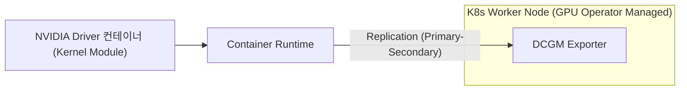
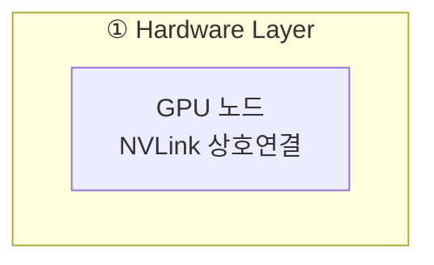

# diagram — Pick the tool the diagram needs

## Why

A diagram in a study note earns its place by making a structure easier to hold
than the prose would. That fails in two directions: a tool too weak leaves a
tangle nobody redraws, and a tool too heavy leaves a picture nobody can edit.

Mermaid is the default because Obsidian renders it with nothing installed, the
source stays in the note, and a diff shows what changed. Everything else here
is an escalation with a reason.

## Choose

| The diagram is | Use | Why |
|---|---|---|
| a flow, sequence, state, class, or ER structure | Mermaid, inline | renders in Obsidian, no toolchain, diffable source |
| the same but large - past about 15 nodes or three levels of nesting | D2 → SVG, embedded | Mermaid's layout stops being readable at that size |
| a map of notes that already exist | JSON Canvas → the `obsidian` skill | a canvas can embed the notes themselves, not restate them |
| anything with real coordinates - a trajectory, a transform, a plot | matplotlib → SVG, embedded | only a renderer gets the geometry right |

Escalate when the check says so, not by taste:

```sh
python3 .agents/skills/diagram/scripts/check.py NOTE.md
```

It reports an unknown Mermaid diagram type, unbalanced delimiters, the label
mistakes below, a wikilink pasted in as a node shape, an embedded asset that
does not exist, and an SVG a failed render left empty. It also counts nodes and says when a diagram has outgrown
Mermaid. That count is advice - the note still renders - but it is the signal
to escalate rather than adding one more edge to a diagram already too dense.

A label can fail twice over, and the two failures look nothing alike: the
parser refuses the diagram, or the parser accepts it and the renderer prints
something else. Both sections below are needed.

The check is a pre-check, not a renderer. Mermaid's parser is JavaScript and
this repository keeps its scripts dependency-free, so a file that passes may
still fail to render. Look at the diagram in Obsidian before calling it done.

## Quote every label in a flowchart

`Error parsing Mermaid diagram!` replaces the whole diagram with an error
block, and the note still looks finished in the source. The cause is almost
always a label Mermaid could not read, because unquoted it accepts far less
than the prose suggests.

So in `flowchart` and `graph`, write every label with quotes:



Unquoted, a parenthesis or a double quote ends the statement - in a node
label, an edge label, or a `subgraph` title, which has no brackets to make the
rule visible. A parenthesis is balanced, so no delimiter count catches it.
Quoting always is one habit instead of a list of exceptions; `&`, `#`, `%`,
`$`, `:`, `/`, `+`, `<br>`, and Korean text happen to parse bare, but nothing
is gained by finding out which.

Two further mistakes cost a whole diagram:

- A `subgraph` title is not a node id. Give the subgraph an id and reference
  that - `subgraph HW["1. Hardware Layer"]` then `HW --> ORCH`. An id holds no
  space, so `1. Hardware Layer --> 2. Orchestration Layer` cannot parse even
  though it reads correctly.
- Every `subgraph` needs its own `end` on a line of its own. A mistyped `end`
  reads as an ordinary line and the parser fails far from the actual typo.

A `sequenceDiagram` does not share these rules: it takes a parenthesis
unquoted in a participant or a message. The check applies them only where
Mermaid does.

## A flowchart label is markdown, so write it as prose

Quoting makes a label parse. It does nothing to how the label is rendered,
because Mermaid hands the text to a markdown lexer either way and supports
only paragraph, text, `**bold**`, `*italic*`, and inline HTML. Anything else
the lexer produces is thrown away, and the version Obsidian bundles puts the
literal words `Unsupported markdown: list` in the box where the label was. The
diagram parses, so no rule in the section above can see it.

The trap is numbering, because a diagram of layers or phases invites it:



- `1. ` and `1) ` and `01. ` are all ordered-list markers, so renumbering the
  punctuation does not help. Write `①` or `1 · `. The backslash escape `1\. `
  survives the HTML renderer and is dropped by the SVG one, so it is not a fix.
- `- `, `* `, `+ ` at the front of a label are bullets; `# ` is a heading; `> `
  is a blockquote; a label that is only `---` is a horizontal rule.
- A backtick pair is inline code and a `[text](url)` is a link. Both vanish,
  and neither stops at a `<br/>`: the whole label goes to one lexer, so a
  backtick opened before the break closes after it and takes the label with it.
  `**bold**` and `*italic*` cross a break safely - they are supported types.
- The rule applies to a node label, an edge label, and a `subgraph` title
  alike - they all go through the same renderer.

Break a line with `<br/>`, never `\n`. A markdown label renders `\n` as the two
characters a backslash and an `n`; only the older non-markdown path ever turned
it into a line break. `<br/>` is inline HTML, which both renderers accept.

The break starts a new markdown block, so the front-of-line rules are read
again after it - but it starts no new inline scope. A construct opened on one
side of the break still closes on the other.

These are the node-shaped types only. A `sequenceDiagram` message is drawn by a
different code path that still treats `\n` as a line break.

## A wikilink drawn in a diagram links to nothing

`id[[text]]` is Mermaid's subroutine shape, and its source is
character-for-character an Obsidian wikilink. So pasting `[[노트 이름]]` into a
flowchart parses cleanly and draws the note title in a double-bordered box,
while Obsidian resolves no link inside a code fence. The diagram then shows a
connection the vault does not have, and looking at it cannot reveal that: the
box is exactly the box that was meant.

Quoting decides which of the two was intended:

- `OBS["LLM 트레이싱과 OpenTelemetry 계측"]` - an ordinary box. Put the wikilink
  in the prose, which is where it becomes an edge. `related` is not a
  substitute: `knowledge-graph` reads note bodies and never the frontmatter, so
  a link that lives only in `related` is invisible to the graph, to
  `vault-gardening`, and to the Stop hook's reachability check.
- `OBS[["LLM 트레이싱과 OpenTelemetry 계측"]]` - the subroutine shape, kept
  deliberately.

The check reports an unquoted subroutine label for this reason, and for this
one shape it asks for quotes even where Mermaid would parse the label bare.

## Rendering to SVG

D2 and matplotlib produce files, and files go stale silently. So:

- Write the source under `assets/`, with the same base name as the SVG. A
  rendered file with no source beside it cannot be corrected, only redrawn.
  `wiki/` keeps notes one level deep in topic folders and `wiki/assets/` is the
  one exception, so the pair lives at `wiki/assets/<group>/name.d2` and the note
  in `wiki/<topic>/` embeds it as `![[assets/<group>/name.svg]]` - a wikilink
  resolves against the vault, not the note's own directory.
- Render with `d2 assets/name.d2 assets/name.svg`, or a small matplotlib
  script saved beside its output. Embed with `![[assets/name.svg]]`.
- Run the check on the SVG too. A failed render often still writes a file, and
  an empty canvas embeds without complaint.
- `d2` is optional. When it is missing, say so and keep the diagram in Mermaid
  rather than installing it mid-task; a dense Mermaid diagram the user can see
  beats a perfect one that does not exist.

## Boundaries

- A diagram is an explanation, not evidence. It carries no verification state
  of its own, and a relationship drawn in a diagram is not established by
  having been drawn. `note-writer` and the evidence rules still decide what the
  note may claim.
- Generated images are not sources. When one is produced by an image model
  rather than a renderer, record that provenance in the note and say the image
  is illustrative.
- Do not send note or source content to an external rendering or image service.
  A scene description is enough (AGENTS.md section 5).
- Redraw from the source, never by editing an SVG by hand.

## With / without

| Metric | Without this skill | With this skill |
|---|---|---|
| Tool choice | Habit, or whatever is installed | Matched to structure, escalated on a counted threshold |
| Editability | Rendered image with no source | Source beside the output, same base name |
| Silent failure | Empty SVG, broken embed, or a wikilink that draws as a box and links nowhere | All caught before the note is done |
| Authority | Diagram read as a finding | Explanation only; evidence rules unchanged |
