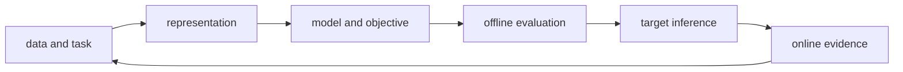
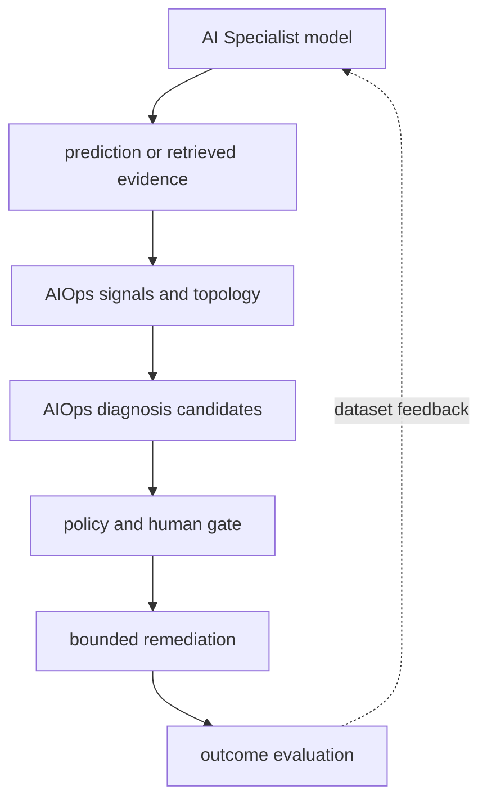

# AI Specialist Full Module Roadmap

This roadmap maps subject areas into a learning sequence. Coverage in the map does not mean every technique has a complete implementation or measured production result; follow each chapter's exercise scope and completion criteria.

<!-- source: https://arxiv.org/abs/1706.03762 | checked: 2026-09-03 -->
<!-- source: https://modelcontextprotocol.io/specification/2025-11-25/architecture | checked: 2026-09-03 -->

The AI ​​Specialist path is not a process of listing model names. It is a single iteration that converts input into a representation, learns relationships, compares performance on validation data, and determines whether it can be used within actual targets and operational constraints. Vault's five modules and the detailed topics within them are linked into one public learning map.

## Starting point for beginners

| New term | Plain-language meaning | Why it matters / when to use it |
|---|---|---|
| representation | Converting the original input into a numeric structure that the model can calculate | Convert raw inputs into features on which a model can learn useful distinctions. |
| objective | Loss that the model learns to reduce and business optimization goals | Make the target of learning explicit and check whether it aligns with the business outcome. |
| inference | The process of calculating the result of a new input with a learned model | Apply a trained model to new inputs under measured latency, capacity, and quality constraints. |
| baseline | Simple comparison criteria that complex models should actually win | Require a complex model to improve on a simple reference under the same evaluation conditions. |
| retrieval | The step of finding candidate evidence from external sources before creating an answer | Find relevant external evidence when the answer depends on information beyond model parameters. |
| evaluation | Measuring correctness, quality, cost, safety, and delay under fixed conditions | Decide whether a candidate meets explicit quality and operational requirements before promotion. |

## five modules

1. [LLM underlying structure and efficiency](#doc=ai-specialist-core-llm): Connects the calculation path from token to attention·GPT·learning·sort·KV cache.
2. [Vision and generative model genealogy](#doc=ai-specialist-core-vision): Compare convolution·patch·set prediction·segmentation and generative distribution learning.
3. [On-device AI and model compression](#doc=ai-specialist-core-edge): Verifies pruning·quantization·distillation with target performance.
4. [Time series prediction and recommendation system](#doc=ai-specialist-core-forecast-recommend): Learn split·baseline·ranking evaluation that preserves time order and user relationships.
5. [RAG·GraphRAG·NL2SQL and MCP](#doc=ai-specialist-core-rag-mcp): Find evidence through search and expand with structural queries and approved tools.

## AI Specialist Full Content Connection Table

The technology items covered by Vault's AI Specialist's 49 notes are linked to open chapters for each module. Private sentences and execution figures in lecture slides and notebooks are not posted, and facts in public chapters are re-checked in the original thesis and official documents.

| module | Full details including | Open Learning Connections |
|---|---|---|
| LLM Bottom Line Implementation | tokenization·embedding, causal attention, GPT block·LayerNorm·GELU·residual, pretraining·cross entropy·perplexity·decoding, classification fine-tuning·LoRA, instruction tuning·DPO | [LLM structure and efficiency](#doc=ai-specialist-core-llm) |
| LLM Streamlined | KV cache and prefill/decode, GQA, MLA low-rank KV compression, sliding-window attention, MoE sparse FFN, Gated DeltaNet and linear-attention hybrid | [LLM structure and efficiency](#doc=ai-specialist-core-llm), [AI infrastructure·serving](#doc=ai-transformation-platform-infrastructure) |
| Vision | CNN·ResNet, ViT, DETR object detection, UNet segmentation | [Vision and creation model](#doc=ai-specialist-core-vision) |
| generative model | GAN, VAE·ELBO·reparameterization, VQ-VAE discrete latent, DDPM, DALL·E image-token autoregression, Stable Diffusion latent diffusion·conditioning | [Vision and creation model](#doc=ai-specialist-core-vision) |
| On-device AI | CNN pruning, PTQ·QAT quantization, knowledge distillation, LLM pruning·activation-aware sparsity, GPTQ·AWQ and LLM quantization | [On-device model compression](#doc=ai-specialist-core-edge) |
| time series | Problem definition·horizon·leakage, classical method·state-space model, RNN·LSTM·encoder-decoder, comparison of four models with naive baseline | [Time series and recommendations](#doc=ai-specialist-core-forecast-recommend) |
| recommendation system | collaborative filtering·similarity trap, BPR pairwise ranking, NCF, NGCF·graph collaborative filtering | [Time series and recommendations](#doc=ai-specialist-core-forecast-recommend) |
| RAG·Search | embedding·BM25·dense retrieval·reranking, HNSW·DiskANN ANN, GraphRAG·knowledge-graph query, CRAG scoring·abstention | [RAG·GraphRAG·MCP](#doc=ai-specialist-core-rag-mcp) |
| Structure query/tool | NL2SQL·Text2SQL, MCP host·client·server responsibility, MCP server and tool design·authorization | [RAG·GraphRAG·MCP](#doc=ai-specialist-core-rag-mcp), [Enterprise agent operation](#doc=ai-transformation-platform-agents) |

After generating residual·attention·pairwise loss·candidates across modules, precise ranking is reconnected according to the common principle below. Even if the same mathematical form appears, if the dataset, objective, and evaluation contract are different, it does not have the same guarantee.

## Common principles between modules

| common principles | LLM | Vision·Creation | Time series/recommendations | RAG·Tools |
|---|---|---|---|---|
| Local/global relationships | attention window | convolution·patch attention | lag·seasonality | chunk·graph neighborhood |
| Residual, skip | Transformer residual | ResNet addition·UNet concat | encoder state | retrieval fallback |
| Precise calculation after candidate | token sampling | proposal·matching | candidate ranking | ANN post-reranker |
| compression | GQA·quantization | pruning·distillation | small baseline | index compression |
| assessment leak | train corpus overlap | augmentation·split | future information | query·answer contamination |

Even if the technique has the same name, the guarantee is different. UNet's concat skip and ResNet's addition have different purposes and shapes, and ANN's recall and answer realism are not the same metric.

## Connectivity to AIOps

Time series models can create metric anomaly candidates, RAG can find runbook/change records, and LLM can summarize evidence. However, this alone does not provide cause or execution authority.

[AIOps signals and operational topology](#doc=aiops-foundations-roadmap) receive the lineage of model inputs, [evidence-based fault diagnosis](#doc=aiops-diagnosis-roadmap) verifies evidence coverage of candidates, and [approved automatic recovery](#doc=aiops-remediation-roadmap) separately determines action authority.

## Check your understanding

- Why does the saying that a complex model must beat a naive baseline apply to all modules?
- Even if offline accuracy is good, why can it fail in target device or production serving?
- What is the difference between the fact that there is a retrieval result and the fact that the answer faithfully used the evidence?
- What gets mixed up when anomaly score and root cause confidence are used as the same value?

## Completion criteria

- The input, model, objective, evaluation, and target of the five modules were divided.
- Common patterns and different coverages across modules were indicated.
- We set a boundary where all model outputs are treated only as evidence candidates in AIOps.
- The lineage has passed to the next operational stage, [AI Transformation](#doc=ai-transformation-platform-roadmap).

## Develop operational judgment

A model file that has completed training is not a deployment unit. It must be bundled with tokenizer·preprocessor·feature schema·retrieval index·runtime·precision·evaluation suite. In the AI ​​Transformation path, this combination is made into versioned artifacts and gates, and in the AIOps path, it is returned to actual user results and incident evidence.
