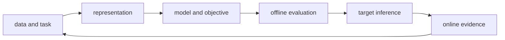
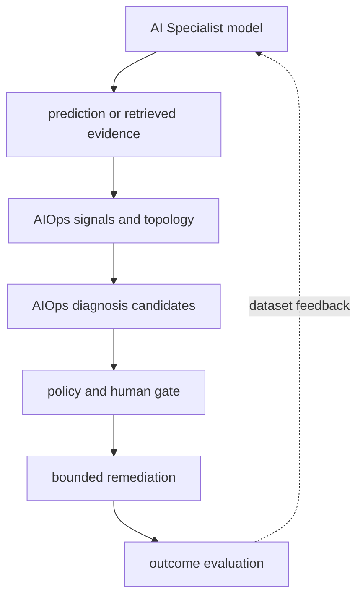

# AI Specialist 전체 모듈 로드맵

<!-- source: https://arxiv.org/abs/1706.03762 | checked: 2026-09-03 -->
<!-- source: https://modelcontextprotocol.io/specification/2025-11-25/architecture | checked: 2026-09-03 -->

AI Specialist 경로는 모델 이름을 나열하는 과정이 아니다. 입력을 표현으로 바꾸고, 관계를 학습하고, 검증 데이터에서 성능을 비교하고, 실제 target과 운영 제약 안에서 사용할 수 있는지 판단하는 하나의 반복이다. vault의 5개 모듈과 그 안의 세부 주제를 공개 학습 지도 하나로 연결한다.

## 처음 보는 사람을 위한 출발점

| 처음 만나는 말 | 학습용 쉬운 뜻 |
|---|---|
| representation | 원본 입력을 모델이 계산할 수 있는 숫자 구조로 바꾼 것 |
| objective | 모델이 줄이도록 학습하는 loss와 업무상 최적화 목표 |
| inference | 학습한 모델로 새 입력의 결과를 계산하는 과정 |
| baseline | 복잡한 모델이 실제로 이겨야 하는 단순 비교 기준 |
| retrieval | 답을 만들기 전에 외부 자료에서 후보 근거를 찾는 단계 |
| evaluation | 정답·품질·비용·안전·지연을 고정한 조건에서 측정하는 일 |

## 다섯 모듈

1. [LLM 밑바닥 구조와 효율화](#doc=ai-specialist-core-llm): token에서 attention·GPT·학습·정렬·KV cache까지 계산 경로를 잇는다.
2. [Vision과 생성 모델 계보](#doc=ai-specialist-core-vision): convolution·patch·set prediction·segmentation과 생성 분포 학습을 비교한다.
3. [On-device AI와 모델 압축](#doc=ai-specialist-core-edge): pruning·quantization·distillation을 target 성능과 함께 검증한다.
4. [시계열 예측과 추천 시스템](#doc=ai-specialist-core-forecast-recommend): 시간 순서와 사용자 관계를 보존하는 split·baseline·ranking 평가를 배운다.
5. [RAG·GraphRAG·NL2SQL과 MCP](#doc=ai-specialist-core-rag-mcp): 검색으로 근거를 찾고 구조 질의와 승인된 tool로 확장한다.

## AI Specialist 전체 내용 연결표

vault의 AI Specialist 49개 노트가 다루는 기술 항목을 모듈별 공개 장에 연결했다. 강의 슬라이드·노트북의 비공개 문장과 실행 수치는 게시하지 않으며, 공개 장의 사실은 원 논문과 공식 문서에서 다시 확인한다.

| 모듈 | 포함한 전체 세부 내용 | 공개 학습 연결 |
|---|---|---|
| LLM 밑바닥 구현 | tokenization·embedding, causal attention, GPT block·LayerNorm·GELU·residual, pretraining·cross entropy·perplexity·decoding, classification fine-tuning·LoRA, instruction tuning·DPO | [LLM 구조와 효율화](#doc=ai-specialist-core-llm) |
| LLM 효율화 | KV cache와 prefill/decode, GQA, MLA 저랭크 KV 압축, sliding-window attention, MoE sparse FFN, Gated DeltaNet과 linear-attention hybrid | [LLM 구조와 효율화](#doc=ai-specialist-core-llm), [AI 인프라·serving](#doc=ai-transformation-platform-infrastructure) |
| Vision | CNN·ResNet, ViT, DETR object detection, UNet segmentation | [Vision과 생성 모델](#doc=ai-specialist-core-vision) |
| 생성 모델 | GAN, VAE·ELBO·reparameterization, VQ-VAE discrete latent, DDPM, DALL·E image-token autoregression, Stable Diffusion latent diffusion·conditioning | [Vision과 생성 모델](#doc=ai-specialist-core-vision) |
| On-device AI | CNN pruning, PTQ·QAT quantization, knowledge distillation, LLM pruning·activation-aware sparsity, GPTQ·AWQ와 LLM quantization | [On-device 모델 압축](#doc=ai-specialist-core-edge) |
| 시계열 | 문제 정의·horizon·leakage, 고전 방법·state-space model, RNN·LSTM·encoder-decoder, 네 model과 naive baseline 비교 | [시계열과 추천](#doc=ai-specialist-core-forecast-recommend) |
| 추천 시스템 | collaborative filtering·similarity 함정, BPR pairwise ranking, NCF, NGCF·graph collaborative filtering | [시계열과 추천](#doc=ai-specialist-core-forecast-recommend) |
| RAG·검색 | embedding·BM25·dense retrieval·reranking, HNSW·DiskANN ANN, GraphRAG·knowledge-graph query, CRAG scoring·abstention | [RAG·GraphRAG·MCP](#doc=ai-specialist-core-rag-mcp) |
| 구조 질의·도구 | NL2SQL·Text2SQL, MCP의 host·client·server 책임, MCP server와 tool 설계·authorization | [RAG·GraphRAG·MCP](#doc=ai-specialist-core-rag-mcp), [Enterprise agent 운영](#doc=ai-transformation-platform-agents) |

모듈을 가로지르는 residual·attention·pairwise loss·후보 생성 후 정밀 ranking은 아래 공통 원리에서 다시 연결한다. 같은 수학적 형태가 보여도 dataset, objective와 평가 계약이 다르면 같은 보장을 갖지 않는다.

## 모듈 사이의 공통 원리

| 공통 원리 | LLM | Vision·생성 | 시계열·추천 | RAG·도구 |
|---|---|---|---|---|
| 국소·전역 관계 | attention window | convolution·patch attention | lag·seasonality | chunk·graph neighborhood |
| 잔차·skip | Transformer residual | ResNet addition·UNet concat | encoder state | retrieval fallback |
| 후보 후 정밀 계산 | token sampling | proposal·matching | candidate ranking | ANN 후 reranker |
| 압축 | GQA·quantization | pruning·distillation | 작은 baseline | index compression |
| 평가 누수 | train corpus overlap | augmentation·split | 미래 정보 | query·answer contamination |

같은 이름의 기법이라도 보장은 다르다. UNet의 concat skip과 ResNet의 addition은 목적·shape가 다르고, ANN의 recall과 답변의 사실성도 같은 metric이 아니다.

## AIOps로 이어지는 연결

시계열 모델은 metric anomaly 후보를 만들 수 있고, RAG는 runbook·change record를 찾을 수 있으며, LLM은 근거를 요약할 수 있다. 하지만 이것만으로 원인이나 실행 권한이 생기지 않는다.

[AIOps 신호와 운영 토폴로지](#doc=aiops-foundations-roadmap)가 모델 입력의 lineage를 받고, [근거 기반 장애 진단](#doc=aiops-diagnosis-roadmap)이 후보의 evidence coverage를 검증하며, [승인된 자동 복구](#doc=aiops-remediation-roadmap)가 action authority를 별도로 판정한다.

## 처음 이해했는지 확인

- 복잡한 모델이 naive baseline을 이겨야 한다는 말이 왜 모든 모듈에 적용되는가?
- offline accuracy가 좋아도 target device나 production serving에서 실패할 수 있는 이유는 무엇인가?
- retrieval 결과가 있다는 사실과 답변이 근거를 충실히 사용했다는 사실은 어떻게 다른가?
- anomaly score와 root cause confidence를 같은 값으로 쓰면 무엇이 섞이는가?

## 완료

- 다섯 모듈의 입력·모델·objective·evaluation·target을 구분했다.
- 모듈을 가로지르는 공통 패턴과 서로 다른 보장 범위를 표시했다.
- 모든 모델 산출물을 AIOps에서 근거 후보로만 다루는 경계를 정했다.
- 다음 운영 단계인 [AI Transformation](#doc=ai-transformation-platform-roadmap)으로 lineage를 넘겼다.

## 운영 판단으로 확장하기

학습이 끝난 모델 파일 하나는 배포 단위가 아니다. tokenizer·preprocessor·feature schema·retrieval index·runtime·precision·evaluation suite와 함께 묶여야 한다. AI Transformation 경로에서는 이 조합을 versioned artifact와 gate로 만들고, AIOps 경로에서는 실제 사용자 결과와 incident evidence로 되돌린다.
