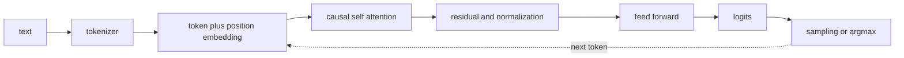

# LLM 밑바닥 구조와 효율화

<!-- source: https://arxiv.org/abs/1706.03762 | checked: 2026-09-03 -->
<!-- source: https://arxiv.org/abs/2106.09685 | checked: 2026-09-03 -->
<!-- source: https://arxiv.org/abs/2305.18290 | checked: 2026-09-03 -->

LLM을 운영하려면 prompt API보다 먼저 한 token이 어떤 계산을 거쳐 다음 token 분포가 되는지 알아야 한다. tokenization, embedding, causal attention, residual block, 학습 objective와 decoding을 연결하면 context 길이·KV cache·batching·fine-tuning 선택이 왜 비용과 품질을 바꾸는지 설명할 수 있다.

## 이 장에서 처음 쓰는 말

| 말 | 이 장에서의 뜻 |
|---|---|
| token | tokenizer가 문자열을 모델 vocabulary의 정수 단위로 나눈 값 |
| embedding | token ID를 학습 가능한 vector로 바꾼 표현 |
| causal mask | 현재 위치가 미래 token을 보지 못하게 하는 제한 |
| attention | query와 key 관계로 value를 가중 합하는 계산 |
| prefill / decode | 입력 token을 한꺼번에 처리하는 단계 / 다음 token을 순차 생성하는 단계 |
| KV cache | 이미 계산한 과거 key·value를 decode 동안 재사용하는 memory |

1. token ID에서 logit까지 tensor shape를 손으로 따라간다.
2. 품질 지표와 memory·latency·throughput의 trade-off를 분리해 측정한다.

## 먼저 이해하기

Transformer는 recurrence 없이 attention과 feed-forward block을 쌓는다. decoder-only LLM은 causal mask 아래에서 다음 token을 예측한다. attention score는 query와 key의 scaled dot product에 softmax를 적용하고 value를 섞는다. 이 구조는 token 사이 관계를 직접 계산하지만 sequence 길이가 커질수록 계산·memory 부담이 증가한다.



## 학습 단계의 계약

| 단계 | 핵심 입력 | objective | 놓치기 쉬운 검증 |
|---|---|---|---|
| pretraining | 대규모 token sequence | next-token loss | train·eval contamination |
| classification fine-tuning | label dataset | class loss | imbalance·calibration |
| instruction tuning | instruction-response | response token loss | template·mask 정확성 |
| LoRA | frozen base + low-rank adapter | task loss | base·adapter 호환성 |
| preference optimization | chosen·rejected pair | 상대 선호 loss | annotator·judge bias |

LoRA는 base weight를 모두 갱신하는 대신 낮은 rank의 update를 학습하는 방식이다. adapter가 작아도 어느 base model·tokenizer·prompt template에서 학습했는지 빠지면 재현할 수 없다. preference loss가 좋아졌다는 사실도 factuality·safety와 동일하지 않다.

```yaml
model_bundle:
  baseModel: model-x@sha256-example
  tokenizer: tokenizer-x@rev-12
  adapter: support-lora@run-418
  promptTemplate: support-chat@v7
  precision: bf16
  maxContextTokens: 8192
  evalSuite: support-golden@2026-09-03
```

## 추론 비용의 두 단계

prefill은 입력 sequence를 병렬로 처리하고, decode는 token을 하나씩 생성한다. decode에서 과거 token의 key·value를 매번 다시 계산하지 않도록 KV cache를 사용한다. 그래서 동시 요청 수, context와 output 길이가 GPU memory를 함께 소비한다.

| 손잡이 | 얻는 것 | 잃을 수 있는 것 | 확인할 지표 |
|---|---|---|---|
| 더 큰 batch | throughput | queue delay·tail latency | TTFT, tokens/s, p99 |
| KV cache 압축·GQA | memory 절약 | 품질·kernel 제약 | max concurrency, task eval |
| sliding window | 긴 입력 비용 제한 | 먼 문맥 정보 | long-context eval |
| quantization | memory·속도 | task별 정확도 | target latency·quality |
| MoE | token당 일부 expert 계산 | routing·통신 복잡성 | load balance·all-to-all |
| speculative decode | 빠른 생성 후보 | draft mismatch 비용 | acceptance·TPOT |

특정 논문의 배수 개선을 그대로 capacity 값으로 쓰지 않는다. prompt 길이 분포, output length, hardware, runtime version과 scheduler가 달라지면 결과도 달라진다. [AI 인프라와 LLM 서빙](#doc=ai-transformation-platform-infrastructure)에서 bundle을 실제 serving SLO로 검증한다.

## 평가의 최소 단위

```json
{
  "runId": "llm-eval-418",
  "bundle": "support-model-bundle-v7",
  "dataset": "support-golden-20260903",
  "metrics": {
    "taskPassRatio": 0.87,
    "citationSupportRatio": 0.91,
    "unsafeActionProposalRatio": 0.002,
    "p95TtftMs": 640,
    "p95TpotMs": 34
  },
  "comparison": "support-model-bundle-v6"
}
```

perplexity, task accuracy, preference와 LLM judge는 서로 다른 질문에 답한다. 운영 모델은 latency·cost·abstention·안전 action까지 함께 gate한다. incident 진단에 쓰는 경우 [AIOps 근거 기반 진단](#doc=aiops-diagnosis-pipeline)의 evidence citation과 false-cause 비용을 추가한다.

## 완료

- tokenization에서 decoding까지 계산 경로를 연결했다.
- pretraining·fine-tuning·preference objective를 구분했다.
- prefill·decode와 KV cache가 capacity에 미치는 영향을 설명했다.
- 모델을 tokenizer·adapter·template·runtime·eval과 bundle로 기록했다.

## 스스로 설명해 보기

- causal mask가 없으면 next-token 학습에서 어떤 정보 누수가 생기는가?
- KV cache가 compute를 줄이면서 memory 상한을 만드는 이유는 무엇인가?
- LoRA adapter만 배포 파일로 보관하면 재현성이 깨지는 이유는 무엇인가?
- offline judge 점수와 production action safety를 같은 metric으로 볼 수 없는 이유는 무엇인가?
