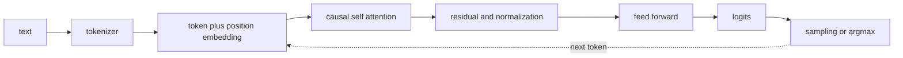

# LLM underlying structure and efficiency

<!-- source: https://arxiv.org/abs/1706.03762 | checked: 2026-09-03 -->
<!-- source: https://arxiv.org/abs/2106.09685 | checked: 2026-09-03 -->
<!-- source: https://arxiv.org/abs/2305.18290 | checked: 2026-09-03 -->

In order to operate LLM, you need to know what calculations are made for one token before using the prompt API to determine the distribution of the next token. By connecting tokenization, embedding, causal attention, residual block, learning objective, and decoding, it is possible to explain why the choice of context length, KV cache, batching, and fine-tuning changes cost and quality.

## Terms introduced in this chapter

| word | Meaning in this chapter |
|---|---|
| token | The tokenizer divides the string into integer units of the model vocabulary. |
| embedding | Expression of token ID converted into learnable vector |
| causal mask | Restrictions that prevent current location from seeing future tokens |
| attention | Calculation of weighted sum of values ​​based on query and key relationship |
| prefill / decode | Step of processing input tokens all at once / Step of sequentially generating the next token |
| KV cache | Memory that reuses already calculated past key·values ​​during decoding |

1. Follow the tensor shape by hand from token ID to logit.
2. Quality indicators and trade-offs of memory, latency, and throughput are measured separately.

## Understand the model first

Transformer stacks attention and feed-forward blocks without recurrence. decoder-only LLM predicts the next token under the causal mask. The attention score applies softmax to the scaled dot product of the query and key and mixes the values. This structure directly calculates the relationship between tokens, but as the sequence length increases, the computational and memory burden increases.



## Contract in the learning phase

| step | key input | objective | Verification that is easy to miss |
|---|---|---|---|
| pretraining | large-scale token sequence | next-token loss | train·eval contamination |
| classification fine-tuning | label dataset | class loss | imbalance·calibration |
| instruction tuning | instruction-response | response token loss | template·mask accuracy |
| LoRA | frozen base + low-rank adapter | task loss | base·adapter compatibility |
| preference optimization | chosen·rejected pair | relative preference loss | annotator·judge bias |

LoRA is a method of learning low rank updates instead of updating all base weights. Even if the adapter is small, it cannot be reproduced unless you forget which base model·tokenizer·prompt template it learned from. The fact that preference loss has improved is not the same as factuality and safety.

```yaml
model_bundle:
  baseModel: model-x@sha256-example
  tokenizer: tokenizer-x@rev-12
  adapter: support-lora@run-418
  promptTemplate: support-chat@v7
  precision: bf16
  maxContextTokens: 8192
  evalSuite: support-golden@2026-09-03
```

## Two levels of inference cost

Prefill processes the input sequence in parallel, and decode generates tokens one by one. In decode, KV cache is used to avoid recalculating the key·value of past tokens every time. Therefore, the number of concurrent requests, context, and output length consume GPU memory together.

| knob | What you get | what you can lose | Metrics to check |
|---|---|---|---|
| larger batch | throughput | queue delay·tail latency | TTFT, tokens/s, p99 |
| KV cache compression/GQA | save memory | Quality/kernel constraints | max concurrency, task eval |
| sliding window | Long input cost limit | Distant context information | long-context eval |
| quantization | memory·speed | Accuracy by task | target latency·quality |
| MoE | Calculate some experts per token | routing·communication complexity | load balance·all-to-all |
| speculative decode | Quick Generate Candidates | draft mismatch cost | acceptance·TPOT |

Do not use the multiple improvement of a specific paper as a capacity value. If the prompt length distribution, output length, hardware, runtime version, and scheduler change, the results will also vary. [AI infrastructure and LLM serving](#doc=ai-transformation-platform-infrastructure) verifies the bundle with actual serving SLO.

## Minimum unit of evaluation

```json
{
  "runId": "llm-eval-418",
  "bundle": "support-model-bundle-v7",
  "dataset": "support-golden-20260903",
  "metrics": {
    "taskPassRatio": 0.87,
    "citationSupportRatio": 0.91,
    "unsafeActionProposalRatio": 0.002,
    "p95TtftMs": 640,
    "p95TpotMs": 34
  },
  "comparison": "support-model-bundle-v6"
}
```

Perplexity, task accuracy, preference and LLM judge answer different questions. The operating model gates latency, cost, abstention, and safety actions together. When used for incident diagnosis, the evidence citation and false-cause costs of [AIOps evidence-based diagnosis](#doc=aiops-diagnosis-pipeline) are added.

## Completion criteria

- We connected the computational path from tokenization to decoding.
- Pretraining·fine-tuning·preference objectives were distinguished.
- The effects of prefill·decode and KV cache on capacity were explained.
- The model was recorded as tokenizer·adapter·template·runtime·eval and bundle.

## Explain it in your own words

- What information leakage occurs in next-token learning without a causal mask?
- Why does the KV cache create a memory cap while reducing compute?
- Why is reproducibility broken if only the LoRA adapter is saved as a deployment file?
- Why can’t offline judge scores and production action safety be viewed as the same metric?
