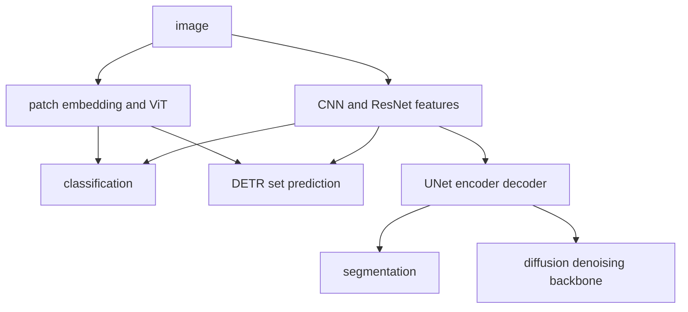

# Vision and generative model lineage

<!-- source: https://arxiv.org/abs/1512.03385 | checked: 2026-09-03 -->
<!-- source: https://arxiv.org/abs/2010.11929 | checked: 2026-09-03 -->
<!-- source: https://arxiv.org/abs/2006.11239 | checked: 2026-09-03 -->

The vision model chooses how to preserve the local structure of pixels and how to combine global relationships. Instead of directly classifying observation data, generative models learn the distribution or inverse process from which the data comes. The two genealogies meet in UNet, attention and latent representation, but the objective and evaluation method must be distinguished.

## Terms introduced in this chapter

| word | Meaning in this chapter |
|---|---|
| convolution | An operation to find local patterns by sharing a small kernel throughout the space. |
| residual | Connections that help the learning path of a deep network by adding input to the transformation result. |
| patch embedding | An expression that divides an image into patches and changes it like a token sequence. |
| detection | The problem of predicting the class and location set of an object |
| segmentation | Problem predicting the class of each pixel or area |
| latent | Internal representation more compressed than observed data |

1. Starting from the output structure of the task, it is divided into classification·detection·segmentation·generation.
2. Verify whether it is better than the baseline in the dataset split and target environment.

## Understand the model first

CNN incorporates locality and translation-related structures into its architecture. ResNet helps optimize deep networks with residual connections. ViT creates images as patch tokens and puts them into a transformer encoder. As the inductive bias of convolution is reduced, it can be more sensitive to dataset and pretraining conditions.



## Contract of discrimination task

| task | output | representative evaluation | What to add in operations |
|---|---|---|---|
| classification | class probability | accuracy·F1·calibration | Cost/abstention by class |
| detection | Set of boxes and classes | mAP | Whether small object·latency·NMS |
| segmentation | pixel mask | IoU·Dice | Boundary/sparse class/memory |
| embedding | vector | retrieval recall | drift·index version |

The DETR series learns prediction sets using object queries and bipartite matching. Implementation numbers like `100 queries` are not universal contracts. It must be verified according to the scene's object density, learning schedule, and backbone. UNet's skip transfers encoder features to the decoder, but the combining method and purpose are not the same as ResNet residual.

```yaml
vision_bundle:
  task: defect-segmentation
  model: unet-vit-hybrid@run-88
  preprocessing: camera-calibration@v4
  input:
    width: 1024
    height: 768
    colorSpace: rgb
  labels: defect-taxonomy@v9
  target: edge-gpu-a@runtime-12
  evaluation: defect-suite@20260903
```

## Different problem settings for generative models

| line | Key Learning Ideas | latent form | Key Failure/Evaluation Questions |
|---|---|---|---|
| GAN | Competition between generator and discriminator | continuous noise | mode collapse·learning instability |
| VAE | Likelihood lower bound and reparameterization | continuous random variables | reconstruction·latent regularity |
| VQ-VAE | Discrete latent in codebook | Discrete token | Codebook usage/commitment |
| autoregressive image token | Predict next token with previous token | Discrete sequence | Long producing cost·ordering |
| diffusion | Reverse process denoising after adding noise | pixel or latent | sampling step·conditioning·fidelity |

DDPM learns the reverse process from data mixed with noise step by step. Stable Diffusion type latent diffusion reduces costs by denoising a latent that is more compressed than the pixel space and combines text conditioning. A single distribution metric like FID does not guarantee prompt fidelity, safety, and individual image accuracy.

## Data and Rating Leaks

1. Group split so that frames and crops cut from the same original are not mixed between train and test.
2. Verify that camera, site, time and device changes are represented in the test.
3. Preserve label guidelines and annotator disagreement.
4. Check whether the augmentation reflects actual invariance.
5. It records results by class, environment, and confidence sections as well as overall metrics.
6. After model update, preprocessing, calibration, and runtime are deployed to the same bundle.

Edge deployment connects to [On-device AI and model compression](#doc=ai-specialist-core-edge), and GPU serving connects to [AI Transformation infrastructure](#doc=ai-transformation-platform-infrastructure). When using an operational video anomaly as an AIOps signal, detection confidence is not the probability of the incident cause, and the model·camera·time ID is left in the [AIOps signal contract](#doc=aiops-foundations-evidence-graph).

## Completion criteria

- The output contracts of classification·detection·segmentation·generation were divided.
- The structural choices of CNN·ResNet·ViT·DETR·UNet were connected.
- We summarized the objective differences between GAN·VAE·VQ-VAE·autoregressive·diffusion.
- Dataset split, preprocessing and target runtime were included in the model bundle.

## Explain it in your own words

- How does converting image patches into tokens change ViT's inductive bias compared with convolution?
- What are we missing if we just call ResNet residual and UNet skip the same connection?
- Even if the FID of the generated image is good, why may it not pass the actual product gate?
- What downstream choices do continuous latent and discrete codebook each change?
