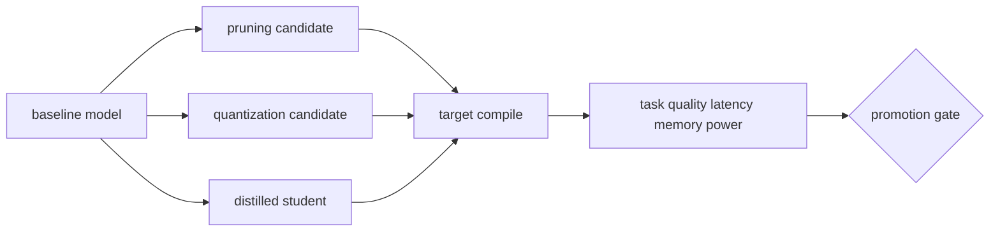

# On-device AI and model compression

<!-- source: https://docs.pytorch.org/tutorials/intermediate/pruning_tutorial.html | checked: 2026-09-03 -->
<!-- source: https://docs.pytorch.org/tutorials/recipes/quantization.html | checked: 2026-09-03 -->
<!-- source: https://docs.pytorch.org/tutorials/beginner/knowledge_distillation_tutorial.html | checked: 2026-09-03 -->

The purpose of model compression is not to reduce the number of parameters, but to simultaneously satisfy quality, delay, memory, power, and thermal conditions on the selected device. Pruning, quantization, and distillation change different things, and reducing the file size does not mean that the actual kernel becomes faster.

## Terms introduced in this chapter

| word | Meaning in this chapter | Why it matters / when to use it |
|---|---|---|
| pruning | How to increase sparsity by removing some of the weight·channel·block or setting it to 0 | Explore smaller models by removing low-value components, then measure accuracy and actual runtime gains. |
| quantization | How to approximate real numbers with lower bit integer/floating point representations | Reduce model storage and arithmetic cost when the target runtime supports lower precision adequately. |
| distillation | How to use the output/feature of a large teacher as a learning signal for a small student | Transfer useful teacher behavior to a smaller model when serving the teacher is too costly. |
| calibration | The process of adjusting the quantization range or confidence from representative data | Choose quantization ranges or assess confidence using representative data before deployment. |
| structured sparsity | Scarcity of units that are easy for hardware to use, such as channel·block | Align removed model structure with patterns the target hardware can accelerate. |
| target artifact | A bundle of deployments with fixed runtime·precision·operator·device conditions as well as model | Reproduce deployment behavior by fixing the model together with its execution environment. |

1. The accuracy baseline and target hardware measurement method are first fixed.
2. Promotion is determined based on end-to-end task and device results, not compression ratio.

## Understand the model first

Unstructured pruning can increase parameter sparsity by setting individual weights to 0, but if there is no sparse kernel in the target runtime, dense calculation time may remain the same. Structured pruning is easy to change the shape itself by reducing channels, heads, and blocks, but the quality loss may be greater.



## Distinguish between three techniques

| techniques | change | data needed | main verification |
|---|---|---|---|
| magnitude pruning | Remove small weight | Select fine-tuning | Real sparse speedup and quality |
| activation-aware pruning | Weight and activation importance | calibration sample | Distribution shift sensitivity |
| PTQ | Determine range and scale after learning | calibration set | outlier·operator support |
| QAT | fake quantization during learning | training data | target conversion match |
| distillation | student objective | teacher output·label | Teacher error transfer/student gain |

PyTorch official materials also treat pruning, various quantization workflows, and distillation as separate processes. We do not use the accuracy/speed multiplier of a specific tutorial as a general guarantee. If the architecture, backend, device, and dataset change, the results will change.

## Basic contract of quantization

When moving the real number `r` to the integer `q`, mappings such as scale and zero point are used. The important thing is not to memorize the formula, but to keep track of which range was used for which tensor·channel and where saturation occurs.

```yaml
edge_bundle:
  model: defect-detector@run-91
  graph: onnx@opset-20
  precision: int8
  calibrationDataset: line-a-camera@20260903
  runtime: tensorrt@target-profile-12
  device: edge-gpu-a
  inputContract: rgb-1024x768-v4
  fallback: fp16-bundle-88
```

LLM may show different sensitivity than CNN due to activation outliers, KV cache, and unsupported operators. Weight-only quantization, activation quantization, prefill, and decode are measured separately.

## target gate

| measurement | Compare to baseline | Questions in case of failure |
|---|---|---|
| task quality | degradation by class·scenario | Does it only break down in certain rare cases? |
| p50·p99 latency | cold·warm, by batch | Is compile·memory copy included? |
| peak memory | model + activation + workspace | Is OOM in concurrent requests? |
| power·temperature | sustained workload | Does latency change after throttle? |
| artifact size·load | OTAs and startups | Are transfer success and load success the same? |
| fallback | Same input contract | Is there a safe transition after a runtime failure? |

```json
{
  "candidate": "defect-detector-int8-91",
  "baseline": "defect-detector-fp16-88",
  "target": "edge-gpu-a",
  "result": {
    "macroF1Delta": -0.006,
    "rareDefectRecallDelta": -0.031,
    "p99LatencyMs": 24,
    "peakMemoryMiB": 812,
    "thermalThrottleObserved": false
  },
  "decision": "blocked-rare-defect-recall"
}
```

Even if the average quality and latency are good, you will not be promoted if you do not exceed the important rare defect recall gate. Instead of uploading only the model artifact to the registry, connect the compiler·runtime·device·calibration dataset and receipt.

## operational connection

1. Input schema and preprocessing are received from the bundle of [Vision and generation model ](#doc=ai-specialist-core-vision).
2. GPU·runtime capacity is connected to [AI infrastructure and LLM serving](#doc=ai-transformation-platform-infrastructure).
3. Artifact promotion and rollback are managed in [MLOps·LLMOps lifecycle](#doc=ai-transformation-platform-mlops).
4. device temperature·OOM·fallback is left in [AIOps signal and topology](#doc=aiops-foundations-evidence-graph).
5. Automatic rollback follows the blast radius and outcome gate of [approved automatic recovery](#doc=aiops-remediation-state-machine).

## Completion criteria

- The objects changed by pruning·quantization·distillation were distinguished.
- Separate parameter·file size and actual target speedup.
- Calibration·runtime·device was added to the model bundle.
- Quality, delay, memory, power, and fallback were made into promotion gates.

## Explain it in your own words

- Why may latency not decrease even if the ratio of weights to 0 is high?
- What quantization errors occur if the calibration dataset is not representative of the production distribution?
- How do we measure the likelihood that a student will learn an example that the teacher got wrong?
- Why is rollback of a target artifact broader than rolling back a single model file?
