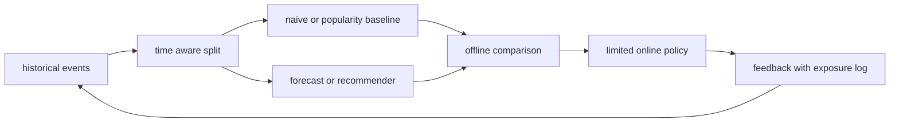

# Time series prediction and recommendation system

<!-- source: https://arxiv.org/abs/1705.09477 | checked: 2026-09-03 -->
<!-- source: https://arxiv.org/abs/1205.2618 | checked: 2026-09-03 -->
<!-- source: https://arxiv.org/abs/1708.05031 | checked: 2026-09-03 -->

Time series predict the future and recommendations rank the next candidate for the user. Even though the tasks are different, it is easy to mistake unobserved values ​​for both as 0, and if the split·baseline·feedback loop is designed incorrectly, the offline score can deceive actual decision making.

## Terms introduced in this chapter

| word | Meaning in this chapter | Why it matters / when to use it |
|---|---|---|
| horizon | The length that determines how far into the future to predict from the present point of time | Match forecast evaluation to how far ahead the business must make a decision. **Concrete situation (illustrative):** Inventory decisions require a week of advance notice. → Evaluate forecasts at that horizon. → Compare errors against a decision-relevant baseline. |
| leakage | Error using future information that is unknown at the time of prediction for learning and evaluation | Detect unavailable future information that would make offline performance misleading. **Concrete situation (illustrative):** A forecast feature contains sales finalized after prediction time. → Enforce timestamp-correct feature availability. → Re-run evaluation without future information. |
| naive baseline | A simple but always compared standard like the previous value/seasonal value | Require a complex forecaster to beat a simple seasonal or recent-value reference. **Concrete situation (illustrative):** A complex forecast claims improvement without a simple comparator. → Add last-value and relevant seasonal baselines. → Compare them on the same held-out periods. |
| implicit feedback | Actions that may be preferred, such as clicks or views, but do not directly state the non-preference | Learn from behavioral observations when explicit ratings are scarce, accounting for exposure bias. **Concrete situation (illustrative):** A recommender has clicks but no explicit ratings. → Model the behavioral feedback and exposure conditions. → Check whether unshown items are being treated as dislikes. |
| negative sampling | Selecting unobserved items as comparison negatives, without claiming they are confirmed dislikes | Make recommendation training tractable by sampling comparison items with an explicit bias policy. **Concrete situation (illustrative):** Training cannot compare every item for every user. → Sample comparison negatives under a documented policy. → Evaluate how sampling changes ranking quality and bias. |
| ranking metric | Indicators such as Recall and NDCG that measure the quality of the top-K order | Evaluate whether relevant items appear near the top where users will encounter them. **Concrete situation (illustrative):** Relevant products exist in results but appear below the visible list. → Measure top-ranked relevance with an appropriate ranking metric. → Compare at the displayed cutoff. |

1. Fix the prediction timing and actual information to be used.
2. Compare simple baseline and policy costs together.

## Understand the model first

A random split can allow future records to be fed into training, or future actions of the same user to be mixed into past predictions. For time series, chronological rolling evaluation is designed, and for recommendations, a split is designed that reflects user/item cold-start and serving candidate conditions.



## Time series problem contract

| item | question | example |
|---|---|---|
| target | What to predict | Request rate after 15 minutes |
| horizon | how far in the future | 1, 4, 12 step |
| cadence | Is the input interval constant? | 5 minute bucket |
| known future | Is this a feature known at the time of prediction? | Reserved deploy·holidays |
| missing | Distinguish between 0 and uncollected? | collector outage flag |
| baseline | what to win | seasonal naive |
| decision | What changes predictions | pre-scale proposal |

When comparing ARIMA·state space model, RNN·LSTM, and encoder-decoder, the same split, horizon, and scaling are used. Complexity is not adopted when a more complex model cannot beat the naive one. View average error as well as peak underprediction, calibration and action cost.

```json
{
  "forecastRun": "traffic-forecast-204",
  "cutoff": "2026-09-03T00:00:00Z",
  "horizonMinutes": 60,
  "baseline": "seasonal-naive-7d",
  "candidate": "encoder-decoder-v8",
  "metrics": {
    "maeBaseline": 18.2,
    "maeCandidate": 17.9,
    "peakUnderpredictionP95": 42.0
  },
  "decision": "observe-only"
}
```

Even if the MAE is slightly good, it can be dangerous for capacity action if the peak is set significantly low. [In AIOps diagnosis](#doc=aiops-diagnosis-pipeline), the forecast residual is an anomaly candidate and not a root cause.

## Recommendation task contract

Collaborative filtering finds relationships in user/item interactions. Items that are not clicked on in implicit feedback do not mean that you dislike them, but may not have been exposed. BPR learns pairwise ranking so that observed items have higher scores than sampled unobserved items. NCF utilizes nonlinear interaction, and graph collaborative filtering utilizes neighbor propagation in the user-item graph.

| step | data | assessment risk |
|---|---|---|
| candidate generation | ANN·Popular·graph Neighborhood | Recall ceiling where the correct item is not a candidate |
| ranking | user·item·context feature | future·post-click leakage |
| policy | Diversity, Safety, Inventory | Conflict between model score and work constraints |
| serving | exposure and position | Only what is seen is returned as feedback |
| retraining | click·purchase | Re-learn existing policy bias |

```yaml
recommendation_receipt:
  dataset: interactions@20260903
  split: chronological-per-user
  candidateGenerator: ann-v12
  ranker: graph-ranker-v7
  policy: diversity-stock-safety-v4
  metrics:
    recallAt20: 0.42
    ndcgAt10: 0.27
    coldUserCoverage: 0.91
  exposureLogging: required
```

## operational connection

Use one global evaluation cutoff as well as per-user ordering. A model fitted on another user's future interactions can leak future item popularity into a supposedly historical prediction. Fit scalers, imputers, vocabularies, and feature aggregates only on the training side; require each feature's availability time to be at or before the prediction time. For ranking, report the candidate universe and negative-sampling scheme beside Recall/NDCG. A score measured against 100 sampled negatives is not directly comparable with full-catalog ranking.

1. The schema, time, and duplicate processing of feature events are connected to [Messaging and Event](#doc=messaging-roadmap).
2. Online feature cache and hot keys are reviewed in [Redis and DynamoDB](#doc=nosql-roadmap).
3. The dataset·run·model·policy lineage is left in [MLOps·LLMOps](#doc=ai-transformation-platform-mlops).
4. The drift alert is entered into the [AIOps signal contract ](#doc=aiops-foundations-contract-lab) along with the user/segment results.
5. Forecast-based scaling goes through precondition and abort of [AIOps recovery state machine ](#doc=aiops-remediation-state-machine) before automatic execution.

## Completion criteria

- We defined a split and naive baseline without time leakage.
- We linked the time series error to the actual capacity action cost.
- In implicit feedback, unobserved and unfavorable were distinguished.
- Candidate·ranking·policy·exposure feedback was recorded in one path.

## Explain it in your own words

- Why can random splits in time series leak future information?
- Why might we not approve automatic pre-scaling even though MAE has improved?
- What kind of bias arises if all unclicked items are viewed as negative?
- What are we missing if we equate the recommended model score with the final policy result?
