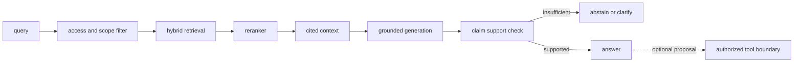

# RAG·GraphRAG·NL2SQL and MCP

<!-- source: https://arxiv.org/abs/2005.11401 | checked: 2026-09-03 -->
<!-- source: https://arxiv.org/abs/1603.09320 | checked: 2026-09-03 -->
<!-- source: https://modelcontextprotocol.io/specification/2025-11-25/architecture | checked: 2026-09-03 -->

RAG is not a technology that adds a lot of documents to the LLM, but a search system that finds candidates for evidence needed for a question and evaluates whether the answer used that evidence. GraphRAG and NL2SQL expand to relational and aggregate queries, and MCP connects data and tools, but evidence and execution authority must be separated until the end.

## Terms introduced in this chapter

| word | Meaning in this chapter |
|---|---|
| chunk | Units and metadata that divide the source for search |
| embedding | Vector expression for calculating semantic proximity |
| ANN | Search to quickly find close candidates without comparing all vectors exactly. |
| reranker | Steps to reorder the fast candidate set to a more expensive model |
| grounding | The nature of the argument in the answer that is actually supported by the evidence provided |
| tool | A boundary that is an external function that model can propose to call and requires separate permissions. |

1. Create corpus·query·relevance and abstention standards before answer.
2. Separate retrieval failure, generation failure, and action authorization.

## Understand the model first

RAG failures are due to lack of appropriate source in the corpus, incorrect chunking, retriever missing, reranker messing up the order, and generator ignoring evidence. If you only evaluate the final answer, you won't know which step needs to be corrected.



## Search Layer

| hierarchy | What you're good at | failure border | evaluation |
|---|---|---|---|
| keyword·BM25 | Proper nouns/precise terms | Search for meaning with different expressions | Recall@K |
| dense retrieval | sentences with similar meaning | Number, negation, new entity | Recall@K·slice |
| HNSW·DiskANN series | Large-scale vector candidates | approximation·filter interaction | latency·recall |
| reranker | query-document precise relationship | Documents outside of top-K cannot be recovered | NDCG·MRR |
| graph traversal | Relationship/multi-level path | extraction error edge stale | path support |
| SQL | Aggregation/filter/accurate schema query | schema linking·authority·cost | execution accuracy·safety |

HNSW searches the proximity graph to find ANN candidates. Index parameters and filters change recall·memory·latency. Instead of using the paper's benchmark value as the production SLO, it is remeasured based on corpus size, hardware, and query distribution.

```json
{
  "queryId": "inc-204-why-checkout-slow",
  "corpusRevision": "runbooks-changes@20260903",
  "accessScope": ["service:checkout", "env:prod"],
  "retrieval": {
    "keywordK": 20,
    "denseK": 20,
    "rerankK": 5
  },
  "citations": ["runbook:checkout-timeout@8", "change:deploy-v18"],
  "answerMode": "evidence-only"
}
```

## GraphRAG and NL2SQL

Just by searching the document, you can ask, “Which deploy changed this service and what are the other services that use the same DB?” It is difficult to reliably solve the same relationship query. Graph specifies entity·edge and provenance, and SQL aggregates it in a structured table. Queries generated by LLM are not immediately executed with wide production privileges.

| vaginal | suitable route | necessary guard |
|---|---|---|
| Find the description of a runbook | hybrid document retrieval | source ACL·citation |
| service dependency path | typed graph query | edge provenance·freshness |
| Counting the number of errors in the last hour | read-only SQL | allowlisted schema·cost·row limit |
| Change settings | tool operation | plan·approval·policy·receipt |

## MCP’s three principals and trust boundaries

MCP architecture divides host, client and server roles. Even if the server exposes a resource·prompt·tool, it does not mean that the host should automatically allow user data and actions. The tool description is viewed as untrusted capability metadata and the actual input schema, target, credential audience, and authorization are verified.

```yaml
tool_proposal:
  server: ops-tools.example.test
  tool: restart_workload
  arguments:
    cluster: production-apne2
    namespace: shop
    workload: checkout-canary
  evidenceRefs:
    - incident:inc-204
    - runbook:restart-checkout@8
  requestedScopes:
    - workload.restart:shop/checkout-canary
  mode: plan-only
```

RAG citation is not action permission. [Enterprise AI and secure agent execution](#doc=ai-transformation-platform-agents) connect workload identity·sandbox·durable operation, and [AIOps automatic recovery](#doc=aiops-remediation-dry-run-lab) performs plan review without actual changes.

## evaluation matrix

1. Put answerable and unanswerable queries together.
2. Fix corpus revision and source ACL.
3. Measure retrieval recall and final claim support separately.
4. Preserves row and edge provenance cited by graph and SQL queries.
5. Tests whether prompt injection expands the tool argument and scope.
6. The tool includes plan-only, deny, timeout and result-unknown scenarios.
7. Production feedback leaves incorrect answers and incorrect action proposals as separate labels.

## Completion criteria

- RAG failure was divided into corpus·retrieval·rerank·generation stages.
- Suitable problems for vector, graph, and SQL queries were distinguished.
- Citation evidence and tool authorization were separated.
- Linked query·corpus·index·model·tool receipt.

## Explain it in your own words

- Why can the answer be wrong even if the retrieval Recall@K is high?
- Why do I need to measure ANN recall again when adding metadata filters?
- What kind of provenance is needed for a GraphRAG edge to become evidence?
- Why doesn't the fact that I searched and found the runbook give me permission to run it?
