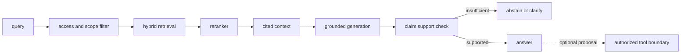

# RAG·GraphRAG·NL2SQL과 MCP

<!-- source: https://arxiv.org/abs/2005.11401 | checked: 2026-09-03 -->
<!-- source: https://arxiv.org/abs/1603.09320 | checked: 2026-09-03 -->
<!-- source: https://modelcontextprotocol.io/specification/2025-11-25/architecture | checked: 2026-09-03 -->

RAG는 LLM에 문서를 많이 붙이는 기술이 아니라 질문에 필요한 근거 후보를 찾고, 답변이 그 근거를 사용했는지 평가하는 검색 시스템이다. GraphRAG와 NL2SQL은 관계·집계 질의로 확장하고, MCP는 data와 tool을 연결하지만 근거와 실행 권한은 끝까지 분리해야 한다.

## 이 장에서 처음 쓰는 말

| 말 | 이 장에서의 뜻 |
|---|---|
| chunk | 검색할 수 있도록 source를 나눈 단위와 metadata |
| embedding | 의미상 가까움을 계산하기 위한 vector 표현 |
| ANN | 모든 vector를 정확히 비교하지 않고 가까운 후보를 빠르게 찾는 검색 |
| reranker | 빠른 후보 집합을 더 비싼 모델로 다시 정렬하는 단계 |
| grounding | 답변의 주장이 제공한 근거로 실제 지지되는 성질 |
| tool | model이 호출을 제안할 수 있는 외부 기능이며 별도 권한이 필요한 경계 |

1. answer보다 corpus·query·relevance와 abstention 기준을 먼저 만든다.
2. retrieval 실패, generation 실패와 action authorization을 분리한다.

## 먼저 이해하기

RAG의 실패는 적절한 source가 corpus에 없음, 잘못 chunking됨, retriever가 놓침, reranker가 순서를 망침, generator가 근거를 무시함으로 나뉜다. 최종 답 하나만 평가하면 어느 단계를 고쳐야 할지 알 수 없다.



## 검색 계층

| 계층 | 잘하는 것 | 실패 경계 | 평가 |
|---|---|---|---|
| keyword·BM25 | 고유 명사·정확 용어 | 표현이 다른 의미 검색 | Recall@K |
| dense retrieval | 의미가 비슷한 문장 | 숫자·부정·새 entity | Recall@K·slice |
| HNSW·DiskANN 계열 | 대규모 vector 후보 | approximation·filter 상호작용 | latency·recall |
| reranker | query-document 정밀 관계 | top-K 밖 문서 복구 불가 | NDCG·MRR |
| graph traversal | 관계·다단계 경로 | extraction 오류·edge stale | path support |
| SQL | 집계·필터·정확 schema 질의 | schema linking·권한·비용 | execution accuracy·safety |

HNSW는 proximity graph를 탐색해 ANN 후보를 찾는다. index parameter와 filter가 recall·memory·latency를 바꾼다. 논문 benchmark 값을 그대로 production SLO로 쓰지 않고 corpus 규모, hardware와 query distribution에서 다시 잰다.

```json
{
  "queryId": "inc-204-why-checkout-slow",
  "corpusRevision": "runbooks-changes@20260903",
  "accessScope": ["service:checkout", "env:prod"],
  "retrieval": {
    "keywordK": 20,
    "denseK": 20,
    "rerankK": 5
  },
  "citations": ["runbook:checkout-timeout@8", "change:deploy-v18"],
  "answerMode": "evidence-only"
}
```

## GraphRAG와 NL2SQL

문서 검색만으로 “어느 deploy가 이 service를 바꿨고 같은 DB를 쓰는 다른 service는 무엇인가?” 같은 관계 질의를 안정적으로 풀기 어렵다. graph는 entity·edge와 provenance를 명시하고, SQL은 구조화된 table에서 집계한다. LLM이 생성한 query를 곧바로 넓은 production 권한으로 실행하지 않는다.

| 질의 | 적합한 경로 | 필요한 guard |
|---|---|---|
| runbook의 설명 찾기 | hybrid document retrieval | source ACL·citation |
| service dependency 경로 | typed graph query | edge provenance·freshness |
| 지난 1시간 오류 수 집계 | read-only SQL | allowlisted schema·cost·row limit |
| 설정 변경 | tool operation | plan·approval·policy·receipt |

## MCP의 세 주체와 신뢰 경계

MCP architecture는 host, client와 server 역할을 나눈다. server가 resource·prompt·tool을 노출해도 host가 사용자 data와 action을 자동으로 허용해야 한다는 뜻은 아니다. tool description은 untrusted capability metadata로 보고 실제 input schema, target, credential audience와 authorization을 검증한다.

```yaml
tool_proposal:
  server: ops-tools.example.test
  tool: restart_workload
  arguments:
    cluster: production-apne2
    namespace: shop
    workload: checkout-canary
  evidenceRefs:
    - incident:inc-204
    - runbook:restart-checkout@8
  requestedScopes:
    - workload.restart:shop/checkout-canary
  mode: plan-only
```

RAG citation은 action permission이 아니다. [Enterprise AI와 안전한 에이전트 실행](#doc=ai-transformation-platform-agents)에서 workload identity·sandbox·durable operation을 연결하고, [AIOps 자동 복구](#doc=aiops-remediation-dry-run-lab)에서 실제 변경 없는 plan 검토를 수행한다.

## 평가 매트릭스

1. answerable·unanswerable query를 함께 둔다.
2. corpus revision과 source ACL을 고정한다.
3. retrieval recall과 final claim support를 따로 잰다.
4. graph·SQL query가 인용한 row·edge provenance를 보존한다.
5. prompt injection이 tool argument와 scope를 확대하는지 시험한다.
6. tool은 plan-only, deny, timeout과 result-unknown 시나리오를 포함한다.
7. production feedback은 잘못된 답·잘못된 action proposal을 별도 label로 남긴다.

## 완료

- RAG 실패를 corpus·retrieval·rerank·generation 단계로 나눴다.
- vector, graph와 SQL 질의의 적합한 문제를 구분했다.
- citation evidence와 tool authorization을 분리했다.
- query·corpus·index·model·tool receipt를 연결했다.

## 스스로 설명해 보기

- retrieval Recall@K가 높아도 답변이 틀릴 수 있는 이유는 무엇인가?
- metadata filter를 추가했을 때 ANN recall을 다시 측정해야 하는 이유는 무엇인가?
- GraphRAG의 edge가 근거가 되려면 어떤 provenance가 필요한가?
- runbook을 검색해 찾았다는 사실이 실행 권한을 주지 않는 이유는 무엇인가?
