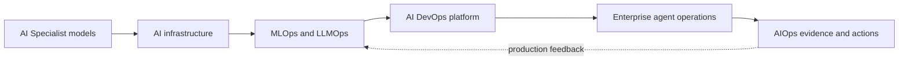
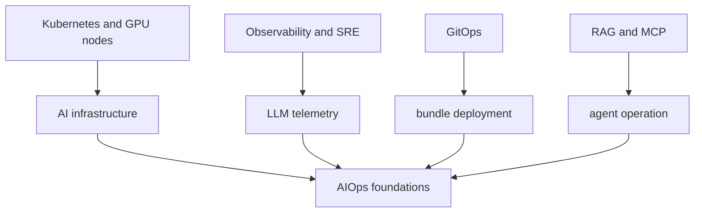

# AI Transformation 전체 필러 로드맵

<!-- source: https://arxiv.org/abs/2309.06180 | checked: 2026-09-03 -->
<!-- source: https://www.kubeflow.org/docs/components/pipelines/overview/ | checked: 2026-09-03 -->
<!-- source: https://modelcontextprotocol.io/specification/2025-11-25/architecture | checked: 2026-09-03 -->

AI Transformation은 model API를 도입하는 일이 아니라 data 수집, 학습·평가, artifact 승급, serving, 권한 있는 tool 실행과 비용 책임을 하나의 운영 체계로 바꾸는 일이다. vault의 AI Transformation 내용을 네 필러로 묶고, AI Specialist의 모델 지식을 AIOps의 관측·진단·복구 폐루프로 전달한다.

## 처음 보는 사람을 위한 출발점

| 처음 만나는 말 | 학습용 쉬운 뜻 |
|---|---|
| AI infrastructure | GPU·network·storage·scheduler·serving runtime을 운영하는 기반 |
| MLOps / LLMOps | dataset·model·prompt·index·평가와 배포 이력을 재현하는 체계 |
| continuous training | 새 data와 기준에 따라 학습 후보를 반복 생성하는 과정 |
| model serving | 여러 요청이 model inference를 안전한 latency와 capacity로 공유하는 계층 |
| capability bundle | model뿐 아니라 prompt·tool·policy·workflow와 runtime을 함께 고정한 배포 단위 |
| receipt | 누가 무엇을 어떤 입력·정책·결과로 실행했는지 남긴 검증 기록 |

## 네 필러

1. [AI 인프라·분산 학습과 LLM 서빙](#doc=ai-transformation-platform-infrastructure): GPU memory, topology, scheduling과 inference queue를 SLO에 맞춘다.
2. [MLOps·LLMOps와 평가 가능한 수명주기](#doc=ai-transformation-platform-mlops): dataset에서 deployment까지 lineage와 gate를 만든다.
3. [AI DevOps·플랫폼과 FinOps](#doc=ai-transformation-platform-devops): IaC·Kubernetes·GitOps·quota·telemetry를 운영 제품으로 제공한다.
4. [Enterprise AI와 안전한 에이전트 실행](#doc=ai-transformation-platform-agents): RAG·gateway·MCP·workflow·identity·sandbox·approval을 한 operation으로 묶는다.

## AI Transformation 전체 내용 연결표

vault의 AI Transformation 허브와 하위 49개 노트가 다루는 기술 항목을 네 필러의 공개 장에 연결했다. 사내 구조 서술이나 credential·개인 data는 옮기지 않고, 공개 가능한 일반 메커니즘과 실패 경계만 공식 자료로 다시 검증한다.

| 필러 | 포함한 전체 세부 내용 | 공개 학습 연결 |
|---|---|---|
| AI infrastructure·학습 | GPU architecture·HBM·NVLink, GPU 성능 산술·MFU, NCCL collective와 parallelism 배치, DeepSpeed·ZeRO, Ray 분산 compute, Kubernetes GPU Operator·MIG, Kueue quota·gang scheduling, GPU 탄력 확보·반납 | [AI 인프라·serving](#doc=ai-transformation-platform-infrastructure), [AI DevOps·FinOps](#doc=ai-transformation-platform-devops) |
| LLM serving | vLLM·PagedAttention, KV cache·continuous batching, serving engine 선택, TTFT·TPOT·throughput·queue, LiteLLM gateway·virtual key·사용량 통제, backend streaming·fallback·circuit breaker | [AI 인프라·serving](#doc=ai-transformation-platform-infrastructure), [백엔드 용량](#doc=backend-engineering-runtime-capacity) |
| MLOps | MLflow experiment·model registry, Kubeflow pipeline orchestration, dataset→run→checkpoint→model lineage, continuous training과 promotion | [MLOps·LLMOps](#doc=ai-transformation-platform-mlops) |
| LLMOps·RAG | hybrid vector search, vector database 운영, prompt registry·Langfuse, LLM trace·OpenTelemetry, evaluation metric·guardrail, golden dataset·eval instrumentation, evaluation gate·CI/CD 차단 | [MLOps·LLMOps](#doc=ai-transformation-platform-mlops), [RAG·MCP](#doc=ai-specialist-core-rag-mcp) |
| AI DevOps·platform | Terraform·IaC, Helm·Kustomize, Argo CD·ML GitOps, CI/CD/CT pipeline, Prometheus·DCGM GPU monitoring, model·prompt·tool bundle deployment | [AI DevOps·FinOps](#doc=ai-transformation-platform-devops), [DevOps GitOps](#doc=helm-gitops-roadmap) |
| FinOps·성과 | AI 비용의 계산 단위, GPU 자원 비용 최적화, workload quota·autoscaling, AI project 성과·ROI 기준 | [AI DevOps·FinOps](#doc=ai-transformation-platform-devops), [신뢰성·FinOps](#doc=reliability-finops-roadmap) |
| Enterprise integration | LLM service backend 통합, Keycloak OIDC realm·identity, MCP agent tool 통합·trust boundary, code 접근 없는 contract 수집·교차 검증 | [Enterprise agent 운영](#doc=ai-transformation-platform-agents), [백엔드 API 계약](#doc=backend-engineering-api-contract) |
| Agent orchestration | LangGraph state graph·memory·session, Temporal durable execution, A2A task lifecycle, tool calling·idempotency, Structured Outputs·JSON Schema | [Enterprise agent 운영](#doc=ai-transformation-platform-agents), [분산 workflow](#doc=backend-engineering-distributed-workflow) |
| Agent security·governance | prompt injection·tool authorization, sandbox·code execution isolation, workload identity·delegated authority, OPA/Rego policy, MCP OAuth, Plan/Commit·물리 작업 승인 | [Enterprise agent 운영](#doc=ai-transformation-platform-agents), [인프라 보안](#doc=infrastructure-security-roadmap) |
| Agent delivery·evaluation | capability bundle·compatibility gate, repository eval wiring·dispatch, multi-agent integrated eval·deployment block, 검증 가능성·jagged intelligence의 한계 | [MLOps·LLMOps](#doc=ai-transformation-platform-mlops), [AIOps 진단](#doc=aiops-diagnosis-roadmap), [AIOps 복구](#doc=aiops-remediation-roadmap) |
| Edge·physical AI | robot edge inference runtime·model deployment gate, target별 graph·precision·accelerator bundle과 rollback | [On-device 모델 압축](#doc=ai-specialist-core-edge), [AIOps 복구](#doc=aiops-remediation-state-machine) |

`Ray`, `Kueue`, `LiteLLM`, `LangGraph`, `Temporal`, `A2A`, `OPA/Rego` 같은 제품 이름은 독립적인 성공 기준이 아니다. 각 도구가 관리하는 state와 permission, failure mode, receipt를 해당 필러의 공통 계약으로 비교한다.

## 전체 artifact 흐름

| 단계 | 정본 | 통과 증거 | 실패 시 돌아갈 곳 |
|---|---|---|---|
| data 준비 | versioned dataset·feature schema | quality·privacy checks | ingestion revision |
| 학습 | run config·code·base artifact | reproducible metrics | prior run |
| 평가 | immutable suite·policy | threshold와 slice 결과 | candidate rejected |
| packaging | content-addressed bundle | compatibility·signature | prior bundle |
| serving | deployment revision | readiness + user SLI | bounded rollback |
| agent action | plan·approval·operation | policy·precondition·outcome | reconciliation·escalation |

`latest`, mutable model tag와 prompt text만으로는 어느 조합이 사용자 결과를 만들었는지 재구성할 수 없다. 최소한 model, tokenizer, prompt, retrieval index, tool schema, policy, runtime과 evaluation suite를 식별한다.

## 기존 학습 경로와 연결

- cluster·workload 기초는 [Kubernetes](#doc=kubernetes-roadmap), GPU node의 생성·축소는 [Karpenter](#doc=karpenter-roadmap)에 연결한다.
- model·tokenizer·KV cache의 계산 전제는 [AI Specialist의 LLM 구조와 효율화](#doc=ai-specialist-core-llm)에서 받는다.
- deployment 선언과 drift는 [Helm과 GitOps](#doc=helm-gitops-roadmap), identity와 network 경계는 [인프라 보안](#doc=infrastructure-security-roadmap)에서 확인한다.
- LLM trace는 [Observability와 SRE](#doc=observability-sre-roadmap)의 signal 원칙을 따르고 [AIOps evidence graph](#doc=aiops-foundations-evidence-graph)로 들어간다.
- 비용은 GPU 할당 시간이 아니라 성공한 training run·validated output·업무 결과 같은 단위로 [신뢰성·FinOps](#doc=reliability-finops-roadmap)와 연결한다.

## 처음 이해했는지 확인

- model registry의 artifact 하나만으로 production 응답을 재현할 수 없는 이유는 무엇인가?
- GPU utilization이 높다는 사실과 유용한 token 처리 비용이 낮다는 사실은 어떻게 다른가?
- evaluation 통과와 안전한 tool 실행 승인이 별도 gate인 이유는 무엇인가?
- AIOps feedback을 training data로 넣기 전에 어떤 lineage·label 검증이 필요한가?

## 완료

- 네 필러의 정본·owner·artifact·receipt를 구분했다.
- AI Specialist의 모델 bundle을 운영 플랫폼의 배포 단위로 연결했다.
- Kubernetes·GitOps·보안·SRE와 중복되지 않는 AI-specific 경계를 표시했다.
- production feedback이 AIOps에서 평가 dataset으로 돌아가는 경로를 만들었다.

## 운영 판단으로 확장하기

플랫폼의 성공은 설치한 도구 수가 아니라 새 candidate를 같은 절차로 재현하고, 위험한 조합을 차단하며, incident에서 실제 bundle까지 추적하고, 실패한 action을 안전하게 수렴시키는 시간으로 평가한다. 각 필러의 도구 선택은 이 계약을 구현하는 수단이다.
