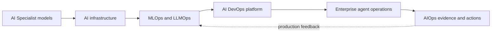
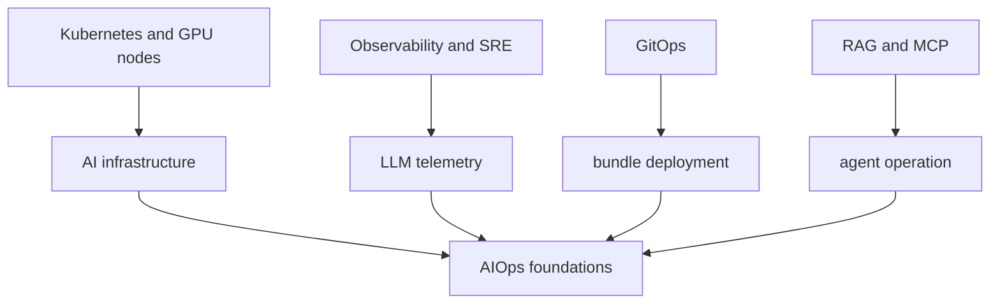

# AI Transformation: the four-pillar roadmap

This roadmap maps subject areas into a learning sequence. Coverage in the map does not mean every technique has a complete implementation or measured production result; follow each chapter's exercise scope and completion criteria.

<!-- source: https://arxiv.org/abs/2309.06180 | checked: 2026-09-03 -->
<!-- source: https://www.kubeflow.org/docs/components/pipelines/overview/ | checked: 2026-09-03 -->
<!-- source: https://modelcontextprotocol.io/specification/2025-11-25/architecture | checked: 2026-09-03 -->

AI Transformation is not about introducing a model API, but about changing data collection, learning and evaluation, artifact promotion, serving, authoritative tool execution, and cost responsibility into a single operating system. The contents of the vault's AI Transformation are grouped into four pillars, and the model knowledge of the AI ​​Specialist is delivered to the AIOps observation, diagnosis, and recovery closed loop.

## Starting point for beginners

| New term | Plain-language meaning |
|---|---|
| AI infrastructure | Foundation for operating GPU·network·storage·scheduler·serving runtime |
| MLOps / LLMOps | A system that reproduces dataset·model·prompt·index·evaluation and deployment history |
| continuous training | The process of repeatedly generating learning candidates based on new data and criteria |
| model serving | A layer where multiple requests share model inference with safe latency and capacity |
| capability bundle | A deployment unit that fixes not only the model but also the prompt·tool·policy·workflow and runtime together. |
| receipt | Verification record of who implemented what and with what inputs, policies, and results |

## Four pillars

1. [AI infrastructure/distributed learning and LLM serving](#doc=ai-transformation-platform-infrastructure): Match GPU memory, topology, scheduling and inference queue to SLO.
2. [MLOps·LLMOps and evaluable life cycle](#doc=ai-transformation-platform-mlops): Create lineage and gate from dataset to deployment.
3. [AI DevOps·Platform and FinOps](#doc=ai-transformation-platform-devops): Provides IaC·Kubernetes·GitOps·quota·telemetry as operating products.
4. [Enterprise AI and safe agent execution](#doc=ai-transformation-platform-agents): Bundles RAG·gateway·MCP·workflow·identity·sandbox·approval into one operation.

## AI Transformation Full Content Connection Table

The technology items covered by the vault's AI Transformation hub and the lower 49 notes were linked to the public chapters of the four pillars. The in-house structure description, credentials, and personal data are not transferred, and only the general mechanisms and failure boundaries that can be disclosed are verified again with official data.

| pillar | Full details including | Open Learning Connections |
|---|---|---|
| AI infrastructure·learning | GPU architecture·HBM·NVLink, GPU performance arithmetic·MFU, NCCL collective and parallelism deployment, DeepSpeed·ZeRO, Ray distributed compute, Kubernetes GPU Operator·MIG, Kueue quota·gang scheduling, securing and returning GPU elasticity | [AI Infrastructure·serving](#doc=ai-transformation-platform-infrastructure), [AI DevOps·FinOps](#doc=ai-transformation-platform-devops) |
| LLM serving | vLLM·PagedAttention, KV cache·continuous batching, serving engine selection, TTFT·TPOT·throughput·queue, LiteLLM gateway·virtual key·usage control, backend streaming·fallback·circuit breaker | [AI infrastructure·serving](#doc=ai-transformation-platform-infrastructure), [backend capacity](#doc=backend-engineering-runtime-capacity) |
| MLOps | MLflow experiment·model registry, Kubeflow pipeline orchestration, dataset→run→checkpoint→model lineage, continuous training and promotion | [MLOps·LLMOps](#doc=ai-transformation-platform-mlops) |
| LLMOps·RAG | Hybrid vector search, vector database operation, prompt registry·Langfuse, LLM trace·OpenTelemetry, evaluation metric·guardrail, golden dataset·eval instrumentation, evaluation gate·CI/CD blocking | [MLOps·LLMOps](#doc=ai-transformation-platform-mlops), [RAG·MCP](#doc=ai-specialist-core-rag-mcp) |
| AI DevOps·platform | Terraform·IaC, Helm·Kustomize, Argo CD·ML GitOps, CI/CD/CT pipeline, Prometheus·DCGM GPU monitoring, model·prompt·tool bundle deployment | [AI DevOps·FinOps](#doc=ai-transformation-platform-devops), [DevOps GitOps](#doc=helm-gitops-roadmap) |
| FinOps·Performance | AI cost calculation unit, GPU resource cost optimization, workload quota·autoscaling, AI project performance·ROI criteria | [AI DevOps·FinOps](#doc=ai-transformation-platform-devops), [Reliability·FinOps](#doc=reliability-finops-roadmap) |
| Enterprise integration | LLM service backend integration, Keycloak OIDC realm/identity, MCP agent tool integration/trust boundary, contract collection/cross-validation without code access | [Enterprise agent operation](#doc=ai-transformation-platform-agents), [Backend API contract](#doc=backend-engineering-api-contract) |
| Agent orchestration | LangGraph state graph·memory·session, Temporal durable execution, A2A task lifecycle, tool calling·idempotency, Structured Outputs·JSON Schema | [Enterprise agent operation](#doc=ai-transformation-platform-agents), [distributed workflow](#doc=backend-engineering-distributed-workflow) |
| Agent security·governance | prompt injection·tool authorization, sandbox·code execution isolation, workload identity·delegated authority, OPA/Rego policy, MCP OAuth, Plan/Commit·physical task approval | [Enterprise agent operation](#doc=ai-transformation-platform-agents), [Infrastructure security](#doc=infrastructure-security-roadmap) |
| Agent delivery·evaluation | Capability bundle·compatibility gate, repository eval wiring·dispatch, multi-agent integrated eval·deployment block, verifiability·jagged intelligence limitations | [MLOps·LLMOps](#doc=ai-transformation-platform-mlops), [AIOps Diagnostic](#doc=aiops-diagnosis-roadmap), [AIOps Recovery](#doc=aiops-remediation-roadmap) |
| Edge·physical AI | Robot edge inference runtime·model deployment gate, target-specific graph·precision·accelerator bundle and rollback | [On-device model compression](#doc=ai-specialist-core-edge), [AIOps recovery](#doc=aiops-remediation-state-machine) |

Product names such as `Ray`, `Kueue`, `LiteLLM`, `LangGraph`, `Temporal`, `A2A`, `OPA/Rego` are not independent success criteria. The state, permission, failure mode, and receipt managed by each tool are compared with the common contract of the corresponding pillar.

## Entire artifact flow

| Step | Source of truth | Evidence to proceed | Recovery point on failure |
|---|---|---|---|
| data preparation | versioned dataset·feature schema | quality·privacy checks | ingestion revision |
| learning | run config·code·base artifact | reproducible metrics | prior run |
| evaluation | immutable suite·policy | threshold and slice results | candidate rejected |
| packaging | content-addressed bundle | compatibility·signature | prior bundle |
| serving | deployment revision | readiness + user SLI | bounded rollback |
| agent action | plan·approval·operation | policy·precondition·outcome | reconciliation·escalation |

`latest`, it is not possible to reconstruct which combination created the user result using only the mutable model tag and prompt text. At a minimum, it identifies the model, tokenizer, prompt, retrieval index, tool schema, policy, runtime, and evaluation suite.

## Connect with existing learning paths

- The cluster·workload basis is connected to [Kubernetes](#doc=kubernetes-roadmap), and the creation and reduction of GPU nodes is connected to [Karpenter](#doc=karpenter-roadmap).
- The calculation premise of model·tokenizer·KV cache is obtained from [AI Specialist's LLM Structure and Efficiency](#doc=ai-specialist-core-llm).
- Deployment declaration and drift can be checked in [Helm and GitOps](#doc=helm-gitops-roadmap), and identity and network boundaries can be checked in [Infrastructure Security](#doc=infrastructure-security-roadmap).
- The LLM trace follows the signal principles of [Observability and SRE](#doc=observability-sre-roadmap) and goes into [AIOps evidence graph](#doc=aiops-foundations-evidence-graph).
- The cost is linked to [Reliability·FinOps](#doc=reliability-finops-roadmap) in units such as successful training run·validated output·business result rather than GPU allocation time.

## Check your understanding

- Why can't I reproduce the production response with just one artifact from the model registry?
- What is the difference between high GPU utilization and low useful token processing cost?
- Why are passing evaluation and approving safe tool execution separate gates?
- What lineage/label verification is needed before incorporating AIOps feedback into training data?

## Completion criteria

- The four pillars' source of truth·owner·artifact·receipt were distinguished.
- AI Specialist's model bundle was connected to the deployment unit of the operating platform.
- AI-specific boundaries that do not overlap with Kubernetes, GitOps, security, and SRE were marked.
- We created a path for production feedback to return to the evaluation dataset in AIOps.

## Develop operational judgment

The success of a platform is not measured by the number of tools installed, but by the time it takes to recreate new candidates through the same process, block dangerous combinations, track incidents from actual bundles, and safely converge failed actions. Each pillar's tool selection is a means of implementing this contract.
