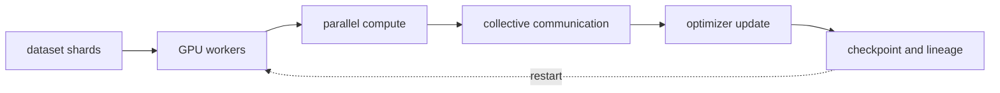
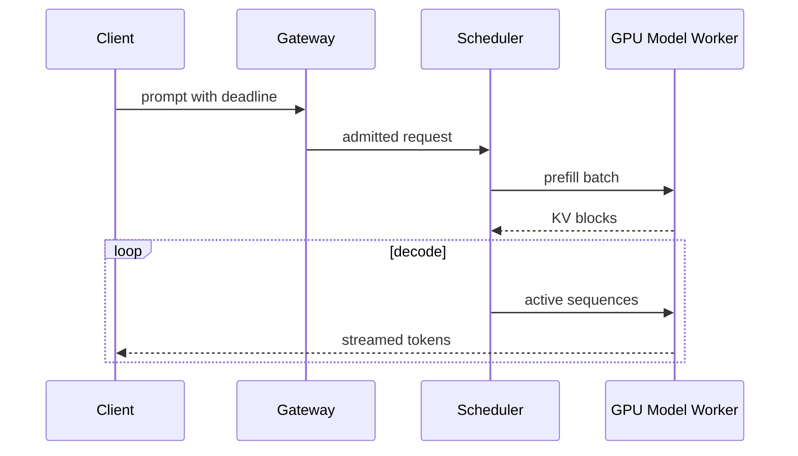

# AI 인프라·분산 학습과 LLM 서빙

<!-- source: https://arxiv.org/abs/1910.02054 | checked: 2026-09-03 -->
<!-- source: https://arxiv.org/abs/2309.06180 | checked: 2026-09-03 -->
<!-- source: https://docs.nvidia.com/datacenter/cloud-native/gpu-operator/gpu-operator-mig.html | checked: 2026-09-03 -->

AI workload는 CPU service와 같은 Pod 형태로 실행될 수 있지만 병목과 실패 단위는 다르다. training은 model state와 collective communication을 여러 GPU에 배치하고, serving은 weight·KV cache·batch scheduler를 latency SLO 안에서 공유한다. GPU 요청 개수만으로 capacity를 설명할 수 없다.

## 이 장에서 처음 쓰는 말

| 말 | 이 장에서의 뜻 |
|---|---|
| HBM / VRAM | GPU가 model·activation·KV cache를 두는 고대역폭 memory |
| data parallel | model 복제본이 다른 batch를 처리하고 gradient를 동기화하는 방식 |
| tensor / pipeline parallel | 한 model의 연산·layer를 여러 device에 나누는 방식 |
| collective | AllReduce·AllGather처럼 여러 GPU가 함께 수행하는 통신 |
| continuous batching | decode step마다 끝난 요청을 빼고 새 요청을 batch에 합류시키는 scheduling |
| MFU | 유효 model 계산량을 hardware 최대 계산량과 비교하는 utilization 관점 |

1. workload의 memory·compute·communication 식을 먼저 적는다.
2. throughput만이 아니라 queue·TTFT·TPOT·OOM·cost를 함께 측정한다.

## 먼저 이해하기

training memory에는 parameter뿐 아니라 gradient, optimizer state와 activation이 들어간다. ZeRO 계열은 이 state들을 data-parallel worker 사이에 단계적으로 partition해 중복 memory를 줄인다. 대신 communication, checkpoint와 장애 복구 경계가 달라진다.



| 병렬화 축 | 나누는 것 | 주된 비용 | 검증 |
|---|---|---|---|
| data | batch | gradient synchronization | global batch·convergence |
| tensor | layer tensor 연산 | 빈번한 collective | topology·kernel efficiency |
| pipeline | layer stage | bubble·activation transfer | microbatch schedule |
| sequence/context | token 축 | attention communication | long-context correctness |

NCCL operation이 빨라도 data loader나 checkpoint storage가 병목일 수 있다. step time을 compute, communication, input과 checkpoint로 분해한다. theoretical FLOPS만으로 업무 효율을 선언하지 않는다.

## GPU 공유와 scheduling

NVIDIA MIG는 지원 GPU를 분리된 instance로 partition한다. GPU Operator의 MIG Manager는 node label과 profile에 따라 재구성하며, 과정에서 GPU client 중지나 node reboot가 필요할 수 있다. time-slicing과 MIG는 isolation 보장이 다르다.

```yaml
workload_contract:
  kind: llm-serving
  modelBundle: support-v7
  gpuProfile: mig-3g-example
  memoryBudgetGiB: 36
  maxContextTokens: 8192
  maxConcurrentSequences: 48
  queueMaxAgeMs: 800
  fallbackBundle: support-small-v4
```

이 profile 이름과 수치는 예시다. device generation, driver, operator와 runtime compatibility를 먼저 확인한다. gang scheduling이 필요한 training job은 필요한 자원 일부만 점유한 채 나머지를 기다리는 교착을 피해야 한다. quota와 preemption은 팀 우선순위·checkpoint 비용을 반영한다.

## LLM serving 경로



PagedAttention은 KV cache를 block 단위로 관리해 memory 낭비와 공유 문제를 다룬다. 논문의 throughput 개선은 특정 workload·비교 시스템 결과이므로 현재 runtime의 보편 배수로 쓰지 않는다.

| 지표 | 사용자 질문 | resource 질문 |
|---|---|---|
| TTFT | 첫 응답이 언제 보이는가 | queue·prefill이 포화인가 |
| TPOT / inter-token latency | stream이 끊기지 않는가 | decode batch가 안정적인가 |
| tokens/s | 유용한 결과 처리량은? | GPU·memory bandwidth 활용은? |
| queue age | deadline 안에 시작 가능한가 | admission 상한은? |
| KV cache occupancy | 긴 context를 감당하는가 | eviction·fragmentation은? |
| OOM·fallback | 결과가 안전하게 수렴하는가 | bundle·profile이 맞는가 |

## 운영 연결

1. model·tokenizer·precision은 [LLM 구조와 효율화](#doc=ai-specialist-core-llm)의 bundle에서 받는다.
2. node·Pod·resource 기초는 [Kubernetes](#doc=kubernetes-scheduling-scaling)와 [Karpenter](#doc=karpenter-provisioning)에 연결한다.
3. gateway deadline과 retry는 [트래픽 복원력](#doc=traffic-resilience-request-budget)에 맞춘다.
4. GPU·queue·request trace는 [AIOps 신호 계약](#doc=aiops-foundations-evidence-graph)에 넣는다.
5. OOM 자동 복구는 재시작 횟수가 아니라 사용자 결과와 fallback 성공을 [AIOps remediation](#doc=aiops-remediation-state-machine)에서 검증한다.

## 완료

- training memory와 병렬화 축별 communication 비용을 구분했다.
- GPU share·scheduler·quota를 isolation과 workload 계약으로 적었다.
- serving의 prefill·decode·KV cache·queue를 SLO와 연결했다.
- 논문 benchmark와 현재 target capacity 측정을 분리했다.

## 스스로 설명해 보기

- ZeRO가 memory를 줄이면서 communication·checkpoint 설계를 바꾸는 이유는 무엇인가?
- MIG와 time-slicing을 같은 GPU 분할로 취급하면 어떤 isolation 차이를 놓치는가?
- tokens/s가 높아도 사용자가 느릴 수 있는 이유는 무엇인가?
- KV cache 상한이 CPU utilization 기반 autoscaling에 잘 보이지 않을 수 있는 이유는 무엇인가?
