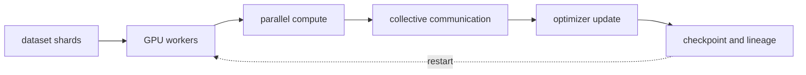
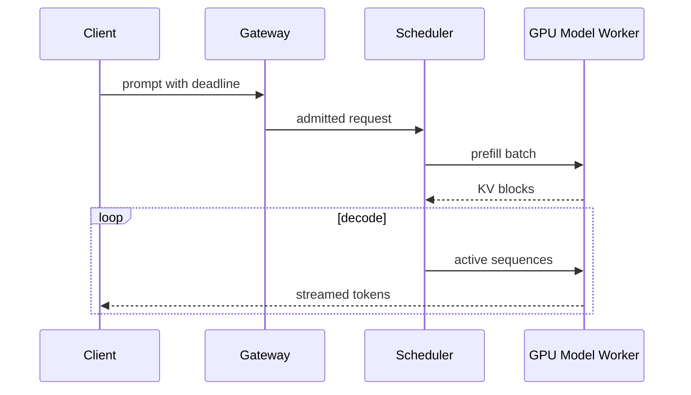

# AI infrastructure, distributed learning and LLM serving

<!-- source: https://arxiv.org/abs/1910.02054 | checked: 2026-09-03 -->
<!-- source: https://arxiv.org/abs/2309.06180 | checked: 2026-09-03 -->
<!-- source: https://docs.nvidia.com/datacenter/cloud-native/gpu-operator/gpu-operator-mig.html | checked: 2026-09-03 -->

AI workloads can run in pod form like CPU services, but the bottlenecks and failure units are different. Training places the model state and collective communication on multiple GPUs, and serving shares weight·KV cache·batch scheduler within latency SLO. Capacity cannot be explained solely by the number of GPU requests.

## Terms introduced in this chapter

| word | Meaning in this chapter | Why it matters / when to use it |
|---|---|---|
| HBM / VRAM | High-bandwidth memory where GPU stores model·activation·KV cache | Budget accelerator memory for weights, activations, and growing request state before admitting work. |
| data parallel | How model replicas process different batches and synchronize gradients | Scale training across replicated models when the model fits each worker's memory. |
| tensor / pipeline parallel | A method of dividing the calculations and layers of one model into multiple devices | Distribute a model that is too large or costly for one device, accounting for communication overhead. |
| collective | Communication performed by multiple GPUs together, such as AllReduce and AllGather | Coordinate distributed tensor exchange so workers can produce consistent training updates. |
| continuous batching | Scheduling to exclude completed requests at each decode step and add new requests to the batch | Use freed serving slots promptly as requests finish instead of waiting for a fixed batch to drain. |
| MFU | Utilization perspective that compares the effective model calculation amount to the maximum hardware calculation amount | Check how effectively a training workload turns hardware capacity into useful model computation. |

1. First write down the memory·compute·communication equation of the workload.
2. It measures not only throughput but also queue·TTFT·TPOT·OOM·cost.

## Understand the model first

The training memory includes not only parameters but also gradient, optimizer state, and activation. The ZeRO series partitions these states step by step between data-parallel workers to reduce redundant memory. Instead, communication, checkpoint, and failover boundaries change.



| parallel axis | sharing | main cost | verification |
|---|---|---|---|
| data | batch | gradient synchronization | global batch·convergence |
| tensor | layer tensor operation | frequent collective | topology·kernel efficiency |
| pipeline | layer stage | bubble·activation transfer | microbatch schedule |
| sequence/context | token axis | attention communication | long-context correctness |

Even if NCCL operation is fast, data loader or checkpoint storage may be a bottleneck. Decompose step time into compute, communication, input, and checkpoint. We do not declare work efficiency based on theoretical FLOPS alone.

## GPU sharing and scheduling

NVIDIA MIG partitions supported GPUs into separate instances. The GPU Operator's MIG Manager is reconfigured according to the node label and profile, and stopping the GPU client or rebooting the node may be necessary in the process. Time-slicing and MIG have different isolation guarantees.

```yaml
workload_contract:
  kind: llm-serving
  modelBundle: support-v7
  gpuProfile: mig-3g-example
  memoryBudgetGiB: 36
  maxContextTokens: 8192
  maxConcurrentSequences: 48
  queueMaxAgeMs: 800
  fallbackBundle: support-small-v4
```

These profile names and numbers are examples. Check device generation, driver, operator and runtime compatibility first. Training jobs that require gang scheduling should avoid deadlock, with only some of the required resources occupied while waiting for the rest. Quotas and preemptions reflect team priorities and checkpoint costs.

## LLM serving path



PagedAttention manages the KV cache in block units to address memory waste and sharing issues. The throughput improvement in the paper is the result of a specific workload/comparison system, so it is not used as a universal multiple of the current runtime.

| characteristic | user questions | resource question |
|---|---|---|
| TTFT | When will I see the first response? | Is queue/prefill saturated? |
| TPOT / inter-token latency | Doesn't the stream stop? | Is the decode batch stable? |
| tokens/s | What is the useful result throughput? | How to utilize GPU/memory bandwidth? |
| queue age | Is it possible to start within deadline? | What is the admission limit? |
| KV cache occupancy | Can it handle a long context? | What about eviction·fragmentation? |
| OOM·fallback | Do the results converge safely? | Is the bundle·profile correct? |

## operational connection

1. The model·tokenizer·precision is received from the bundle of [LLM structure and efficiency](#doc=ai-specialist-core-llm).
2. The node·Pod·resource base connects to [Kubernetes](#doc=kubernetes-scheduling-scaling) and [Karpenter](#doc=karpenter-provisioning).
3. Gateway deadline and retry are adjusted to [traffic resilience](#doc=traffic-resilience-request-budget).
4. GPU·queue·request trace is put into [AIOps signal contract](#doc=aiops-foundations-evidence-graph).
5. OOM automatic recovery verifies user results and fallback success, not the number of restarts, in [AIOps remediation](#doc=aiops-remediation-state-machine).

## Completion criteria

- Training memory and communication costs for each parallel axis were distinguished.
- GPU share·scheduler·quota were written as isolation and workload contracts.
- The serving prefill·decode·KV cache·queue was connected to SLO.
- We separated the paper benchmark and current target capacity measurements.

## Explain it in your own words

- Why does ZeRO change the communication/checkpoint design while reducing memory?
- What isolation differences are we missing if we treat MIG and time-slicing as the same GPU partition?
- Why can users feel slow even if tokens/s is high?
- Why may the KV cache upper limit be invisible to CPU utilization-based autoscaling?
