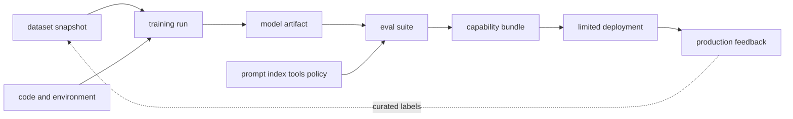

# MLOps·LLMOps와 평가 가능한 수명주기

<!-- source: https://www.kubeflow.org/docs/components/pipelines/overview/ | checked: 2026-09-03 -->
<!-- source: https://mlflow.org/docs/latest/ml/model-registry/ | checked: 2026-09-03 -->
<!-- source: https://opentelemetry.io/docs/specs/semconv/gen-ai/ | checked: 2026-09-03 -->

MLOps는 pipeline을 자동 실행하는 것보다 어떤 data·code·parameter가 model을 만들었고 어떤 평가로 어느 bundle이 승급했는지 재구성하는 체계다. LLMOps에서는 prompt, retrieval index, tool·policy와 judge까지 변하므로 lineage와 evaluation 단위가 더 넓어진다.

## 이 장에서 처음 쓰는 말

| 말 | 이 장에서의 뜻 |
|---|---|
| lineage | 산출물이 어떤 입력·실행·부모 artifact에서 나왔는지 잇는 관계 |
| registry | versioned artifact와 alias·metadata를 관리하는 정본 |
| pipeline | 입력·처리·학습·평가·packaging 단계를 재현 가능한 DAG로 만든 것 |
| eval suite | dataset, metric, judge·policy와 threshold가 고정된 평가 묶음 |
| drift | data·prediction·업무 결과의 분포가 기준선과 달라지는 현상 |
| promotion | candidate가 gate를 통과해 제한된 serving 단계로 이동하는 결정 |

1. dataset→run→artifact→suite→bundle→deployment의 ID를 연결한다.
2. 자동 학습과 자동 production 승급을 별도 권한·gate로 둔다.

## 먼저 이해하기

Kubeflow Pipelines 같은 orchestrator는 containerized step과 artifact 흐름을 실행할 수 있고, MLflow registry는 model version과 metadata를 관리할 수 있다. 도구가 lineage의 의미를 자동으로 결정하지 않는다. mutable path, 누락된 dataset snapshot과 환경 의존 step이 있으면 같은 DAG를 다시 실행해도 같은 결과를 재구성하지 못한다.



## lineage receipt

```json
{
  "bundleId": "ops-assistant-v12",
  "model": "registry://ops-model/versions/41",
  "dataset": "dataset://incidents/2026-09-03@sha256-example",
  "trainingRun": "run-781",
  "prompt": "prompt://triage@19",
  "retrievalIndex": "index://runbooks@20260903-01",
  "toolSchema": "tools://ops-readonly@7",
  "policy": "policy://ops-agent@12",
  "evalSuite": "eval://incident-triage@33",
  "runtime": "serving://runtime@8"
}
```

한 항목이라도 mutable `latest`만 가리키면 incident 뒤 재현이 어려워진다. content hash가 모든 semantic compatibility를 보장하지는 않지만 적어도 bytes를 고정한다. schema·runtime·hardware compatibility는 별도 gate다.

## 평가를 층으로 나눈다

| 층 | 질문 | 실패 예시 |
|---|---|---|
| data | label·split·privacy가 유효한가 | incident 후 정보가 입력에 누수 |
| model | task baseline을 이기는가 | slice별 calibration 붕괴 |
| retrieval | 필요한 근거를 찾는가 | ACL filter 뒤 recall 저하 |
| generation | 주장이 근거로 지지되는가 | citation은 있으나 문장 불일치 |
| tool proposal | target·argument가 타당한가 | 과도한 scope 제안 |
| system | latency·cost·failure가 허용되는가 | queue 포화·fallback 실패 |
| outcome | 실제 업무 결과가 개선되는가 | alert 감소, 사용자 오류 지속 |

LLM-as-a-judge는 자동 측정 도구이지 독립 사실 근거가 아니다. judge model·prompt·sampling과 rubric을 version하고 사람 label과 calibration한다. 평가 dataset이 production incident를 포함하면 민감 정보·권한과 label quality를 검토한 뒤 별도 승인된 과정으로 수집한다.

## observability와 feedback

OpenTelemetry GenAI semantic conventions는 발전 중인 영역이므로 instrumentation version을 기록하고 raw provider field를 무리하게 같은 의미로 합치지 않는다.

```yaml
inference_trace_contract:
  traceId: required
  bundleId: required
  modelProvider: required
  requestClass: required
  promptContent: redacted-by-default
  retrievalRefs: content-identifiers-only
  toolOperationIds: required-when-proposed
  tokenUsage: provider-semantics-recorded
  userOutcome: delayed-join
```

prompt와 retrieved content를 trace에 그대로 넣으면 개인정보·secret이 telemetry backend로 복제될 수 있다. 최소 식별자, hash와 정책 결과를 남기고 원문 접근은 별도 통제한다. [AIOps evidence graph](#doc=aiops-foundations-evidence-graph)는 bundle·deployment·trace·incident를 연결하되 payload를 무차별 수집하지 않는다.

## 승급 절차

1. immutable candidate와 lineage 완전성을 확인한다.
2. baseline 대비 offline suite와 위험 slice를 비교한다.
3. policy·tool schema·runtime compatibility를 검사한다.
4. shadow traffic에서 결과를 쓰지 않고 비교한다.
5. 작은 canary에서 사용자·cost·latency·safety를 관찰한다.
6. abort와 rollback을 실제로 연습한 뒤 범위를 늘린다.
7. outcome·incident를 label 후보로 수집하되 사람 검토 뒤 dataset에 반영한다.

## 완료

- dataset에서 deployment까지 immutable ID를 연결했다.
- model·retrieval·generation·tool·system·outcome 평가를 분리했다.
- judge와 telemetry 자체를 versioned·검토 대상에 넣었다.
- continuous training과 production promotion 권한을 분리했다.

## 스스로 설명해 보기

- pipeline DAG가 같아도 결과가 재현되지 않을 수 있는 이유는 무엇인가?
- model metric 하나로 RAG·tool system을 승급할 수 없는 이유는 무엇인가?
- trace에 prompt 원문을 모두 저장하면 어떤 운영·보안 비용이 생기는가?
- production incident를 자동으로 training label로 쓰면 어떤 feedback 오류가 생길 수 있는가?
