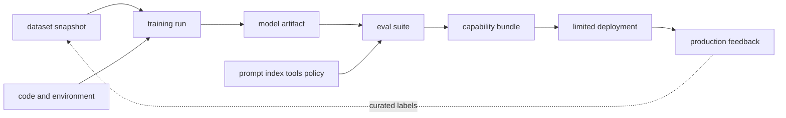

# MLOps, LLMOps and evaluable life cycle

<!-- source: https://www.kubeflow.org/docs/components/pipelines/overview/ | checked: 2026-09-03 -->
<!-- source: https://mlflow.org/docs/latest/ml/model-registry/ | checked: 2026-09-03 -->
<!-- source: https://opentelemetry.io/docs/specs/semconv/gen-ai/ | checked: 2026-09-03 -->

Rather than automatically executing a pipeline, MLOps is a system that reconstructs which data·code·parameters created a model and which bundle was promoted through which evaluation. In LLMOps, the prompt, retrieval index, tool·policy, and even judge change, so the lineage and evaluation unit become wider.

## Terms introduced in this chapter

| word | Meaning in this chapter |
|---|---|
| lineage | The relationship between which input, execution, and parent artifact the output came from |
| registry | Source of truth that manages versioned artifacts and alias/metadata |
| pipeline | The input, processing, learning, evaluation, and packaging steps are made into reproducible DAG. |
| eval suite | Evaluation bundle with fixed dataset, metric, judge·policy, and threshold |
| drift | Data·prediction·A phenomenon in which the distribution of work results differs from the baseline |
| promotion | Decision to allow a candidate to pass through the gate and move to the limited serving stage |

1. Connect the ID of dataset→run→artifact→suite→bundle→deployment.
2. Automatic learning and automatic production promotion are set as separate permissions/gates.

## Understand the model first

Orchestrators such as Kubeflow Pipelines can run containerized steps and artifact flows, and MLflow registries can manage model versions and metadata. The tool does not automatically determine the meaning of the lineage. If there are mutable paths, missing dataset snapshots, and environment-dependent steps, the same results cannot be reconstructed even if the same DAG is run again.



## lineage receipt

```json
{
  "bundleId": "ops-assistant-v12",
  "model": "registry://ops-model/versions/41",
  "dataset": "dataset://incidents/2026-09-03@sha256-example",
  "trainingRun": "run-781",
  "prompt": "prompt://triage@19",
  "retrievalIndex": "index://runbooks@20260903-01",
  "toolSchema": "tools://ops-readonly@7",
  "policy": "policy://ops-agent@12",
  "evalSuite": "eval://incident-triage@33",
  "runtime": "serving://runtime@8"
}
```

If even one item points to mutable `latest`, it becomes difficult to reproduce after the incident. Although the content hash does not guarantee all semantic compatibility, it at least fixes the bytes. Schema·runtime·hardware compatibility are separate gates.

## Divide evaluation into layers

| floor | question | Failure example |
|---|---|---|
| data | Is label·split·privacy valid? | Information leaks into input after incident |
| model | Does it beat the task baseline? | Calibration breakdown by slice |
| retrieval | Find the necessary evidence | Decreased recall after ACL filter |
| generation | Is the claim supported by evidence? | There is a citation, but the sentences are inconsistent. |
| tool proposal | Is the target/argument valid? | Excessive scope suggestion |
| system | Are latency·cost·failure acceptable? | Queue saturation/fallback failure |
| outcome | Do actual work results improve? | Reduced alerts, persistent user errors |

LLM-as-a-judge is an automated measurement tool, not independent factual evidence. Version judge model·prompt·sampling and rubric and calibrate with human label. If the evaluation dataset includes a production incident, sensitive information, permissions, and label quality are reviewed and collected through a separately approved process.

## observability and feedback

OpenTelemetry GenAI semantic conventions are a developing area, so record the instrumentation version and do not unreasonably combine raw provider fields with the same meaning.

```yaml
inference_trace_contract:
  traceId: required
  bundleId: required
  modelProvider: required
  requestClass: required
  promptContent: redacted-by-default
  retrievalRefs: content-identifiers-only
  toolOperationIds: required-when-proposed
  tokenUsage: provider-semantics-recorded
  userOutcome: delayed-join
```

If you leave the prompt and retrieved content in the trace, personal information and secrets can be copied to the telemetry backend. Access to the original text is separately controlled, leaving a minimum identifier, hash, and policy result. [AIOps evidence graph](#doc=aiops-foundations-evidence-graph) connects bundle·deployment·trace·incident, but does not collect payload indiscriminately.

## Promotion Process

1. Check immutable candidates and lineage completeness.
2. Compare offline suite and risk slice against baseline.
3. Check policy·tool schema·runtime compatibility.
4. Compare shadow outputs without applying business side effects; store permitted evaluation receipts so differences remain inspectable.
5. Observe users, cost, latency, and safety in a small canary.
6. After actually practicing abort and rollback, increase the range.
7. Outcomes and incidents are collected as label candidates, but reflected in the dataset after human review.

## Completion criteria

- We connected an immutable ID from dataset to deployment.
- Model·retrieval·generation·tool·system·outcome evaluation was separated.
- Judge and telemetry themselves were versioned and subject to review.
- Continuous training and production promotion authorities were separated.

## Explain it in your own words

- Why may the results not be reproduced even if the pipeline DAG is the same?
- Why can’t the RAG·tool system be promoted with just one model metric?
- What operational and security costs arise if the entire text of the prompt is stored in trace?
- What feedback errors can occur if a production incident is automatically used as a training label?
