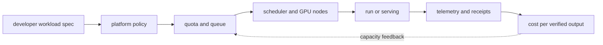

# AI DevOps·플랫폼과 FinOps

<!-- source: https://kubernetes.io/docs/concepts/scheduling-eviction/dynamic-resource-allocation/ | checked: 2026-09-03 -->
<!-- source: https://opentelemetry.io/docs/concepts/observability-primer/ | checked: 2026-09-03 -->
<!-- source: https://docs.nvidia.com/datacenter/dcgm/latest/gpu-telemetry/dcgm-exporter.html | checked: 2026-09-03 -->

AI platform은 GPU cluster를 대신 관리해 주는 설치 모음이 아니다. 개발자가 dataset·job·serving bundle을 정해진 계약으로 제출하면 quota, scheduler, identity, telemetry와 deployment gate가 반복 가능하게 작동하는 내부 제품이다. FinOps는 GPU 사용률을 높이는 데서 끝나지 않고 성공한 학습·추론·업무 결과당 비용을 보여 줘야 한다.

## 이 장에서 처음 쓰는 말

| 말 | 이 장에서의 뜻 |
|---|---|
| platform contract | workload가 선언해야 할 resource·identity·artifact·SLO의 공통 입력 |
| quota | 팀·project가 점유할 수 있는 자원과 우선순위의 한계 |
| gang scheduling | 필요한 worker 전체를 함께 확보하거나 시작하지 않는 배치 방식 |
| autoscaling | 관찰한 demand에 따라 workload·node 수를 조정하는 제어 |
| chargeback / showback | 소비한 비용을 팀에 청구하거나 가시화하는 방식 |
| unit economics | 성공한 업무 단위 하나를 만드는 데 든 실제 비용 |

1. self-service API와 guardrail을 먼저 정의한다.
2. infrastructure 비용을 verified output과 연결한다.

## 먼저 이해하기

Terraform·Kubernetes·Helm과 GitOps는 AI platform의 기반이지만 기존 DevOps 경로가 이미 다루는 원리를 반복할 필요는 없다. AI-specific layer는 GPU profile, distributed job topology, model bundle, queue·token SLO와 dataset·checkpoint lifecycle을 선언하는 부분이다.



## platform API 예시

```yaml
apiVersion: platform.example.test/v1
kind: AIWorkload
metadata:
  name: incident-model-eval-418
spec:
  owner: ops-ai
  workloadClass: evaluation
  bundle: ops-assistant-v12
  dataset: incident-golden-33
  resources:
    gpuProfile: approved-small-gpu
    replicas: 2
    maxDurationMinutes: 90
  policy:
    network: registry-and-object-store-only
    secrets: workload-identity-only
    preemptible: true
  outputs:
    receipt: required
    retentionDays: 30
```

이 CRD는 설명용이다. 실제 API는 조직의 scheduler·cloud와 보안 경계에 맞춰야 한다. 긴 training이 일부 GPU만 잡고 나머지를 기다리지 않도록 queue admission과 gang scheduling을 결합하고, checkpoint 가능 여부에 따라 preemption cost를 계산한다.

## telemetry를 층별로 잇는다

| 층 | 예시 신호 | 단독 해석의 위험 |
|---|---|---|
| hardware | GPU utilization·memory·temperature·ECC | 유용한 model 계산인지 모름 |
| node·container | allocation·restart·I/O | job step 의미를 모름 |
| scheduler | pending reason·queue age·preemption | 업무 우선순위를 모름 |
| training | step time·loss·checkpoint | 품질 개선을 보장하지 않음 |
| serving | TTFT·TPOT·tokens·queue | 답변 품질을 보장하지 않음 |
| business | accepted answer·resolved incident | resource 원인을 바로 말하지 않음 |

DCGM exporter 같은 구성 요소는 GPU telemetry를 Prometheus 형식으로 노출할 수 있다. metric 수집 성공이 scheduling·모델 성능 성공은 아니다. workload·bundle·node·GPU·trace ID를 cardinality budget 안에서 연결한다.

```json
{
  "costReceipt": "cost-ops-assistant-20260903",
  "bundleId": "ops-assistant-v12",
  "window": "2026-09-03T00:00:00Z/2026-09-03T01:00:00Z",
  "gpuAllocatedSeconds": 14400,
  "gpuActiveSeconds": 10320,
  "validatedOutputs": 8120,
  "successfulIncidentSuggestions": 143,
  "costPerValidatedOutput": 0.018,
  "currency": "example-unit"
}
```

`gpuActiveSeconds`가 늘어도 잘못된 output을 더 많이 만들면 경제성이 좋아지지 않는다. 반대로 낮은 utilization은 작은 batch의 latency SLO를 지키기 위한 의도된 여유일 수 있다.

## autoscaling과 비용의 함정

| 결정 | 좋은 신호 | 필요한 안전 조건 |
|---|---|---|
| serving replica 증가 | queue age·KV pressure·TTFT | node provisioning delay·budget |
| node scale-to-zero | 장기 idle·pending 없음 | cold start·availability SLO |
| spot 사용 | checkpoint 가능한 batch | interruption·restore 검증 |
| MIG 재구성 | workload profile 수요 변화 | node drain·reboot·rollback |
| model fallback | primary saturation | 품질·privacy·contract gate |

CPU만 보고 LLM serving을 scale하면 KV cache pressure와 queue를 놓칠 수 있다. prediction 기반 scaling은 [시계열 예측](#doc=ai-specialist-core-forecast-recommend)의 underprediction cost와 [AIOps remediation](#doc=aiops-remediation-state-machine)의 bounded action을 거친다.

## 기존 DevOps와 역할 분담

1. account·network는 [AWS 인프라 기반](#doc=aws-foundations-roadmap)에 둔다.
2. infrastructure code와 drift는 [Terraform on AWS](#doc=terraform-aws-roadmap)에 둔다.
3. packaging과 desired state는 [Helm과 GitOps](#doc=helm-gitops-roadmap)에 둔다.
4. workload·node scheduling은 [Kubernetes](#doc=kubernetes-scheduling-scaling)와 [Karpenter](#doc=karpenter-roadmap)에 둔다.
5. AI platform은 위 기반 위에 GPU profile·job·bundle·eval·cost contract를 추가한다.
6. drift·incident는 [AIOps 신호와 토폴로지](#doc=aiops-foundations-roadmap)에 전달한다.

## 완료

- AI workload self-service contract와 guardrail을 적었다.
- GPU·scheduler·model·업무 신호를 한 receipt에 연결했다.
- quota·preemption·autoscaling을 checkpoint와 SLO에 맞췄다.
- 비용을 성공한 output과 업무 결과 단위로 계산했다.

## 스스로 설명해 보기

- GPU utilization을 최대화하는 것이 항상 latency·비용 최적화가 아닌 이유는 무엇인가?
- gang scheduling이 partial resource 점유 문제를 어떻게 줄이는가?
- scale-to-zero가 싸지만 항상 가능한 전략이 아닌 이유는 무엇인가?
- platform과 기존 DevOps 경로의 책임을 어디에서 나누는가?
