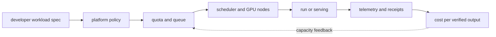

# AI DevOps/Platform and FinOps

<!-- source: https://kueue.sigs.k8s.io/docs/concepts/all_or_nothing/ | checked: 2026-09-10 | quota reservation versus physical placement and readiness timeout -->

<!-- source: https://kubernetes.io/docs/concepts/scheduling-eviction/dynamic-resource-allocation/ | checked: 2026-09-03 -->
<!-- source: https://opentelemetry.io/docs/concepts/observability-primer/ | checked: 2026-09-03 -->
<!-- source: https://docs.nvidia.com/datacenter/dcgm/latest/gpu-telemetry/dcgm-exporter.html | checked: 2026-09-03 -->

AI platform is not a collection of installations that manages the GPU cluster on your behalf. It is an internal product in which quota, scheduler, identity, telemetry, and deployment gate operate repeatably when a developer submits a dataset·job·serving bundle to a defined contract. FinOps goes beyond increasing GPU utilization; it must also demonstrate the cost per successful learning, inference, and work result.

## Terms introduced in this chapter

| word | Meaning in this chapter | Why it matters / when to use it |
|---|---|---|
| platform contract | Common input of resource·identity·artifact·SLO that workload must declare | Require workloads to declare the resources, identity, and service promises the platform must enforce. |
| quota | Limits on resources and priorities that a team/project can occupy | Limit one tenant's consumption so other teams retain their allocated capacity. |
| gang scheduling | Coordinating admission or placement for the required worker group so partial allocation does not strand the job | Avoid occupying scarce resources with a distributed job that cannot start its required worker group. |
| autoscaling | Control to adjust the number of workload·nodes according to observed demand | Adapt capacity to changing demand while checking startup delay and downstream bottlenecks. |
| chargeback / showback | How to bill or visualize the cost spent to the team | Expose or allocate shared costs so teams can make accountable usage decisions. |
| unit economics | The true cost of creating one successful unit of work | Compare designs by the cost of successful work rather than raw hardware utilization alone. |

1. Define the self-service API and guardrail first.
2. Connect infrastructure costs with verified output.

## Understand the model first

Terraform, Kubernetes, Helm, and GitOps are the foundation of the AI ​​platform, but there is no need to repeat the principles already covered by the existing DevOps path. The AI-specific layer is the part that declares GPU profile, distributed job topology, model bundle, queue·token SLO, and dataset·checkpoint lifecycle.



## platform API example

```yaml
apiVersion: platform.example.test/v1
kind: AIWorkload
metadata:
  name: incident-model-eval-418
spec:
  owner: ops-ai
  workloadClass: evaluation
  bundle: ops-assistant-v12
  dataset: incident-golden-33
  resources:
    gpuProfile: approved-small-gpu
    replicas: 2
    maxDurationMinutes: 90
  policy:
    network: registry-and-object-store-only
    secrets: workload-identity-only
    preemptible: true
  outputs:
    receipt: required
    retentionDays: 30
```

This CRD illustrates a proposed platform contract, not an installed API. Match it to the organization's scheduler and security boundaries. Queue admission and gang scheduling should prevent a training job from holding a few GPUs indefinitely while waiting for the rest. Implementations differ: Kueue coordinates quota, readiness timeouts, and related scheduling mechanisms; admission alone is not proof that every worker started atomically. Measure readiness and requeue behavior, and include checkpoint loss in preemption cost.

## Connect telemetry floor by floor

| floor | example signal | Dangers of Solo Interpretation |
|---|---|---|
| hardware | GPU utilization·memory·temperature·ECC | Not sure if this is a useful model calculation |
| node·container | allocation·restart·I/O | I don't know the meaning of job step |
| scheduler | pending reason·queue age·preemption | Not knowing work priorities |
| training | step time·loss·checkpoint | No guarantee of quality improvement |
| serving | TTFT·TPOT·tokens·queue | No guarantee of answer quality |
| business | accepted answer·resolved incident | resource The cause is not stated directly |

Components such as the DCGM exporter can expose GPU telemetry in Prometheus format. Success in metric collection does not mean success in scheduling or model performance. Connect workload·bundle·node·GPU·trace ID within cardinality budget.

```json
{
  "costReceipt": "cost-ops-assistant-20260903",
  "bundleId": "ops-assistant-v12",
  "window": "2026-09-03T00:00:00Z/2026-09-03T01:00:00Z",
  "gpuAllocatedSeconds": 14400,
  "gpuActiveSeconds": 10320,
  "validatedOutputs": 8120,
  "successfulIncidentSuggestions": 143,
  "costPerValidatedOutput": 0.018,
  "currency": "example-unit"
}
```

Even if `gpuActiveSeconds` increases, economic efficiency will not improve if more incorrect outputs are created. Conversely, low utilization may be an intentional margin to maintain the latency SLO of small batches.

## Autoscaling and cost pitfalls

| decision | good signal | Necessary safety conditions |
|---|---|---|
| Increased serving replica | queue age·KV pressure·TTFT | node provisioning delay·budget |
| node scale-to-zero | No long-term idle/pending | cold start·availability SLO |
| use spot | Checkpoint possible batch | interruption·restore verification |
| MIG reconstruction | workload profile demand changes | node drain·reboot·rollback |
| model fallback | primary saturation | Quality·privacy·contract gate |

If you only look at the CPU and scale LLM serving, you may miss KV cache pressure and queue. Prediction-based scaling goes through the underprediction cost of [time series prediction](#doc=ai-specialist-core-forecast-recommend) and the bounded action of [AIOps remediation](#doc=aiops-remediation-state-machine).

## Existing DevOps and role division

1. The account·network is placed in [AWS infrastructure base](#doc=aws-foundations-roadmap).
2. Infrastructure code and drift are placed in [Terraform on AWS](#doc=terraform-aws-roadmap).
3. Packaging and desired state are placed in [Helm and GitOps](#doc=helm-gitops-roadmap).
4. Workload·node scheduling is placed in [Kubernetes](#doc=kubernetes-scheduling-scaling) and [Karpenter](#doc=karpenter-roadmap).
5. The AI ​​platform adds GPU profile·job·bundle·eval·cost contract on top of the above foundation.
6. drift·incident delivers [AIOps signal and topology](#doc=aiops-foundations-roadmap).

## Completion criteria

- AI workload self-service contract and guardrail were written.
- GPU · scheduler · model · task signal is connected to one receipt.
- Quota, preemption, and autoscaling were adjusted to checkpoint and SLO.
- Costs were calculated in units of successful output and work results.

## Explain it in your own words

- Why isn't maximizing GPU utilization always optimizing latency and cost?
- How does gang scheduling reduce the partial resource occupancy problem?
- Why isn't scale-to-zero a cheap but always feasible strategy?
- Where do you divide responsibility between platform and existing DevOps paths?
