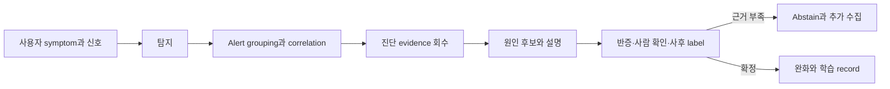

# 이상 탐지와 장애 진단 로드맵

## 처음 보는 사람을 위한 출발점

운영 중 평소와 다른 값이 보였다는 사실은 incident도, root cause도 아니다. 사용자가 영향을 받았는지, 같은 사건에서 나온 여러 신호인지, 최근 변경과 어떤 순서로 나타났는지를 확인해야 한다. 이 주제는 AIOps 진단을 **탐지 → 묶기 → evidence 회수 → 원인 후보 → 검증**의 다섯 단계로 나눈다.

선수 주제는 [AIOps 신호와 운영 토폴로지](../aiops-foundations/00-roadmap.md)와 [Observability와 SRE](../observability-sre/00-roadmap.md)다. 시계열 anomaly와 retrieval·LLM 후보는 각각 [AI Specialist의 시계열·추천](../ai-specialist-core/04-time-series-and-recommendation.md)과 [RAG·MCP](../ai-specialist-core/05-rag-graph-mcp.md)의 평가 경계를 따른다. 입력 계약과 SLO 없이 anomaly score만 만들면 정상적인 batch 작업이나 traffic 증가를 장애로 부르고, 여러 서비스의 alert를 잘못 묶는다. 진단 결과는 자동 실행 명령이 아니라 evidence와 반증 조건이 붙은 후보이며, 실제 조치는 [승인된 자동 복구](../aiops-remediation/00-roadmap.md)에서 별도 gate를 거친다.

| 처음 만나는 말 | 학습용 쉬운 뜻 |
|---|---|
| static rule | 사람이 정한 명시적 조건으로 이상을 찾는 규칙 |
| baseline | 시간·요일·traffic 조건이 비슷한 정상 비교 구간 |
| anomaly score | 관측값이 기준선에서 얼마나 벗어났는지 나타내는 점수 |
| alert correlation | 여러 alert가 같은 incident에 속하는지 관계와 시간으로 묶는 과정 |
| root cause candidate | 현재 evidence로 설명력이 있지만 아직 검증해야 하는 원인 후보 |
| diagnostic handler | alert 종류에 맞는 query와 evidence 회수 절차 |
| abstain | 근거가 부족해 원인 결론을 내리지 않는 선택 |

## 다섯 단계를 섞지 않기

Google SRE의 monitoring 지침은 page 경로를 단순하고 이해 가능하게 유지하고 사용자 symptom을 우선하라고 강조한다. 복잡한 학습 모델은 후보 생성과 사후 분석에 쓸 수 있지만, 사람이 반드시 반응해야 하는 page를 설명 불가능한 점수 하나에만 걸면 noise와 blind spot을 모두 만들 수 있다.

Microsoft의 RCACopilot 사례는 alert type에 맞는 handler를 고르고, 중요한 runtime 진단 정보를 모은 뒤, LLM이 root cause category와 설명을 생성하는 순서다. 이 사례가 모든 환경에서 같은 정확도를 보장하지는 않는다. 여기서 가져올 구조적 교훈은 **진단 정보 수집이 먼저이고, LLM은 제한된 evidence 위에서 분류·설명을 돕는다**는 것이다.

## 학습 순서

1. [탐지 점수에서 근거 있는 원인 후보까지](01-detection-correlation-rca.md)에서 rule·baseline·topology·change를 단계별로 연결한다.
2. [Alert 묶기와 진단 근거 선택 실습](02-alert-correlation-triage-lab.md)에서 합성 alert를 하나의 incident로 묶고 관련 없는 신호를 제외한다.
3. [트래픽 제어](../traffic-resilience/01-request-budget-and-ownership.md)에서 retry·overflow가 원래 장애를 증폭하는 사례를 원인 후보로 연결한다.
4. [Incident Command](../observability-sre/01-signals-slo-incident-model.md)의 사람 역할과 [자동 복구](../aiops-remediation/01-guarded-remediation-state-machine.md)의 실행 상태를 분리한다.

## 진단 품질을 재는 네 축

| 축 | 질문 | 실패 예 |
|---|---|---|
| detection | 실제 사용자 영향 incident를 놓치지 않았나 | 정상 CPU만 학습해 오류율 급증을 놓침 |
| grouping | 같은 사건을 하나로 묶고 다른 사건을 나눴나 | 공통 DB 장애를 서비스별 20개 incident로 생성 |
| evidence | 후보가 사용한 query·trace·change가 재현되나 | 자유 서술만 있고 읽은 기록이 없음 |
| decision | 맞히기 어려울 때 abstain하고 사람에게 넘겼나 | 근거 부족을 높은 confidence로 포장 |

## 완료

- anomaly, alert, incident와 root cause를 구분할 수 있다.
- 사용자 symptom rule과 원인 후보용 anomaly model의 역할을 나눌 수 있다.
- alert grouping에 시간만 아니라 service dependency와 change ID가 필요한 이유를 설명할 수 있다.
- LLM 진단이 읽은 evidence, 후보 category, 반대 증거와 abstain 사유를 남길 수 있다.
- 사후 확정 label로 detection·grouping·diagnosis를 각각 평가할 수 있다.

## 처음 이해했는지 확인

1. CPU anomaly score가 매우 높아도 page 조건이 아닐 수 있는 이유는 무엇인가?
2. 여러 alert를 너무 많이 묶는 것과 너무 잘게 나누는 것은 각각 어떤 비용을 만드는가?
3. LLM이 그럴듯한 root cause를 썼지만 evidence ID가 없다면 어떤 상태로 처리해야 하는가?

## 운영 판단으로 확장하기

- 정답 label이 없는 incident를 정확도 계산에서 조용히 제외하지 않는가?
- 새로운 service·revision·traffic pattern이 baseline을 바꿀 때 model version을 갱신하는가?
- 진단 결과가 특정 팀·제품을 과도하게 원인으로 지목하는 편향을 점검하는가?
- 사람의 수정 결과가 다음 평가셋으로 들어갈 때 개인정보와 잘못된 label을 검토하는가?

<!-- source: https://sre.google/sre-book/monitoring-distributed-systems/ | checked: 2026-09-03 -->
<!-- source: https://sre.google/workbook/alerting-on-slos/ | checked: 2026-09-03 -->
<!-- source: https://www.microsoft.com/en-us/research/publication/automatic-root-cause-analysis-via-large-language-models-for-cloud-incidents/ | checked: 2026-09-03 | publication: EuroSys 2024 -->
<!-- source: https://arxiv.org/abs/2305.15778 | checked: 2026-09-03 -->
