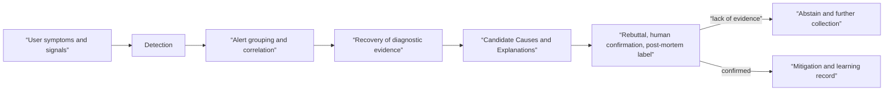

# Anomaly detection and fault diagnosis roadmap

## Starting point for beginners

The fact that unusual values ​​were seen during operation is neither an incident nor a root cause. You need to determine whether users were affected, whether multiple signals came from the same event, recent changes, and in what order they appeared. This topic divides AIOps diagnosis into five steps: **detection → grouping → evidence recovery → cause candidate → verification**.

The prerequisite topics are [AIOps Signals and Operational Topology](../aiops-foundations/00-roadmap.md) and [Observability and SRE](../observability-sre/00-roadmap.md). Time series anomaly and retrieval·LLM candidates follow the evaluation boundaries of [AI Specialist's time series·recommendation](../ai-specialist-core/04-time-series-and-recommendation.md) and [RAG·MCP](../ai-specialist-core/05-rag-graph-mcp.md), respectively. If you only create an anomaly score without an input contract and SLO, normal batch work or increased traffic will be called a failure, and alerts from multiple services will be incorrectly grouped together. The diagnosis result is not an automatic execution command, but a candidate with evidence and disconfirmation conditions, and the actual action goes through a separate gate in [Approved Automatic Recovery](../aiops-remediation/00-roadmap.md).

| New term | Plain-language meaning | Why it matters / when to use it |
|---|---|---|
| static rule | Rules for finding anomalies based on explicit conditions set by a person | Detect known failure conditions with an inspectable threshold or explicit business rule. **Concrete situation (illustrative):** A known failure means a required publication interval is missing. → Encode an explicit rule for expected delivery. → Test both missed and successfully completed intervals. |
| baseline | Normal comparison section with similar time, day, and traffic conditions | Compare an observation with a relevant normal period before calling it abnormal. **Concrete situation (illustrative):** Monday traffic looks unusual compared with Sunday. → Choose a baseline with comparable calendar and load conditions. → Reassess the anomaly against that reference. |
| anomaly score | A score indicating how far an observation deviates from the baseline | Rank unusual observations for investigation without equating unusualness with a confirmed incident. **Concrete situation (illustrative):** A traffic spike is unusual but customers still succeed. → Inspect the anomaly score with user-outcome evidence. → Prioritize investigation without equating the score with an incident. |
| alert correlation | The process of grouping multiple alerts by relationship and time to determine whether they belong to the same incident | Reduce duplicate triage by grouping related alerts while preserving evidence for each one. **Concrete situation (illustrative):** One backend outage triggers dozens of alerts. → Group alerts by validated dependency and timing. → Preserve individual evidence while reducing duplicate triage. |
| root cause candidate | Candidate cause that has explanatory power based on current evidence but still needs to be verified | Keep competing explanations testable until evidence supports a diagnosis. **Concrete situation (illustrative):** A deployment and a database slowdown both fit the symptom. → Keep both root-cause candidates explicit. → Run checks that distinguish their predictions. |
| diagnostic handler | Query and evidence retrieval procedures appropriate for the alert type | Run the queries appropriate to the failure class instead of collecting arbitrary evidence. **Concrete situation (illustrative):** A storage alert needs different evidence from a routing failure. → Select the matching diagnostic handler. → Confirm its queries resolve the relevant uncertainty. |
| abstain | The choice not to draw a conclusion on the cause due to insufficient evidence | Avoid unsafe certainty or action when the available evidence cannot justify a diagnosis. **Concrete situation (illustrative):** Telemetry is missing for the suspected failure period. → Abstain from a definitive root-cause claim. → Record the evidence gap and next safe diagnostic step. |

## Don't Mix the Five Steps

Google SRE's monitoring guidelines emphasize keeping page paths simple and understandable and prioritizing user symptoms. Complex learning models can be used for candidate generation and post-analysis, but if a page that a person must respond to is tied to only one unexplainable score, it can create both noise and blind spots.

Microsoft's RCACopilot example involves selecting a handler that matches the alert type, collecting important runtime diagnostic information, and then LLM creates a root cause category and explanation. This example does not guarantee the same accuracy in all environments. The structural lesson to be taken here is that **collecting diagnostic information comes first, and LLM helps classify and explain based on limited evidence**.

## learning sequence

1. [Connect rule·baseline·topology·change step by step in ](01-detection-correlation-rca.md) from the detection score to the cause candidate with evidence.
2. [Alert grouping and selection of diagnostic evidence In lab](02-alert-correlation-triage-lab.md), group synthetic alerts into one incident and exclude irrelevant signals.
3. [In traffic control](../traffic-resilience/01-request-budget-and-ownership.md), cases where retry/overflow amplifies the original failure are linked as candidate causes.
4. Separate the human role of [Incident Command](../observability-sre/01-signals-slo-incident-model.md) from the execution status of [Automatic Recovery](../aiops-remediation/01-guarded-remediation-state-machine.md).

## Four axes measuring diagnostic quality

| axis | question | failure example |
|---|---|---|
| detection | Did you miss an actual user impact incident? | Missing error rate spikes by training only healthy CPUs |
| grouping | Did you group the same incidents into one and divide the other incidents? | Generate common DB failures into 20 incidents for each service |
| evidence | Are the queries, traces, and changes used by the candidate reproduced? | Only free description, no reading records |
| decision | When it was difficult to guess, did you abstain and hand it over to someone? | Packaging lack of evidence with high confidence |

## Completion criteria

- Anomaly, alert, incident and root cause can be distinguished.
- The roles of user symptom rule and anomaly model for cause candidates can be divided.
- This can explain why alert grouping requires not only time but also service dependency and change ID.
- The LLM diagnosis can leave read evidence, candidate categories, opposing evidence and abstain reasons.
- Detection·grouping·diagnosis can be evaluated respectively with post-confirmation labels.

## Check your understanding

1. Why might it not be a page condition even if the CPU anomaly score is very high?
2. What are the costs of grouping too many alerts and splitting them too finely?
3. If LLM uses a plausible root cause but there is no evidence ID, what should be done?

## Develop operational judgment

- Aren't incidents without a correct label quietly excluded from accuracy calculations?
- Do you update the model version when a new service·revision·traffic pattern changes the baseline?
- Do the diagnostic results check for bias that excessively points to specific teams and products as the cause?
- Are human-corrected results reviewed for personal information and incorrect labels when entering the next evaluation set?

<!-- source: https://sre.google/sre-book/monitoring-distributed-systems/ | checked: 2026-09-03 -->
<!-- source: https://sre.google/workbook/alerting-on-slos/ | checked: 2026-09-03 -->
<!-- source: https://www.microsoft.com/en-us/research/publication/automatic-root-cause-analysis-via-large-language-models-for-cloud-incidents/ | checked: 2026-09-03 | publication: EuroSys 2024 -->
<!-- source: https://arxiv.org/abs/2305.15778 | checked: 2026-09-03 -->
