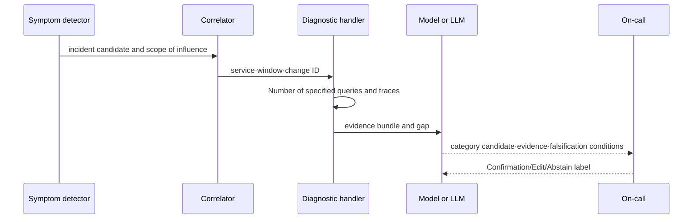

# From detection scores to cause candidates with evidence

## Terms introduced in this chapter

| word | Meaning in this chapter |
|---|---|
| symptom detector | Rules to directly find user errors, delays, and poor availability |
| cause hint | Internal signals that narrow down the cause, such as CPU·queue·deployment |
| change correlation | Linking deployment/setting changes before and after symptoms to candidates |
| topology radius | Impact The scope of determining how many levels of dependency will be explored in the service. |
| confidence | Degree to which a candidate is selected within the given evidence and evaluation criteria |
| counterevidence | If the candidate is the cause, it should be observed, but in fact, there is evidence to the contrary. |

## Understand the model first

If detection and diagnosis are made into one “AI model,” the location of failure cannot be known. Improvements can be made by separating whether there was no input when an incident was missed, whether the anomaly model was unable to find it, whether the grouping was wrong, or the diagnostic machine picked the wrong evidence. Therefore, each step must be an independent contract with input, output, version, and evaluation labels.

1. User symptom detector opens incident candidate.
2. Alert grouping groups signals from the same service·region·dependency·time window.
3. The handler retrieves queries and traces determined by incident type.
4. Topology and change events limit the scope of the investigation.
5. A rule, statistical model, or LLM ranks root cause category candidates.
6. If there is insufficient evidence or the difference between candidates is small, abstain.
7. Human confirmation and post-verification become the ground truth and each step is evaluated separately.



## Don't abandon simple rules

You can check with explicit calculations whether the user error rate is quickly burning up your SLO budget. The Prometheus alert rule's `for` fires after the condition lasts for a certain period of time, and `keep_firing_for` can alleviate brief data missing or immediate release from flapping. This behavior can be understood and tested. The anomaly model can be used as an auxiliary signal to search for unknown changes or many candidates, but if it is to be used as the only evidence for opening or closing a page, separate precision·recall·latency·drift verification is required.

Google SRE has experienced limited success with complex dependency hierarchies and automatic causal detection, and explains the need to keep the critical path simple. There is no need to read this experience as “don’t use AI.” Separation of layers is key: **User impact alerts are simple and robust, and root cause detection is richer in signals**.

## Priority of Correlation

| relationship | robbery | How to use | margin |
|---|---|---|---|
| Same trace·operation ID | height | span·log connection of the same execution | Missing sampling and transmission |
| Same deployment·change ID | height | Comparison of changed cohort and old cohort | Simultaneous change/common dependency |
| explicit service dependency | middle | Probe topology radius limit | Difference between actual runtime call and document topology |
| Same region·tenant·resource | middle | Verify scope of influence matches | high-cardinality and privacy |
| Nearest timestamp | lowness | Candidate Generation | Coincidental simultaneity, clock drift |
| Sentence Similarity | lowness | Past incident search | Similar expressions do not mean the same cause |

It is not elevated to a cause just because it is close in time. If errors increase immediately after deployment, the cohort difference between the new revision and the previous revision, recovery after rollback, and reproduction tests strengthen the causal judgment. Conversely, if all revisions fail at the same time or dependency saturation starts first, deployment may be a coincidental coincidence.

## Output Agreement of LLM Diagnostics

```json
{
  "incident_id": "inc-20260903-001",
  "candidate_category": "dependency_capacity",
  "candidate_entity": "orders-db",
  "evidence_ids": ["metric-q17", "trace-a91", "change-881"],
  "counterevidence": ["old revision cohort also failed"],
  "unknowns": ["orders-db lock snapshot missing"],
  "recommended_queries": ["db-wait-events-v2"],
  "decision": "abstain"
}
```

The free statement should be the explanation behind this structure. `candidate_category` uses an evaluable label set, and `evidence_ids` must be resolved in the actual bundle. A single confidence number is meaningless for humans to read unless calibration is verified. What is more important is what missing evidence and which observations disprove the candidate.

RCACopilot collected diagnostic information with handlers for each alert type and created root cause categories and explanations. The results of this study are about a Microsoft cloud incident and its data/handler, so the accuracy cannot be taken from other organizations. The applicable structure has handlers and categories, so collection and evaluation are more reproducible than free description.

## Step-by-step evaluation

| step | evaluation unit | example failure |
|---|---|---|
| detection | Detect/miss and latency by incident | Late detection of total outage |
| grouping | alert pair or incident cluster | Merge two incidents into one |
| collect | required evidence coverage | Missing recent change event |
| diagnosis | category top-k, abstain, evidence precision | It's the right category, but fake evidence is cited |
| operate | Person time, relief time, recurrence/side effects | Expand blast radius with quick misdiagnosis |

Just by looking at the final MTTR, it is impossible to distinguish between a misdiagnosis that was luckily recovered quickly and a diagnosis that was accurate but for which there was no authority to take action. Conversely, if you only look at offline category accuracy, you miss the actual evidence collection time and the cost of incorrect automatic actions. View step-by-step quality and end-to-end operation results together.

## Explain it in your own words

- What problems arise if symptom detector and cause hint are used on a page with the same threshold?
- Why is change cohort comparison stronger evidence than timestamp correlation?
- Even if the category is correct, why is it not safe if the evidence precision is low?
- Why is the goal of unconditionally lowering the abstain rate dangerous?

<!-- source: https://prometheus.io/docs/prometheus/latest/configuration/alerting_rules/ | checked: 2026-09-03 -->
<!-- source: https://sre.google/sre-book/monitoring-distributed-systems/ | checked: 2026-09-03 -->
<!-- source: https://www.microsoft.com/en-us/research/publication/automatic-root-cause-analysis-via-large-language-models-for-cloud-incidents/ | checked: 2026-09-03 | publication: EuroSys 2024 -->
<!-- source: https://arxiv.org/abs/2305.15778 | checked: 2026-09-03 -->
