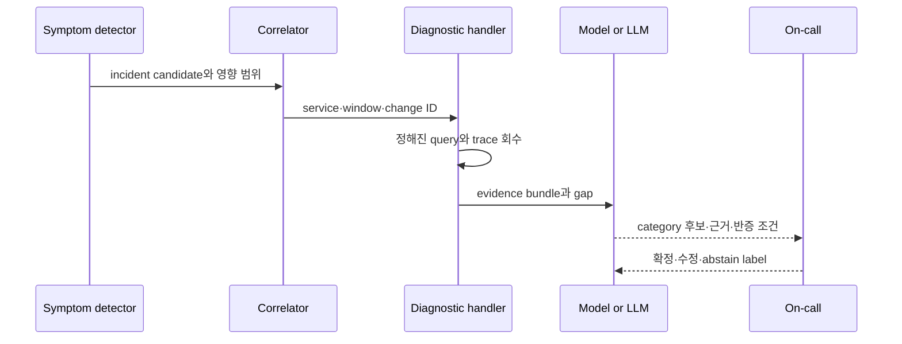

# 탐지 점수에서 근거 있는 원인 후보까지

## 이 장에서 처음 쓰는 말

| 말 | 이 장에서의 뜻 |
|---|---|
| symptom detector | 사용자 오류·지연·가용성 저하를 직접 찾는 규칙 |
| cause hint | CPU·queue·deployment처럼 원인을 좁히는 내부 신호 |
| change correlation | symptom 전후의 배포·설정 변경을 후보에 연결하는 것 |
| topology radius | 영향 service에서 dependency를 몇 단계까지 탐색할지 정한 범위 |
| confidence | 주어진 evidence와 평가 기준 안에서 후보를 선택한 정도 |
| counterevidence | 그 후보가 원인이라면 관측돼야 하지만 실제로는 반대인 증거 |

## 먼저 이해하기

탐지와 진단을 하나의 “AI model”로 만들면 실패 위치를 알 수 없다. incident를 놓쳤을 때 입력이 없었는지, anomaly model이 못 찾았는지, grouping이 잘못됐는지, 진단기가 엉뚱한 evidence를 골랐는지 분리해야 개선할 수 있다. 따라서 각 단계는 입력·출력·version·평가 label을 가진 독립 계약이어야 한다.

1. 사용자 symptom detector가 incident 후보를 연다.
2. alert grouping이 같은 service·region·dependency·시간 창의 신호를 묶는다.
3. handler가 incident 종류별로 정해진 query와 trace를 회수한다.
4. topology와 change event가 조사 범위를 제한한다.
5. rule, 통계 모델 또는 LLM이 root cause category 후보를 순위화한다.
6. evidence가 부족하거나 후보 간 차이가 작으면 abstain한다.
7. 사람의 확정과 사후 검증이 ground truth가 되어 각 단계를 따로 평가한다.



## 단순 규칙을 버리지 않는다

사용자 오류율이 SLO budget을 빠르게 태우는지는 명시적 계산으로 확인할 수 있다. Prometheus alert rule의 `for`는 조건이 일정 시간 지속된 뒤 firing하게 하고 `keep_firing_for`는 짧은 데이터 누락이나 flapping에서 즉시 해제되는 것을 완화할 수 있다. 이 동작은 이해하고 테스트할 수 있다. anomaly model은 알려지지 않은 변화나 많은 후보를 탐색하는 보조 신호로 두되, page를 열거나 닫는 유일한 근거로 쓰려면 별도의 precision·recall·latency·drift 검증이 필요하다.

Google SRE는 복잡한 dependency hierarchy와 자동 인과 탐지에 제한적인 성공을 경험했고 critical path를 단순하게 유지해야 한다고 설명한다. 이 경험을 “AI를 쓰지 말라”로 읽을 필요는 없다. **사용자 영향 경보는 단순하고 robust하게, 원인 탐색은 더 풍부한 신호로**라는 계층 분리가 핵심이다.

## 상관관계의 우선순위

| 관계 | 강도 | 사용 방법 | 한계 |
|---|---|---|---|
| 같은 trace·operation ID | 높음 | 동일 실행의 span·log 연결 | sampling과 전파 누락 |
| 같은 deployment·change ID | 높음 | 변경 cohort와 구 cohort 비교 | 동시 변경·공통 dependency |
| 명시적 service dependency | 중간 | 조사 topology radius 제한 | 실제 runtime 호출과 문서 topology 차이 |
| 같은 region·tenant·resource | 중간 | 영향 범위 일치 확인 | high-cardinality와 개인정보 |
| 가까운 timestamp | 낮음 | 후보 생성 | 우연한 동시성, clock drift |
| 문장 유사도 | 낮음 | 과거 incident 검색 | 비슷한 표현이 같은 원인을 뜻하지 않음 |

시간이 가깝다는 이유만으로 원인으로 승격하지 않는다. 배포 직후 오류가 늘었다면 새 revision과 이전 revision의 cohort 차이, rollback 뒤 회복, 재현 test가 인과 판단을 강화한다. 반대로 모든 revision이 동시에 실패하거나 dependency saturation이 먼저 시작됐다면 배포는 우연한 동시 사건일 수 있다.

## LLM 진단의 출력 계약

```json
{
  "incident_id": "inc-20260903-001",
  "candidate_category": "dependency_capacity",
  "candidate_entity": "orders-db",
  "evidence_ids": ["metric-q17", "trace-a91", "change-881"],
  "counterevidence": ["old revision cohort also failed"],
  "unknowns": ["orders-db lock snapshot missing"],
  "recommended_queries": ["db-wait-events-v2"],
  "decision": "abstain"
}
```

자유 서술은 이 구조 뒤의 설명이어야 한다. `candidate_category`는 평가 가능한 label set을 쓰고, `evidence_ids`는 실제 bundle에서 해소되어야 한다. confidence 숫자 하나는 calibration이 검증되지 않으면 사람이 읽을 의미가 없다. 더 중요한 것은 missing evidence와 어떤 관찰이 후보를 반증하는지다.

RCACopilot은 alert type별 handler로 진단 정보를 모으고 root cause category와 설명을 생성했다. 이 연구의 결과는 Microsoft cloud incident와 그 데이터·handler에 대한 것이므로 다른 조직의 정확도로 가져올 수 없다. 적용할 수 있는 구조는 handler와 category가 있어 수집과 평가가 자유 서술보다 재현 가능하다는 점이다.

## 단계별 평가

| 단계 | 평가 단위 | 예시 실패 |
|---|---|---|
| 탐지 | incident별 detect·miss와 latency | 전체 outage를 늦게 탐지 |
| grouping | alert pair 또는 incident cluster | 두 incident를 하나로 병합 |
| 회수 | required evidence coverage | 최근 change event 누락 |
| 진단 | category top-k, abstain, evidence precision | 맞는 category지만 가짜 evidence 인용 |
| 운영 | 사람 시간, 완화 시간, 재발·부작용 | 빠른 오진으로 blast radius 확대 |

최종 MTTR만 보면 운 좋게 빨리 복구한 오진과 정확하지만 조치 권한이 없던 진단을 구분할 수 없다. 반대로 offline category accuracy만 보면 실제로 필요한 evidence 수집 시간과 잘못된 자동 조치 비용을 놓친다. 단계별 품질과 end-to-end 운영 결과를 함께 본다.

## 스스로 설명해 보기

- symptom detector와 cause hint를 같은 threshold로 page에 쓰면 어떤 문제가 생기는가?
- timestamp correlation보다 change cohort 비교가 강한 evidence인 이유는 무엇인가?
- category가 맞아도 evidence precision이 낮으면 왜 안전하지 않은가?
- abstain 비율을 무조건 낮추는 목표가 왜 위험한가?

<!-- source: https://prometheus.io/docs/prometheus/latest/configuration/alerting_rules/ | checked: 2026-09-03 -->
<!-- source: https://sre.google/sre-book/monitoring-distributed-systems/ | checked: 2026-09-03 -->
<!-- source: https://www.microsoft.com/en-us/research/publication/automatic-root-cause-analysis-via-large-language-models-for-cloud-incidents/ | checked: 2026-09-03 | publication: EuroSys 2024 -->
<!-- source: https://arxiv.org/abs/2305.15778 | checked: 2026-09-03 -->
