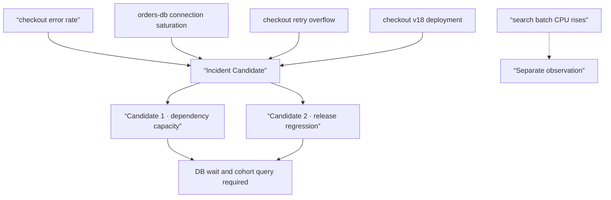

# Alert binding and diagnostic evidence selection lab

## Lab prerequisites

This lab is a **Local·read only** analysis that groups incidents by looking at four synthetic alerts. It does not change the actual monitoring system or tickets. Use only paper, a text editor, or the Python standard library. The goal is not to guess the most likely cause, but to leave a reproducible record of what was grouped into the same event and why it was excluded.

| Preparation items | value |
|---|---|
| input | 4 synthetic alerts, 1 change event, 1 service dependency |
| output of power | incident cluster, evidence and gap, next query |
| Correct answer status | The cause is not yet determined |
| stopping condition | One of service·timestamp·source cannot be interpreted |
| cleanup | No operational changes |

## Understand the model first

alert If you group them together because their names are similar, different services that use the same template can be combined. If timestamps are grouped together because they are close, regular batch CPU increases may be mixed in with user failures. First, the user influence range is fixed, strong relationships such as trace·dependency·deployment·region are applied, and time and sentence similarity are used as auxiliary evidence.



## input event

| Time UTC | type | service·resource | detail | user impact |
|---|---|---|---|---|
| 01:00:30 | change | checkout v18 | image revision change | Don't know yet |
| 01:03:00 | alert | checkout | success ratio 99.95% → 91% | Confirmed |
| 01:03:20 | alert | orders-db | connection pool pending surge | checkout dependency |
| 01:03:40 | alert | checkout proxy | Increased retry overflow | Check on request path |
| 01:04:00 | alert | search-batch | CPU 92% | Separate service, no impact |

It is assumed that `checkout → orders-db` dependency has been confirmed in the service catalog and trace. search-batch is in the same node pool, but there is no checkout, no trace/dependency, and no user influence. Although this information alone cannot confirm that the search-batch is completely unrelated, it excludes the core evidence from the first incident cluster and leaves a shared resource query as a follow-up.

## Step 1 — Open incident boundaries with symptoms

The first incident started with a low checkout success ratio. The reason for not taking DB saturation as a starting point is that internal saturation may not create user impact. The incident window is set from 00:55 to 01:15 to include the baseline before the change. It is not the ticket creation time, but a range that includes symptoms and preceding changes.

## Step 2 — Include or Exclude alerts

```json
{
  "incident_id": "inc-checkout-001",
  "window": ["00:55:00Z", "01:15:00Z"],
  "included": [
    {"id": "checkout-error", "because": ["user-symptom", "same-service"]},
    {"id": "orders-db-pending", "because": ["declared-dependency", "same-window"]},
    {"id": "checkout-retry-overflow", "because": ["same-request-path", "same-window"]}
  ],
  "excluded": [
    {"id": "search-batch-cpu", "because": ["no-trace-or-dependency-edge", "no-user-impact"]}
  ]
}
```

In this structure, `excluded` is also left. If shared node pressure is later found to be the actual cause, you can evaluate why it was missed. If you quietly throw it away, you won't know whether it's a false split or reasonable pruning.

## Step 3 — Holding both causal candidates simultaneously

| candidate | supporting evidence | Opposition/lack of evidence | Next query |
|---|---|---|---|
| checkout v18 regression | symptom 2 minutes 30 seconds ago deployment | Old revision cohort no results | Success ratio by revision, recovery after rollback |
| orders-db capacity | Dependency pending increases immediately after symptoms | It is unclear whether DB saturation came first. | DB connection·wait event primitive series |
| retry amplification | Overflow increases on the same request path | May be amplification rather than initial cause | Separate original attempt and retry rate |
| search batch resource contention | same node pool | dependency·host overlap unconfirmed | affected pod and node placement |

Here, v18 is not confirmed simply because “deployment comes first.” Due to metric resolution, the actual start of DB pending may be 01:02, and all cohorts may fail regardless of deployment. Conversely, DB saturation may be an intermediate cause caused by v18 leaking connections. The root cause may not be a single node label, but may be a combination of defects and defense failures.

## Step 4 — Create a diagnostic handler input

The following query list is passed to the handler without throwing the entire log.

1. Search `checkout_success_ratio` from 00:55 to 01:15 by revision·region.
2. Check `orders-db`'s active·pending connection and wait event with the same resolution.
3. Compare the DB span latency and error type of v17·v18 in the failure trace.
4. Separate the proxy's original request, retry attempt, and overflow.
5. Check whether the checkout pod and search-batch actually experienced CPU contention on the same node.

This list verifies the edges of [incident evidence graph](../aiops-foundations/01-evidence-graph.md). If you ask LLM about the cause before the query results come out, it will only repeat the current table in natural language and will not create any new evidence.

## How to interpret the results

| Additional observations | Candidate Change | acceptable conclusion |
|---|---|---|
| Only v18 fails and recovers after rollback | Strengthening release candidates | High possibility of regression, reproducible test required |
| v17·v18 all failed, DB pending precedence | Strengthening dependency capacity candidates | DB path priority mitigation and investigation |
| Pending worsens as retry rate rapidly increases | Check amplification | Retry restrictions are relaxed, initial cause is separate |
| Node where search batch and affected pod are different | Weakening contention candidates | Excluded from the core of this incident |
| There is no trace due to sampling. | evidence gap | Do not interpret as “no DB call” |

## Completion criteria

- Opened the incident boundary from user symptoms.
- Both inclusion and exclusion alerts were left with reasons.
- Instead of early confirmation of a single candidate for cause, opposing evidence was written down.
- The following query connects which edge to verify.
- We only created a triage bundle without running any automatic actions.

## Explain it in your own words

- Why was the search-batch CPU alert left as excluded rather than completely deleted?
- Is retry overflow a root cause or an amplification cause? Can this be confirmed based on current evidence?
- What are the minimum conditions for passing this cluster result to [automatic recovery dry-run](../aiops-remediation/02-remediation-dry-run-lab.md)?
- To evaluate the grouping model after confirming the person, do we need to record which pairs are false positive and false negative?

<!-- source: https://sre.google/sre-book/monitoring-distributed-systems/ | checked: 2026-09-03 -->
<!-- source: https://sre.google/workbook/incident-response/ | checked: 2026-09-03 -->
<!-- source: https://www.microsoft.com/en-us/research/publication/automatic-root-cause-analysis-via-large-language-models-for-cloud-incidents/ | checked: 2026-09-03 | publication: EuroSys 2024 -->
<!-- source: https://kubernetes.io/docs/tasks/debug/debug-application/debug-running-pod/ | checked: 2026-09-03 -->
