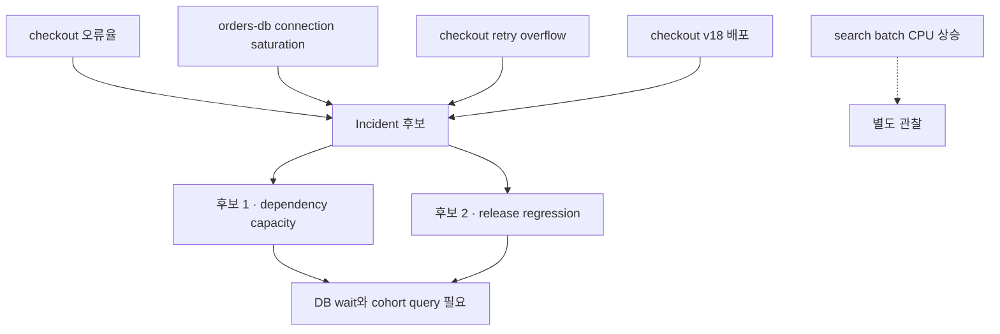

# Alert 묶기와 진단 근거 선택 실습

## 실습 전에 준비할 것

이 실습은 네 개의 합성 alert를 보고 incident를 묶는 **Local·read only** 분석이다. 실제 monitoring system이나 ticket을 변경하지 않는다. 종이, 텍스트 편집기 또는 Python 표준 라이브러리만 사용한다. 목표는 가장 그럴듯한 원인을 맞히는 것이 아니라 **무엇을 같은 사건으로 묶었고 왜 제외했는지 재현 가능하게 남기는 것**이다.

| 준비 항목 | 값 |
|---|---|
| 입력 | 합성 alert 4개, change event 1개, service dependency 1개 |
| 출력 | incident cluster, evidence와 gap, 다음 query |
| 정답 상태 | 원인은 아직 미확정 |
| 중단 조건 | service·timestamp·source 중 하나가 해석 불가 |
| cleanup | 운영 변경 없음 |

## 먼저 이해하기

alert 이름이 비슷하다는 이유로 묶으면 같은 template을 쓰는 다른 service가 합쳐질 수 있다. timestamp가 가깝다는 이유로 묶으면 정기 batch CPU 상승이 사용자 장애에 섞일 수 있다. 먼저 사용자 영향 범위를 고정하고, trace·dependency·deployment·region 같은 강한 관계를 적용한 뒤, 시간과 문장 유사도는 보조 근거로 쓴다.



## 입력 사건

| 시각 UTC | 종류 | service·resource | 내용 | 사용자 영향 |
|---|---|---|---|---|
| 01:00:30 | change | checkout v18 | image revision 변경 | 아직 모름 |
| 01:03:00 | alert | checkout | success ratio 99.95% → 91% | 확인됨 |
| 01:03:20 | alert | orders-db | connection pool pending 급증 | checkout dependency |
| 01:03:40 | alert | checkout proxy | retry overflow 증가 | 요청 경로상 확인 |
| 01:04:00 | alert | search-batch | CPU 92% | 별도 service, 영향 없음 |

`checkout → orders-db` dependency는 service catalog와 trace에서 확인됐다고 가정한다. search-batch는 같은 node pool에 있지만 checkout과 trace·dependency가 없고 사용자 영향도 없다. 이 정보만으로 search-batch가 완전히 무관하다고 확정할 수는 없지만 첫 incident cluster의 핵심 evidence에서는 제외하고 공유 resource query를 후속으로 남긴다.

## 1단계 — symptom으로 사건 경계 열기

첫 incident는 checkout success ratio 저하로 연다. DB saturation을 시작점으로 삼지 않는 이유는 내부 포화가 사용자 영향을 만들지 않을 수도 있기 때문이다. incident window는 change 이전 baseline을 포함하도록 00:55~01:15로 잡는다. ticket 생성 시각이 아니라 symptom과 선행 change를 포함하는 범위다.

## 2단계 — alert를 포함하거나 제외하기

```json
{
  "incident_id": "inc-checkout-001",
  "window": ["00:55:00Z", "01:15:00Z"],
  "included": [
    {"id": "checkout-error", "because": ["user-symptom", "same-service"]},
    {"id": "orders-db-pending", "because": ["declared-dependency", "same-window"]},
    {"id": "checkout-retry-overflow", "because": ["same-request-path", "same-window"]}
  ],
  "excluded": [
    {"id": "search-batch-cpu", "because": ["no-trace-or-dependency-edge", "no-user-impact"]}
  ]
}
```

이 구조에서 `excluded`도 남긴다. 나중에 shared node pressure가 실제 원인으로 밝혀지면 왜 놓쳤는지 평가할 수 있기 때문이다. 조용히 버리면 false split인지 합리적 pruning인지 알 수 없다.

## 3단계 — 두 원인 후보를 동시에 유지하기

| 후보 | 지지 evidence | 반대·부족 evidence | 다음 query |
|---|---|---|---|
| checkout v18 regression | symptom 2분 30초 전 배포 | 구 revision cohort 결과 없음 | revision별 success ratio, rollback 후 회복 |
| orders-db capacity | dependency pending이 symptom 직후 상승 | DB 포화가 먼저였는지 불명 | DB connection·wait event 원시계열 |
| retry amplification | overflow가 같은 요청 경로에서 증가 | 최초 원인이 아니라 증폭일 수 있음 | original attempt와 retry rate 분리 |
| search batch resource contention | 같은 node pool | dependency·host overlap 미확인 | affected pod와 node placement |

여기서 “배포가 먼저”라는 이유만으로 v18을 확정하지 않는다. metric 해상도 때문에 DB pending의 실제 시작이 01:02일 수 있고, 배포와 무관하게 모든 cohort가 실패할 수 있다. 반대로 DB saturation은 v18이 connection을 누수해 만든 중간 원인일 수 있다. root cause는 하나의 node label이 아니라 결함과 방어 실패가 함께 있을 수도 있다.

## 4단계 — diagnostic handler 입력 만들기

handler에는 전체 log를 던지지 않고 다음 query 목록을 전달한다.

1. `checkout_success_ratio`를 revision·region별로 00:55~01:15 조회한다.
2. `orders-db`의 active·pending connection과 wait event를 같은 해상도로 조회한다.
3. 실패 trace에서 v17·v18의 DB span latency와 error type을 비교한다.
4. proxy의 original request, retry attempt, overflow를 분리한다.
5. checkout pod와 search-batch가 실제 같은 node에서 CPU contention을 겪었는지 확인한다.

이 목록은 [incident evidence graph](../aiops-foundations/01-evidence-graph.md)의 edge를 검증한다. query 결과가 나오기 전 LLM에게 원인을 물으면 현재 표를 자연어로 반복할 뿐 새로운 증거를 만들지 못한다.

## 결과를 이렇게 읽는다

| 추가 관찰 | 후보 변화 | 허용할 결론 |
|---|---|---|
| v18만 실패하고 rollback 뒤 회복 | release 후보 강화 | 회귀 가능성 높음, 재현 test 필요 |
| v17·v18 모두 실패, DB pending 선행 | dependency capacity 후보 강화 | DB 경로 우선 완화·조사 |
| retry 비율이 급증하며 pending 악화 | amplification 확인 | retry 제한은 완화, 최초 원인은 별도 |
| search batch와 affected pod가 다른 node | contention 후보 약화 | 이 incident의 핵심에서 제외 가능 |
| trace가 sampling으로 없음 | evidence gap | “DB 호출 없음”으로 해석 금지 |

## 완료

- 사용자 symptom에서 incident 경계를 열었다.
- 포함·제외 alert 모두 이유와 함께 남겼다.
- 원인 후보를 하나로 조기 확정하지 않고 반대 evidence를 적었다.
- 다음 query가 어떤 edge를 검증하는지 연결했다.
- 자동 조치를 실행하지 않고 triage bundle만 만들었다.

## 스스로 설명해 보기

- search-batch CPU alert를 완전히 삭제하지 않고 excluded로 남긴 이유는 무엇인가?
- retry overflow는 root cause와 증폭 원인 중 어느 쪽인가? 현재 evidence로 확정할 수 있는가?
- 이 cluster 결과를 [자동 복구 dry-run](../aiops-remediation/02-remediation-dry-run-lab.md)에 넘길 최소 조건은 무엇인가?
- 사람 확정 뒤 grouping model을 평가하려면 어떤 pair가 false positive·false negative인지 기록해야 하는가?

<!-- source: https://sre.google/sre-book/monitoring-distributed-systems/ | checked: 2026-09-03 -->
<!-- source: https://sre.google/workbook/incident-response/ | checked: 2026-09-03 -->
<!-- source: https://www.microsoft.com/en-us/research/publication/automatic-root-cause-analysis-via-large-language-models-for-cloud-incidents/ | checked: 2026-09-03 | publication: EuroSys 2024 -->
<!-- source: https://kubernetes.io/docs/tasks/debug/debug-application/debug-running-pod/ | checked: 2026-09-03 -->
