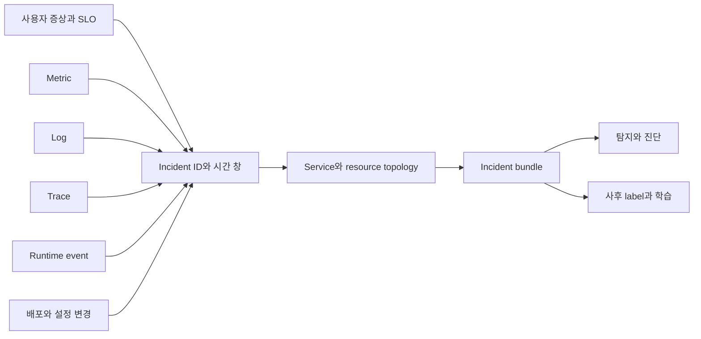

# AIOps 신호와 운영 토폴로지 로드맵

## 처음 보는 사람을 위한 출발점

AIOps는 운영 화면에 챗봇을 붙이거나 모든 alert를 AI에게 읽히는 일이 아니다. 이 과정에서는 **운영 데이터로 탐지·진단·조치 결정을 보조하고, 그 결정이 어떤 근거에서 나왔는지 다시 확인할 수 있게 만드는 체계**로 다룬다. AI가 없어도 incident를 재구성할 수 있는 신호와 관계가 먼저고, AI는 반복되는 후보 탐색과 정보 압축을 돕는 다음 층이다.

먼저 [Observability와 SRE](../observability-sre/00-roadmap.md)에서 metric·log·trace·SLO의 역할을 익힌다. [AI Specialist](../ai-specialist-core/00-roadmap.md)의 model·retrieval 결과와 [AI Transformation](../ai-transformation-platform/00-roadmap.md)의 bundle·deployment·tool operation ID도 이 단계에서 운영 신호와 만난다. 여기서는 여기에 Kubernetes event, deployment·configuration change, service owner와 topology를 더해 `incident bundle`을 만든다. 이 bundle이 있어야 [이상 탐지와 장애 진단](../aiops-diagnosis/00-roadmap.md)이 매번 다른 데이터를 임의로 읽지 않고 같은 사건을 재현할 수 있다.

| 처음 만나는 말 | 학습용 쉬운 뜻 |
|---|---|
| AIOps | 운영 데이터를 분석해 탐지·진단·조치 결정을 보조하는 기술과 운영 절차 |
| telemetry | 시스템이 밖으로 내보내는 metric·log·trace 같은 관측 데이터 |
| semantic convention | 서로 다른 시스템이 같은 의미를 같은 이름과 단위로 기록하기 위한 약속 |
| topology | service·dependency·deployment·resource가 어떻게 연결되는지 나타낸 관계 |
| change event | 배포·설정·feature flag처럼 시스템 동작을 바꾼 사건 |
| incident bundle | 한 장애의 시간 범위, 영향, 신호, 변경, 후보와 판단을 묶은 재현 가능한 기록 |
| ground truth | 사건이 끝난 뒤 사람과 증거로 확정한 원인·영향·조치 label |

## AIOps가 읽을 수 있는 운영 기반

OpenTelemetry Collector는 telemetry를 수신·처리·내보내는 공통 경로를 제공하지만, incident 저장소나 원인 판정기는 아니다. Semantic Conventions는 데이터 이름을 맞추는 데 도움을 주지만, 서비스 소유권·배포 revision·업무 성공 여부까지 자동으로 만들지 않는다. AIOps 기반은 도구 하나가 아니라 **식별자, 시간, 관계, 보존과 개인정보 계약**의 결합이다.

## 학습 순서

1. [운영 신호를 incident evidence graph로 연결하기](01-evidence-graph.md)에서 symptom → service → deployment → resource → trace 관계와 시간 창을 만든다.
2. [Incident bundle 데이터 계약 검토 실습](02-incident-bundle-contract-lab.md)에서 작은 JSON record의 누락을 찾아 같은 사건을 재현할 수 있는지 확인한다.
3. [Alert 묶기와 진단 근거 선택](../aiops-diagnosis/02-alert-correlation-triage-lab.md)으로 bundle을 넘겨 여러 alert를 incident 하나로 묶는다.
4. [승인된 자동 복구](../aiops-remediation/00-roadmap.md)에서 진단 결과가 어떤 권한과 검증을 거쳐 조치가 되는지 연결한다.

## 데이터 품질을 정확도보다 먼저 묻기

| 질문 | 나쁜 출발 | 확인 가능한 출발 |
|---|---|---|
| 무엇이 깨졌나 | alert 제목 | 사용자 영향 SLI와 영향 범위 |
| 언제 시작했나 | ticket 생성 시각 | 최초 symptom·change·signal timestamp와 clock 기준 |
| 어디서 깨졌나 | hostname 문자열 | 안정적인 service·resource·deployment ID |
| 무엇이 바뀌었나 | 채팅 기억 | revision과 actor가 있는 change event |
| 왜 그렇게 판단했나 | 모델 자유 서술 | 사용한 evidence ID와 반대 증거 |
| 결과가 맞았나 | thumbs-up | 사후 확정 label과 사용자 회복 검증 |

## 완료

- AIOps와 observability, incident management의 책임 차이를 설명할 수 있다.
- metric·log·trace·event·change를 같은 incident ID와 시간 창에 연결할 수 있다.
- service name, deployment revision, resource ID 중 어느 식별자가 어떤 관계를 고정하는지 말할 수 있다.
- 개인정보·secret·고카디널리티 값을 telemetry attribute로 무제한 넣지 않는 이유를 설명할 수 있다.
- 모델 입력과 출력뿐 아니라 어떤 evidence를 사용했고 사후 어떤 label로 확정됐는지 남길 수 있다.

## 처음 이해했는지 확인

1. metric anomaly가 보였다는 사실만으로 root cause라고 말할 수 없는 이유는 무엇인가?
2. 배포 직후 오류가 늘었을 때 시간 상관과 인과를 구분하려면 어떤 반대 증거가 필요한가?
3. incident bundle에서 원문 log 전체 대신 evidence reference를 두는 장점은 무엇인가?

## 운영 판단으로 확장하기

- telemetry schema 변경이 alert·dashboard·feature pipeline을 동시에 깨뜨리지 않는가?
- 진단에 필요한 데이터 보존 기간과 개인정보 삭제 요구가 충돌하지 않는가?
- 사건이 끝난 뒤 원인 label을 누가 확정하고 수정 이력을 남기는가?
- AIOps가 못 읽은 incident와 잘못 묶은 incident도 평가셋에 남기는가?

<!-- source: https://opentelemetry.io/docs/concepts/ | checked: 2026-09-03 -->
<!-- source: https://opentelemetry.io/docs/collector/ | checked: 2026-09-03 -->
<!-- source: https://opentelemetry.io/docs/specs/semconv/ | checked: 2026-09-03 | semconv-version: 1.44.0 -->
<!-- source: https://sre.google/sre-book/monitoring-distributed-systems/ | checked: 2026-09-03 -->
