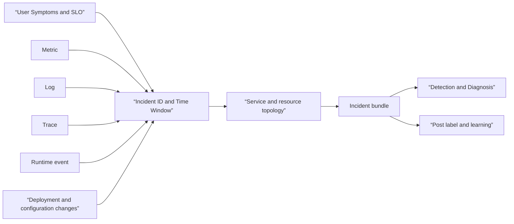

# AIOps Signals and Operations Topology Roadmap

## Starting point for beginners

AIOps is not about attaching a chatbot to the operation screen or having all alerts read by AI. In this process, it is treated as **a system that assists detection, diagnosis, and action decisions with operational data and makes it possible to check again what evidence the decision was made from.** Signals and relationships that can reconstruct an incident without AI come first, and AI is the next layer that helps with repeated candidate search and information compression.

First, learn the role of metric·log·trace·SLO in [Observability and SRE](../observability-sre/00-roadmap.md). [AI Specialist](../ai-specialist-core/00-roadmap.md)'s model·retrieval result and [AI Transformation](../ai-transformation-platform/00-roadmap.md)'s bundle·deployment·tool operation ID also meet operation signals at this stage. Here, we add Kubernetes event, deployment·configuration change, service owner, and topology to create `incident bundle`. With this bundle, [anomaly detection and fault diagnosis](../aiops-diagnosis/00-roadmap.md) can reproduce the same event without arbitrarily reading different data each time.

| New term | Plain-language meaning | Why it matters / when to use it |
|---|---|---|
| AIOps | Technology and operating procedures that analyze operational data to assist in detection, diagnosis, and action decisions | Help responders organize operational evidence and decisions when manual triage cannot keep up. **Concrete situation (illustrative):** A responder receives hundreds of related operational signals. → Use the AIOps workflow to organize evidence and candidates. → Keep the resulting diagnosis verifiable before acting. |
| telemetry | Observation data such as metrics, log, and trace sent out by the system | Provide observable evidence for troubleshooting, service measurement, and incident analysis. **Concrete situation (illustrative):** The service stays healthy while its monitoring becomes silent. → Inspect telemetry generation and export separately. → Mark missing observations as unknown, not successful operation. |
| semantic convention | A promise for different systems to record the same meaning under the same name and unit. | Join and compare signals across services without silently mixing names, units, or meanings. **Concrete situation (illustrative):** Two services report the same duration in different units. → Apply the declared semantic convention. → Verify cross-service queries compare compatible names and units. |
| topology | Relationship showing how service·dependency·deployment·resource are connected | Follow dependencies to scope possible causes and affected users during an incident. **Concrete situation (illustrative):** Checkout errors may originate in a shared dependency. → Follow the relevant topology edges. → Check whether affected and unaffected services support that explanation. |
| change event | Events that change system behavior, such as deployment·configuration·feature flag | Test whether a recent deployment or configuration change plausibly explains the observed symptom. **Concrete situation (illustrative):** Errors begin shortly after a configuration rollout. → Align the change event with symptom timing. → Test competing explanations before declaring the change causal. |
| incident bundle | A reproducible record of a disturbance's time horizon, impacts, signals, changes, candidates and judgments | Give investigators the same bounded evidence set so diagnosis can be replayed and reviewed. **Concrete situation (illustrative):** Two investigators reach different conclusions from different time windows. → Share one versioned incident bundle. → Reproduce their queries against the same evidence. |
| ground truth | Cause, effect, and action label confirmed by people and evidence after the incident is over | Evaluate diagnostic predictions against adjudicated incident outcomes rather than model agreement. **Concrete situation (illustrative):** An automated diagnosis is scored against another model's guess. → Use an evidence-reviewed incident outcome instead. → Record unresolved cases rather than inventing labels. |

## An operational foundation that AIOps can read

OpenTelemetry Collector provides a common path to receive, process, and export telemetry, but is not an incident repository or cause determiner. Semantic conventions help match data names, but do not automatically create service ownership, deployment revision, and task success. The AIOps foundation is not a single tool, but a combination of identifiers, time, relationships, retention, and privacy contracts.

## learning sequence

1. [Connect operational signals to incident evidence graph. Create symptom → service → deployment → resource → trace relationship and time window in ](01-evidence-graph.md).
2. [Review the Incident bundle data contract. Find missing small JSON records in lab](02-incident-bundle-contract-lab.md) and check whether the same incident can be reproduced.
3. [Bundle alerts and select diagnostic evidence Pass the bundle to ](../aiops-diagnosis/02-alert-correlation-triage-lab.md) to group multiple alerts into one incident.
4. [In the approved automatic recovery ](../aiops-remediation/00-roadmap.md), the diagnosis result is linked to what authority and verification is required before action is taken.

## Put data quality before accuracy

| question | bad start | Confirmable departure |
|---|---|---|
| what is broken | alert title | User Impact SLI and Scope of Impact |
| When did it start? | Ticket creation time | Based on first symptom·change·signal timestamp and clock |
| Where did it break? | hostname string | Stable service·resource·deployment ID |
| What has changed | chat memory | change event with revision and actor |
| Why did you judge it that way? | model free description | Evidence ID and counter evidence used |
| Was the result correct? | thumbs-up | Post-confirmation label and user recovery verification |

## Completion criteria

- Can explain the difference in responsibility between AIOps, observability, and incident management.
- You can link metrics·log·trace·event·change to the same incident ID and time window.
- You can tell which identifier among service name, deployment revision, and resource ID fixes which relationship.
- This can explain why personal information, secret, and high cardinality values ​​are not unlimitedly included as telemetry attributes.
- In addition to model input and output, you can leave information about what evidence was used and what label was confirmed after the fact.

## Check your understanding

1. Why can't the mere fact that a metric anomaly was seen be the root cause?
2. When errors increase immediately after deployment, what opposing evidence is needed to distinguish between temporal correlation and causation?
3. What is the advantage of having an evidence reference instead of the entire original log in an incident bundle?

## Develop operational judgment

- Wouldn't changing the telemetry schema simultaneously break the alert·dashboard·feature pipeline?
- Are there any conflicts between the data retention period required for diagnosis and the request for deletion of personal information?
- After the incident is over, who determines the cause label and leaves a history of modifications?
- Does AIOps leave unread and incorrectly grouped incidents in the evaluation set?

<!-- source: https://opentelemetry.io/docs/concepts/ | checked: 2026-09-03 -->
<!-- source: https://opentelemetry.io/docs/collector/ | checked: 2026-09-03 -->
<!-- source: https://opentelemetry.io/docs/specs/semconv/ | checked: 2026-09-03 | semconv-version: 1.44.0 -->
<!-- source: https://sre.google/sre-book/monitoring-distributed-systems/ | checked: 2026-09-03 -->
