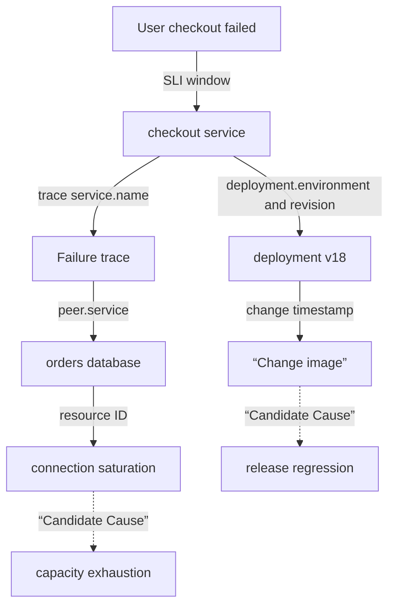

# Connecting operational signals to an incident evidence graph

## Terms introduced in this chapter

| word | Meaning in this chapter |
|---|---|
| symptom node | Errors, delays, and feature failures actually experienced by users |
| evidence edge | A connection showing that two records belong to the same request, deployment, resource, or time window. |
| correlation ID | Stable identifier to find the same execution in different signals |
| observation window | Start and end time range to include in incident analysis |
| provenance | Source indicating which collector·query·revision the evidence came from |
| cardinality | Number of different values ​​an attribute can have |

## Understand the model first

Capturing multiple dashboards does not connect the incidents. Even if the CPU is high and the error rate is high at the same time, you should check whether the two values ​​describe the same service·deployment·request. Evidence graph is not the name of a graph database product, but a data model that specifies which facts are linked with which identifiers and times.

1. Set user symptoms as the starting point of the incident.
2. Find the request trace or workload that created the symptom.
3. Connect the service·dependency of the trace to the deployment revision and resource.
4. Attach runtime event and change event within the incident time window.
5. Query, timestamp, schema version, and whether collection is missing are left on each edge.
6. A candidate cause reads this graph, but it is not a cause just because it is connected to the graph.



The solid lines are observed identifiers or explicit relationships, and the dotted lines are cause candidates that still need to be verified. Without this distinction, the model immediately promotes “error increase after deployment” from a fact to a cause. A candidate for a cause requires supporting evidence as well as opposing evidence. For example, if the old version cohort also failed at the same rate, it is difficult to attribute the new image alone.

## Different signals answer different questions

| signal | Mainly answered questions | core connection key | common omission |
|---|---|---|---|
| SLI·metric | When and how many users were affected? | service, region, window | Missing the tail and cohort by only looking at the average |
| trace | What dependencies did the failed request pass through? | trace_id, span_id, service.name | Failure trace missing due to sampling |
| log | What states and errors did that code path log? | trace_id, deployment, resource | Unstructured strings and secret leaks |
| runtime event | What has changed in scheduler·controller·kernel? | object UID, reason, namespace | Short retention and clock differences |
| change event | Who changed what desired state? | revision, actor, rollout ID | Missing manual changes and flag changes |

OpenTelemetry provides common signal and semantic conventions, but not all conventions are in the same stable state. Since alert and feature pipeline, which are consumers, are based on attribute names and units, the schema version must be recorded and both must be verified together during migration. Information whose value increases infinitely or is sensitive, such as user ID, original text prompt, and query text, is not directly inserted into the metric label, but is left as a reference in an access-controlled original text repository.

## The time window is not the ticket time

Even though the ticket was created at 10:07, the error may have started at 10:02 and was preceded by the 10:01 deployment. The analysis window must include at least `pre-change baseline`, `symptom onset`, `mitigation`, and `recovery verification`. If the clocks of different sources are off, a one-minute difference can reverse the causal order, so distinguish between source timestamp and ingestion timestamp.

Event time and collection time are also different. If logs arrive late after a network disconnection, the dashboard may appear as if an error occurred after recovery. When creating an AIOps feature, if late arrival, missing interval, and sampling policy are not preserved as input quality, the model interprets missingness as a normal value.

## Minimum incident bundle

```json
{
  "incident_id": "inc-20260903-001",
  "window": {"start": "2026-09-03T01:01:00Z", "end": "2026-09-03T01:18:00Z"},
  "impact": {"sli": "checkout_success_ratio", "regions": ["ap-northeast-2"]},
  "entities": [
    {"type": "service", "id": "checkout", "revision": "v18"},
    {"type": "dependency", "id": "orders-db"}
  ],
  "changes": [{"id": "deploy-881", "at": "2026-09-03T01:00:30Z", "actor": "ci"}],
  "evidence": [
    {"id": "metric-q17", "kind": "metric-query", "schema": "sli-v3"},
    {"id": "trace-a91", "kind": "trace", "sampled": true}
  ],
  "gaps": ["logs from checkout-7b9 between 01:04Z and 01:06Z are missing"]
}
```

This bundle is not a copy of the original data. Leave the query to be re-executed, the identifier of the access-controlled evidence, and the schema used at the time. If model input snapshots are required, separate personal information removal and retention policies are applied. If you only have an incident ID and no query version, you will see different dashboard results even if you open the same ID later.

## Relationships and Next Steps

- The basic role of the signal follows from [Observability and SRE](../observability-sre/01-signals-slo-incident-model.md).
- Kubernetes object status and events can be checked with actual commands in [Observation and Troubleshooting](../kubernetes/09-observability-and-troubleshooting.md).
- deployment·route change connects to revisions of [Helm and GitOps](../helm-gitops/02-render-upgrade-drift-lab.md) and [Traffic Control](../traffic-resilience/01-request-budget-and-ownership.md).
- The procedure for using this graph for diagnosis is covered in [](../aiops-diagnosis/01-detection-correlation-rca.md), from detection scores to cause candidates with evidence.

## Explain it in your own words

- Why is one evidence edge not enough for two metrics that moved at the same time?
- What misdiagnosis occurs when the source timestamp and ingestion timestamp are reversed?
- In an environment with trace sampling, what should be checked to use “no relevant trace” as a counterevidence?
- Let’s explain the difference between evidence graph and graph database products.

<!-- source: https://opentelemetry.io/docs/specs/otel/overview/ | checked: 2026-09-03 -->
<!-- source: https://opentelemetry.io/docs/specs/semconv/ | checked: 2026-09-03 | semconv-version: 1.44.0 -->
<!-- source: https://opentelemetry.io/docs/specs/otel/schemas/ | checked: 2026-09-03 -->
<!-- source: https://kubernetes.io/docs/tasks/debug/debug-application/debug-running-pod/ | checked: 2026-09-03 -->
