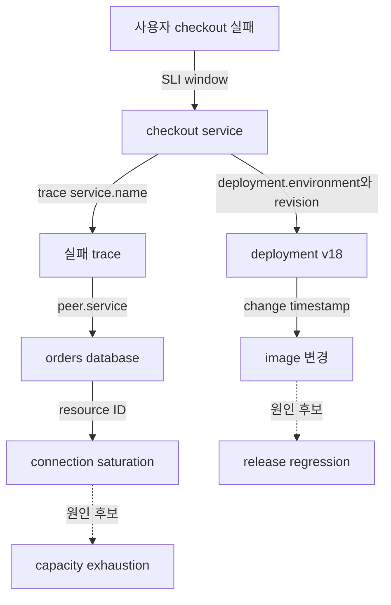

# 운영 신호를 incident evidence graph로 연결하기

## 이 장에서 처음 쓰는 말

| 말 | 이 장에서의 뜻 |
|---|---|
| symptom node | 사용자가 실제로 겪은 오류·지연·기능 실패 |
| evidence edge | 두 기록이 같은 요청·배포·자원·시간 창에 속함을 보여 주는 연결 |
| correlation ID | 서로 다른 신호에서 같은 실행을 찾는 안정적인 식별자 |
| observation window | incident 분석에 포함할 시작·종료 시간 범위 |
| provenance | evidence가 어느 collector·query·revision에서 왔는지 나타내는 출처 |
| cardinality | attribute가 가질 수 있는 서로 다른 값의 개수 |

## 먼저 이해하기

대시보드 여러 장을 캡처한다고 사건이 연결되지는 않는다. 같은 시각에 CPU가 높고 오류율이 올랐더라도 두 값이 같은 service·deployment·request를 설명하는지 확인해야 한다. evidence graph는 graph database 제품 이름이 아니라, **어떤 사실을 어떤 식별자와 시간으로 연결했는지 명시하는 데이터 모델**이다.

1. 사용자 symptom을 incident의 시작점으로 둔다.
2. symptom을 만든 request trace나 workload를 찾는다.
3. trace의 service·dependency를 deployment revision과 resource에 연결한다.
4. incident 시간 창 안의 runtime event와 change event를 붙인다.
5. 각 edge에 query, timestamp, schema version과 수집 누락 여부를 남긴다.
6. 원인 후보는 이 graph를 읽지만, graph에 연결됐다는 이유만으로 원인이 되지는 않는다.



실선은 관측된 식별자나 명시적 관계이고, 점선은 아직 검증할 원인 후보다. 이 구분이 없으면 모델이 “배포 뒤 오류 증가”를 사실에서 원인으로 바로 승격한다. 원인 후보에는 지지 evidence와 함께 반대 evidence도 필요하다. 예를 들어 구 version cohort도 같은 비율로 실패했다면 새 image만을 원인으로 보기 어렵다.

## 신호마다 답하는 질문이 다르다

| 신호 | 주로 답하는 질문 | 핵심 연결 키 | 흔한 누락 |
|---|---|---|---|
| SLI·metric | 언제, 얼마나 많은 사용자가 영향을 받았나 | service, region, window | 평균만 보고 tail·cohort 누락 |
| trace | 실패한 요청이 어떤 dependency를 지났나 | trace_id, span_id, service.name | sampling으로 실패 trace 누락 |
| log | 그 코드 경로가 어떤 상태와 오류를 기록했나 | trace_id, deployment, resource | 비정형 문자열과 secret 유출 |
| runtime event | scheduler·controller·kernel에서 무엇이 변했나 | object UID, reason, namespace | 짧은 보존과 clock 차이 |
| change event | 누가 어떤 desired state를 바꿨나 | revision, actor, rollout ID | 수동 변경과 flag 변경 누락 |

OpenTelemetry는 공통 signal과 semantic convention을 제공하지만 모든 convention이 같은 안정성 상태인 것은 아니다. consumer인 alert와 feature pipeline은 attribute 이름과 단위를 전제로 하므로 schema version을 기록하고 migration 시 양쪽을 함께 검증해야 한다. 사용자 ID, 원문 prompt, query text처럼 값이 무한히 늘거나 민감한 정보는 metric label에 직접 넣지 않고 접근 통제된 원문 저장소의 reference로 남긴다.

## 시간 창은 ticket 시각이 아니다

ticket이 10:07에 만들어졌어도 오류는 10:02에 시작했고 10:01 배포가 선행했을 수 있다. analysis window는 최소한 `pre-change baseline`, `symptom onset`, `mitigation`, `recovery verification`을 포함해야 한다. 서로 다른 source의 clock이 어긋나면 1분 차이가 인과 순서를 뒤집을 수 있으므로 source timestamp와 ingestion timestamp를 구분한다.

event time과 collection time도 다르다. network 단절 뒤 log가 늦게 도착하면 dashboard에서는 복구 뒤 오류가 생긴 것처럼 보일 수 있다. AIOps feature를 만들 때 late arrival, missing interval, sampling policy를 입력 품질로 보존하지 않으면 모델은 누락을 정상값으로 해석한다.

## 최소 incident bundle

```json
{
  "incident_id": "inc-20260903-001",
  "window": {"start": "2026-09-03T01:01:00Z", "end": "2026-09-03T01:18:00Z"},
  "impact": {"sli": "checkout_success_ratio", "regions": ["ap-northeast-2"]},
  "entities": [
    {"type": "service", "id": "checkout", "revision": "v18"},
    {"type": "dependency", "id": "orders-db"}
  ],
  "changes": [{"id": "deploy-881", "at": "2026-09-03T01:00:30Z", "actor": "ci"}],
  "evidence": [
    {"id": "metric-q17", "kind": "metric-query", "schema": "sli-v3"},
    {"id": "trace-a91", "kind": "trace", "sampled": true}
  ],
  "gaps": ["logs from checkout-7b9 between 01:04Z and 01:06Z are missing"]
}
```

이 bundle은 원문 데이터 복사본이 아니다. 재실행할 query와 접근 통제된 evidence의 식별자, 당시 사용한 schema를 남긴다. 모델 입력 snapshot이 필요하다면 개인정보 제거와 보존 정책을 별도로 적용한다. incident ID만 있고 query version이 없으면 나중에 같은 ID를 열어도 달라진 dashboard 결과를 보게 된다.

## 관계와 다음 단계

- 신호의 기본 역할은 [Observability와 SRE](../observability-sre/01-signals-slo-incident-model.md)에서 이어진다.
- Kubernetes object 상태와 event는 [관측과 트러블슈팅](../kubernetes/09-observability-and-troubleshooting.md)에서 실제 명령으로 확인한다.
- 배포·route change는 [Helm과 GitOps](../helm-gitops/02-render-upgrade-drift-lab.md)와 [트래픽 제어](../traffic-resilience/01-request-budget-and-ownership.md)의 revision으로 연결한다.
- 이 graph를 진단에 사용하는 절차는 [탐지 점수에서 근거 있는 원인 후보까지](../aiops-diagnosis/01-detection-correlation-rca.md)에서 다룬다.

## 스스로 설명해 보기

- 같은 시간에 움직인 두 metric이 evidence edge 하나로 충분하지 않은 이유는 무엇인가?
- source timestamp와 ingestion timestamp가 뒤집히면 어떤 오진이 생기는가?
- trace sampling이 있는 환경에서 “관련 trace가 없다”를 반증으로 쓰려면 무엇을 확인해야 하는가?
- evidence graph와 graph database 제품을 구분해 설명해 보자.

<!-- source: https://opentelemetry.io/docs/specs/otel/overview/ | checked: 2026-09-03 -->
<!-- source: https://opentelemetry.io/docs/specs/semconv/ | checked: 2026-09-03 | semconv-version: 1.44.0 -->
<!-- source: https://opentelemetry.io/docs/specs/otel/schemas/ | checked: 2026-09-03 -->
<!-- source: https://kubernetes.io/docs/tasks/debug/debug-application/debug-running-pod/ | checked: 2026-09-03 -->
