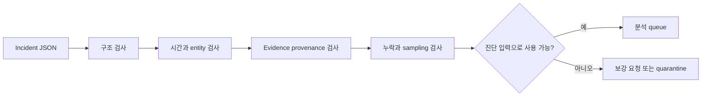

# Incident bundle 데이터 계약 검토 실습

## 실습 전에 준비할 것

이 실습은 로컬에서 JSON 파일 하나를 만들고 읽는 **Local** 등급이다. 운영 log나 개인정보를 사용하지 않는다. `python3`가 있으면 검증 명령을 실행할 수 있고, 없으면 표와 JSON을 눈으로 비교해도 된다. `/tmp/aiops-incident-lab`만 사용하며 다른 경로를 삭제하지 않는다.

| 준비 항목 | 값 |
|---|---|
| 입력 | 합성 incident record 두 개 |
| 변경 대상 | `/tmp/aiops-incident-lab/incidents.json` |
| 성공 기준 | 진단 가능한 record와 불가능한 record를 누락 field로 구분 |
| 중단 조건 | 실제 고객·회사 데이터가 입력에 포함됨 |
| cleanup | `/tmp/aiops-incident-lab` 한 디렉터리 |

## 먼저 이해하기

스키마 검증은 JSON 문법이 맞는지만 보는 일이 아니다. `incident_id`가 있어도 영향 범위, 시간 창, service revision, evidence provenance가 없으면 진단 결과를 재현할 수 없다. 반대로 모든 log 원문을 넣으면 검색은 쉬워 보여도 개인정보·secret·보존 비용과 입력 크기가 폭발한다. 계약은 필요한 식별자와 누락을 명시하고 원문은 별도 저장소에 둔다.



## 합성 입력 만들기

다음 내용을 `/tmp/aiops-incident-lab/incidents.json`에 저장한다. 첫 record는 최소 계약을 갖고, 두 번째는 ticket 제목과 alert 이름만 있어 의도적으로 부족하다.

```json
[
  {
    "incident_id": "inc-good-001",
    "window": {"start": "2026-09-03T01:01:00Z", "end": "2026-09-03T01:18:00Z"},
    "impact": {"sli": "checkout_success_ratio", "scope": ["region:ap-northeast-2"]},
    "entities": [{"type": "service", "id": "checkout", "revision": "v18"}],
    "changes": [{"id": "deploy-881", "at": "2026-09-03T01:00:30Z"}],
    "evidence": [{"id": "metric-q17", "kind": "metric-query", "schema": "sli-v3"}],
    "gaps": []
  },
  {
    "incident_id": "inc-bad-002",
    "title": "checkout looks weird",
    "alerts": ["HighCpu", "ErrorSpike"]
  }
]
```

디렉터리와 파일은 텍스트 편집기로 만들어도 된다. 아래 검사는 파일을 수정하지 않는다.

```bash
python3 -c 'import json; p="/tmp/aiops-incident-lab/incidents.json"; rows=json.load(open(p)); required={"incident_id","window","impact","entities","changes","evidence","gaps"}; [print(r.get("incident_id"), "missing=", sorted(required-set(r))) for r in rows]'
```

예상 결과는 `inc-good-001 missing= []`와 `inc-bad-002`의 여섯 개 누락 field다. 명령이 성공했다는 사실은 JSON이 읽혔다는 것과 top-level key의 존재만 증명한다. timestamp 순서, evidence reference의 실제 존재, SLI query 정확성이나 개인정보 안전성은 아직 증명하지 않는다.

## 계약을 한 단계 더 검사하기

다음 조건을 수동으로 확인한다.

1. `window.start < window.end`이고 모든 change·evidence timestamp를 같은 UTC 기준으로 비교할 수 있는가?
2. `impact.sli`가 dashboard 제목이 아니라 version이 관리되는 query 또는 recording rule을 가리키는가?
3. `entities`의 service ID가 metric, trace와 deployment에서 같은 값을 쓰는가?
4. `changes`에 code deploy만 아니라 configuration·feature flag·route 변경도 들어오는가?
5. `evidence`가 원문 내용을 복사하지 않고 재조회 가능한 ID·query·schema를 갖는가?
6. sampling·수집 단절·clock 오차가 `gaps`에 사실대로 남는가?

좋은 record에도 빈 `gaps`가 있다. 이것이 “누락이 없다”는 보장은 아니다. 각 collector와 source의 self-observability를 확인한 결과로 빈 배열이 만들어졌는지, 아무도 기록하지 않아 비어 있는지 구분해야 한다. 모르는 상태는 `unknown`이나 구체적인 gap으로 남긴다.

## 실패 조건 추가하기

`inc-good-001`에서 `revision`을 지우거나 `window.end`를 시작보다 빠르게 바꿔 다시 검사한다. 현재 한 줄 검사는 key 존재만 보므로 revision 누락과 잘못된 시간 순서를 놓친다. 이 차이가 schema validation, semantic validation과 evidence validation의 경계다.

| 검사 층 | 잡는 문제 | 잡지 못하는 문제 |
|---|---|---|
| JSON parse | 쉼표·괄호·문자열 문법 | 의미상 누락 |
| schema | 필수 field·type·enum | timestamp의 실제 순서와 ID 존재 |
| semantic rule | 시간 순서·entity 관계·허용 범위 | query 결과의 진실성 |
| evidence check | 원문·query·source와 주장 일치 | 미래 incident에서의 일반화 |

## 결과를 이렇게 읽는다

| 결과 | 판정 | 다음 행동 |
|---|---|---|
| 필수 key 누락 | 진단 입력 불가 | collector·ticket adapter 보강 |
| 시간 순서 오류 | incident timeline 불가 | clock 기준과 source timestamp 수정 |
| change ID 없음 | 배포 상관 후보 검증 불가 | CI/CD·GitOps event 연결 |
| evidence는 있으나 schema 없음 | 재조회 결과가 달라질 수 있음 | query와 telemetry schema version 기록 |
| gap이 확인됨 | 제한된 진단 가능 | 결론에 불확실성 표시, 대체 evidence 탐색 |
| 모든 검사 통과 | 분석 시작 가능 | 원인이나 복구가 맞다는 뜻은 아님 |

## cleanup과 완료

검토가 끝나면 target을 먼저 확인한 뒤 `/tmp/aiops-incident-lab`만 삭제한다. 운영에서 incident bundle은 삭제 대상이 아니라 보존·접근·감사 정책을 가진 기록이므로 이 cleanup을 그대로 적용하지 않는다.

```bash
ls -ld /tmp/aiops-incident-lab
rm -r /tmp/aiops-incident-lab
```

- 구조·의미·evidence 검증의 차이를 설명했다.
- 진단 불가능한 record를 억지로 모델 입력에 넣지 않고 quarantine했다.
- 개인정보 원문 대신 통제된 evidence reference를 사용했다.
- 누락과 sampling 상태를 정상값으로 바꾸지 않았다.

## 스스로 설명해 보기

- `alerts` 배열만으로 incident를 재구성할 수 없는 이유는 무엇인가?
- 모든 key가 존재해도 진단을 시작하면 안 되는 반례를 두 가지 들어보자.
- 이 bundle을 [이상 탐지와 진단](../aiops-diagnosis/01-detection-correlation-rca.md)에 넘기기 전에 어떤 품질 지표를 집계할 것인가?
- 개인정보 삭제 요청이 들어왔을 때 evidence reference와 immutable audit 사이의 정책을 어떻게 정할 것인가?

<!-- source: https://opentelemetry.io/docs/specs/semconv/ | checked: 2026-09-03 | semconv-version: 1.44.0 -->
<!-- source: https://opentelemetry.io/docs/specs/otel/schemas/ | checked: 2026-09-03 -->
<!-- source: https://opentelemetry.io/docs/collector/ | checked: 2026-09-03 -->
<!-- source: https://sre.google/sre-book/monitoring-distributed-systems/ | checked: 2026-09-03 -->
