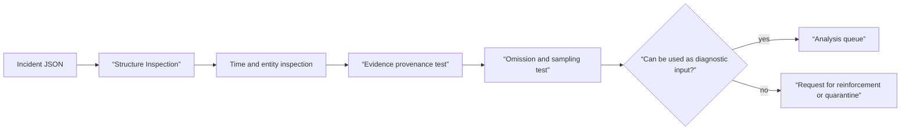

# Incident bundle data contract review lab

## Lab prerequisites

This lab is a **Local** class that creates and reads a JSON file locally. We do not use operation logs or personal information. If you have `python3`, you can run the verification command. If not, you can visually compare the table and JSON. Only `/tmp/aiops-incident-lab` is used and other paths are not deleted.

| Preparation items | value |
|---|---|
| input | Two synthetic incident records |
| change target | `/tmp/aiops-incident-lab/incidents.json` |
| success criteria | Divide diagnosable and non-diagnosable records into missing fields |
| stopping condition | Actual customer/company data included in input |
| cleanup | `/tmp/aiops-incident-lab` one directory |

## Understand the model first

Schema verification is not just about checking that the JSON grammar is correct. Even if `incident_id` exists, the diagnosis results cannot be reproduced without the scope of influence, time window, service revision, and evidence provenance. Conversely, if you enter all the original log text, search may seem easy, but personal information, secrets, preservation costs, and input size explode. The contract specifies necessary identifiers and omissions, and the original text is placed in a separate repository.



## Create synthetic input

Save the following contents in `/tmp/aiops-incident-lab/incidents.json`. The first record has the minimum contract, and the second has only the ticket title and alert name, which is intentionally insufficient.

```json
[
  {
    "incident_id": "inc-good-001",
    "window": {"start": "2026-09-03T00:55:00Z", "end": "2026-09-03T01:18:00Z"},
    "impact": {"sli": "checkout_success_ratio", "scope": ["region:ap-northeast-2"]},
    "entities": [{"type": "service", "id": "checkout", "revision": "v18"}],
    "changes": [{"id": "deploy-881", "at": "2026-09-03T01:00:30Z"}],
    "evidence": [{"id": "metric-q17", "kind": "metric-query", "schema": "sli-v3"}],
    "gaps": []
  },
  {
    "incident_id": "inc-bad-002",
    "title": "checkout looks weird",
    "alerts": ["HighCpu", "ErrorSpike"]
  }
]
```

Directories and files can be created with a text editor. The tests below do not modify files.

```bash
python3 -c 'import json; p="/tmp/aiops-incident-lab/incidents.json"; rows=json.load(open(p)); required={"incident_id","window","impact","entities","changes","evidence","gaps"}; [print(r.get("incident_id"), "missing=", sorted(required-set(r))) for r in rows]'
```

The expected result is six missing fields: `inc-good-001 missing= []` and `inc-bad-002`. The fact that the command was successful only proves that the JSON was read and the existence of the top-level key. Timestamp order, actual existence of evidence references, SLI query accuracy, or personal information security are not yet proven.

## Examine your contract one step further

Manually check the following conditions:

1. `window.start < window.end` and can all change·evidence timestamps be compared based on the same UTC?
2. Does `impact.sli` refer to a query or recording rule whose version is managed rather than the dashboard title?
3. Does the service ID of `entities` use the same value in metrics, trace, and deployment?
4. Does `changes` include not only code deployment but also configuration·feature flag·route changes?
5. Does `evidence` have an ID, query, and schema that can be re-queried without copying the original content?
6. Do sampling/collection disconnection/clock errors remain true in `gaps`?

Even good records have empty `gaps`. This is not a guarantee of “no omissions.” As a result of checking the self-observability of each collector and source, it is necessary to determine whether an empty array was created or whether it is empty because no one recorded it. Unknown states are left as `unknown` or a specific gap.

## Adding a Failure Condition

Delete `revision` from `inc-good-001` or change `window.end` to faster than starting and retest. Currently, single-line inspection only looks at the presence of a key, so it misses revisions and incorrect time sequences. This difference is the boundary between schema validation, semantic validation, and evidence validation.

| inspection floor | catch problem | problem that can't be solved |
|---|---|---|
| JSON parse | Comma, parenthesis, string grammar | semantically missing |
| schema | Required field·type·enum | Actual order of timestamps and presence of IDs |
| semantic rule | Time order, entity relationship, and tolerance range | Veracity of query results |
| evidence check | The claim is consistent with the original text, query, and source. | Generalization from future incidents |

## Example results

Expected exact lines from the top-level-key inspection:

```text
inc-good-001 missing= []
inc-bad-002 missing= ['changes', 'entities', 'evidence', 'gaps', 'impact', 'window']
```

After removing a nested revision or reversing the time window, the first line still shows `missing= []`. That is an intentional counterexample: the original command has passed only key presence. The semantic review must reject those changed records before diagnosis.

## How to interpret the results

| result | verdict | next action |
|---|---|---|
| Required key missing | Diagnosis input not possible | Reinforcement of collector·ticket adapter |
| time order error | incident timeline not possible | Modify clock standard and source timestamp |
| No change ID | Deployment correlation candidate verification not possible | CI/CD·GitOps event connection |
| There is evidence, but no schema | Result of re-inquiry may vary | Query and telemetry schema version records |
| gap confirmed | Limited diagnostic capabilities | Expressing uncertainty in conclusions and exploring alternative evidence |
| All inspections passed | Analysis can begin | It does not mean that the cause or recovery is correct. |

## cleanup and done

After review, check the target first and then delete only `/tmp/aiops-incident-lab`. In operation, the incident bundle is not subject to deletion, but is a record with retention, access, and audit policies, so this cleanup is not applied as is.

```bash
ls -ld /tmp/aiops-incident-lab
rm -r /tmp/aiops-incident-lab
```

- The differences in structure, meaning, and evidence verification were explained.
- Non-diagnosable records were quarantined rather than forced into the model input.
- Controlled evidence references were used instead of original personal information.
- Missing and sampling status were not changed to normal values.

## Explain it in your own words

- Why can't I reconstruct the incident with just the `alerts` array?
- Let's look at two counterexamples where diagnosis should not be started even if all keys exist.
- What quality indicators will be aggregated before passing this bundle to [Anomaly Detection and Diagnosis](../aiops-diagnosis/01-detection-correlation-rca.md)?
- How do you determine the policy between evidence reference and immutable audit when a request to delete personal information comes in?

<!-- source: https://opentelemetry.io/docs/specs/semconv/ | checked: 2026-09-03 | semconv-version: 1.44.0 -->
<!-- source: https://opentelemetry.io/docs/specs/otel/schemas/ | checked: 2026-09-03 -->
<!-- source: https://opentelemetry.io/docs/collector/ | checked: 2026-09-03 -->
<!-- source: https://sre.google/sre-book/monitoring-distributed-systems/ | checked: 2026-09-03 -->
