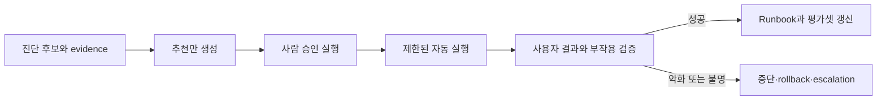

# 승인된 자동 복구와 운영 학습 로드맵

## 처음 보는 사람을 위한 출발점

AIOps 진단이 “최근 배포가 원인일 가능성이 높다”고 말해도 곧바로 rollback을 실행해서는 안 된다. 진단은 후보이고, 실행은 권한과 부작용을 가진 상태 변경이다. 자동 복구는 **어떤 조건에서, 어느 범위에, 어떤 작업을, 누가 승인해, 언제 중단하고, 무엇으로 성공을 판정할지**가 적힌 runbook을 실행하는 체계다.

Google SRE는 잘 정의된 범위의 failover나 traffic switching은 자동화가 사람보다 빠르게 동작할 수 있다고 설명하면서도, 자동 절차가 상황을 악화시킬 수 있으므로 범위를 명확히 제한해야 한다고 경고한다. 이 주제는 자동화를 금지하거나 무조건 확대하지 않는다. 추천만 하는 단계, 사람이 승인해 실행하는 단계, 좁은 범위에서 자동 실행하는 단계를 evidence에 따라 승급한다. 실행 identity·sandbox·durable operation의 선수 계약은 [Enterprise AI와 안전한 에이전트 실행](../ai-transformation-platform/04-enterprise-agent-operations.md), 중복·결과 불명의 일반 원리는 [백엔드 분산 워크플로](../backend-engineering/04-distributed-workflows.md)와 공유한다.

| 처음 만나는 말 | 학습용 쉬운 뜻 |
|---|---|
| remediation | 사용자 피해를 줄이거나 정상 상태를 되찾기 위한 운영 조치 |
| runbook | 사전 조건·명령·검증·중단·되돌리기를 적은 실행 절차 |
| dry-run | 실제 상태를 바꾸지 않고 계획과 권한·대상을 검토하는 실행 |
| blast radius | 조치가 영향을 줄 수 있는 service·region·tenant·resource 범위 |
| abort condition | 결과가 나빠지거나 증거가 부족할 때 즉시 멈추는 조건 |
| rollback pointer | 되돌아갈 검증된 revision이나 configuration 식별자 |
| idempotency key | 같은 조치 요청이 중복돼도 한 operation으로 수렴시키는 키 |
| outcome verification | 명령 성공이 아니라 사용자 결과와 시스템 상태가 회복됐는지 확인하는 절차 |

## 조치를 세 등급으로 나누기

등급은 모델 confidence만으로 올리지 않는다. 반복 incident에서 같은 precondition과 action이 같은 결과를 냈는지, 잘못 실행했을 때 되돌릴 수 있는지, 범위 제한과 독립적인 사용자 검증이 있는지를 본다. 데이터 삭제, 권한 확대, schema migration처럼 복구가 어렵거나 영향이 큰 작업은 자동 실행 대상에서 제외할 수 있다.

## 학습 순서

1. [Remediation을 상태 머신과 안전 계약으로 만들기](01-guarded-remediation-state-machine.md)에서 중복·결과 불명·부분 성공을 operation 상태로 다룬다.
2. [자동 복구 dry-run과 rollback 판정 실습](02-remediation-dry-run-lab.md)에서 실제 변경 없이 계획의 빠진 gate를 찾는다.
3. [트래픽 제어와 서비스 복원력](../traffic-resilience/00-roadmap.md)에서 retry 축소·traffic switch 같은 구체 action의 실행 예산을 연결한다.
4. [Helm과 GitOps](../helm-gitops/02-render-upgrade-drift-lab.md)에서 desired state와 rollback revision을, [인프라 보안](../infrastructure-security/00-roadmap.md)에서 실행 identity와 최소 권한을 확인한다.

## 승급 gate

| 등급 | 허용 동작 | 최소 evidence | 실패 시 |
|---|---|---|---|
| recommend | 조치 후보와 근거 제시 | incident bundle, runbook ID | 사람이 거절·수정 가능 |
| approve-to-run | 승인 뒤 좁은 범위 실행 | target diff, 권한, abort·rollback | 즉시 중단·사람 takeover |
| auto-run | 사전 승인 정책 안에서 자동 실행 | 반복 성공, bounded blast radius, 독립 검증 | 자동 rollback과 page |

## 완료

- 진단 confidence와 실행 권한이 별개인 이유를 설명할 수 있다.
- remediation operation의 상태와 idempotency key를 정의할 수 있다.
- target·precondition·blast radius·abort·rollback·verification을 runbook에 적을 수 있다.
- 명령 exit code와 사용자 결과 회복을 별도로 검증할 수 있다.
- incident 결과를 threshold·runbook·test·evaluation dataset에 되돌릴 수 있다.

## 처음 이해했는지 확인

1. rollback이 가능한 작업도 무조건 auto-run으로 승급할 수 없는 이유는 무엇인가?
2. 같은 incident에서 executor timeout 뒤 요청을 다시 보낼 때 idempotency key가 필요한 이유는 무엇인가?
3. 사용자 오류율이 회복됐지만 DB queue가 계속 증가하면 성공으로 볼 수 있는가?

## 운영 판단으로 확장하기

- 실행 identity가 읽기·계획·변경·승급 권한을 구분하는가?
- 두 automation이 같은 resource를 동시에 고치려 할 때 lock과 우선순위가 있는가?
- 결과가 불명인 operation을 재실행하기 전에 실제 상태를 조회하는가?
- 자동 완화가 근본 원인 수정과 postmortem action을 대신하지 않는가?

<!-- source: https://sre.google/sre-book/automation-at-google/ | checked: 2026-09-03 -->
<!-- source: https://sre.google/workbook/incident-response/ | checked: 2026-09-03 -->
<!-- source: https://kubernetes.io/docs/concepts/workloads/controllers/deployment/ | checked: 2026-09-03 -->
<!-- source: https://gateway-api.sigs.k8s.io/docs/concepts/security/ | checked: 2026-09-03 -->
