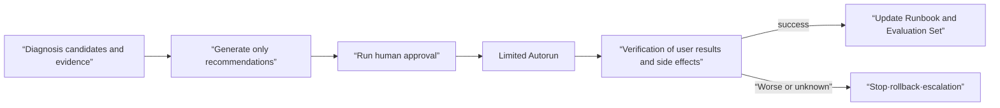

# Approved Automated Recovery and Operational Learning Roadmap

## Starting point for beginners

Even if the AIOps diagnosis says, “Recent deployment is most likely the cause,” rollback should not be executed immediately. A diagnosis is a candidate, and an execution is a state change with permissions and side effects. Automatic recovery is a system that executes a runbook that describes **under what conditions, to what scope, what tasks, who approves, when to stop, and what determines success**.

Google SRE explains that automation can operate faster than humans with a well-defined scope of failover or traffic switching, but warns that the scope must be clearly limited because automated procedures can make the situation worse. This topic does not prohibit or unconditionally expand automation. The stages of recommendation only, stages of human approval and execution, and automatic execution in a narrow scope are promoted based on evidence. The prerequisite contract for execution identity·sandbox·durable operation is shared with [Enterprise AI and secure agent execution](../ai-transformation-platform/04-enterprise-agent-operations.md), and the general principle of duplication and unknown results is shared with [backend distributed workflow](../backend-engineering/04-distributed-workflows.md).

| New term | Plain-language meaning | Why it matters / when to use it |
|---|---|---|
| remediation | Operational actions to reduce harm to users or restore normalcy | Restore an agreed user outcome through a scoped action with verification and abort criteria. |
| runbook | Execution procedure that includes preconditions, commands, verification, abort, and revert | Make response steps repeatable and reviewable under incident pressure. |
| dry-run | Execution of reviewing plans, authorities and targets without changing the actual state | Check targets, permissions, and proposed effects before executing a real change. |
| blast radius | Scope of service·region·tenant·resource that action can affect | Constrain the scope of experiments and actions so one mistake affects fewer users or resources. |
| abort condition | Conditions to stop immediately when results worsen or evidence is lacking | Stop a response that is worsening impact or no longer meets its safety assumptions. |
| rollback pointer | Validated revision or configuration identifier to return to | Name a verified recovery target before starting a change that may need reversal. |
| idempotency key | Key that converges into one operation even if the same action request is duplicated | Recognize repeated action requests as one logical operation after timeouts or retries. |
| outcome verification | A procedure that verifies that the user results and system state have been restored, rather than a command success. | Confirm recovery in user results rather than declaring success from a command exit alone. |

## Divide actions into three classes

The grade is not raised based on model confidence alone. In repeated incidents, we check whether the same precondition and action produce the same result, whether it can be reversed when executed incorrectly, and whether there are scope restrictions and independent user verification. Tasks that are difficult to recover or have a large impact, such as data deletion, permission expansion, and schema migration, can be excluded from automatic execution.

## learning sequence

1. [Make Remediation a state machine and a safety contract. In ](01-guarded-remediation-state-machine.md), duplicates, unknown results, and partial success are treated as operation states.
2. [In automatic recovery dry-run and rollback judgment lab](02-remediation-dry-run-lab.md), find missing gates in the plan without actual changes.
3. [Traffic control and service resilience](../traffic-resilience/00-roadmap.md) connects the execution budget of specific actions such as retry reduction and traffic switch.
4. [Check the desired state and rollback revision in Helm and GitOps](../helm-gitops/02-render-upgrade-drift-lab.md), and the execution identity and minimum privileges in [Infrastructure Security](../infrastructure-security/00-roadmap.md).

## promotion gate

| rating | Allowed Behavior | minimal evidence | In case of failure |
|---|---|---|---|
| recommend | Present candidates for action and evidence | incident bundle, runbook ID | People can reject and modify |
| approve-to-run | Narrow scope execution after approval | target diff, permission, abort·rollback | Immediate stop/person takeover |
| auto-run | Automatic execution within pre-approval policy | Repeatable success, bounded blast radius, independent verification | Automatic rollback and page |

## Completion criteria

- This can explain why diagnostic confidence and execution permissions are separate.
- The status and idempotency key of the remediation operation can be defined.
- Target·precondition·blast radius·abort·rollback·verification can be written in the runbook.
- Command exit code and user result recovery can be verified separately.
- The incident results can be returned to the threshold·runbook·test·evaluation dataset.

## Check your understanding

1. Why can’t even tasks that can be rolled back be promoted to auto-run?
2. Why is the idempotency key needed when resending a request after an executor timeout in the same incident?
3. If the user error rate has recovered but the DB queue continues to increase, can this be considered a success?

## Develop operational judgment

- Does the execution identity separate read, plan, change, and promote permissions?
- Are there locks and priorities when two automations try to modify the same resource at the same time?
- Do you check the actual status before re-executing an operation with an unknown result?
- Isn't automatic mitigation a substitute for root cause correction and postmortem action?

<!-- source: https://sre.google/sre-book/automation-at-google/ | checked: 2026-09-03 -->
<!-- source: https://sre.google/workbook/incident-response/ | checked: 2026-09-03 -->
<!-- source: https://kubernetes.io/docs/concepts/workloads/controllers/deployment/ | checked: 2026-09-03 -->
<!-- source: https://gateway-api.sigs.k8s.io/docs/concepts/security/ | checked: 2026-09-03 -->
