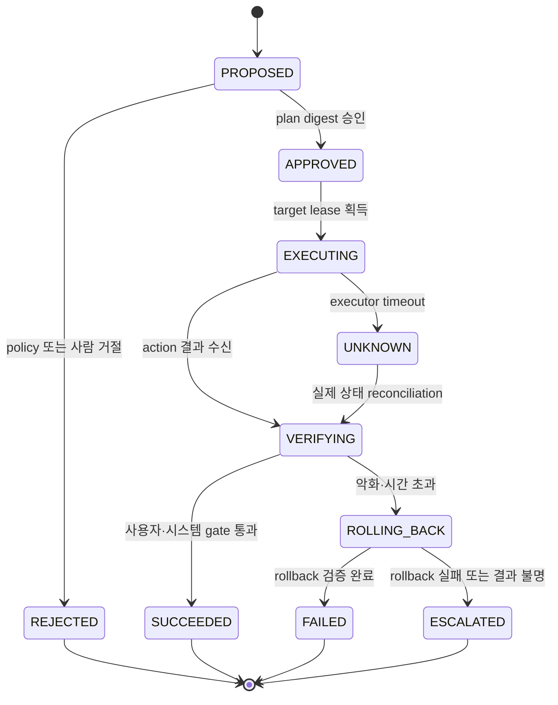

# Remediation을 상태 머신과 안전 계약으로 만들기

## 이 장에서 처음 쓰는 말

| 말 | 이 장에서의 뜻 |
|---|---|
| operation | 한 remediation 요청과 그 실행·검증 결과를 대표하는 기록 |
| plan | 실행할 target과 예상 diff, precondition을 고정한 변경안 |
| commit | 승인된 plan을 실제 상태 변경으로 전환하는 단계 |
| reconciliation | 원하는 상태와 실제 상태를 다시 읽어 operation을 수렴시키는 과정 |
| lease | 같은 target을 동시에 바꾸는 executor를 제한하는 시간 있는 소유권 |
| verification receipt | action 뒤 어떤 query와 기준으로 성공·실패를 판정했는지 남긴 기록 |

## 먼저 이해하기

자동 복구 API가 `200 OK`를 반환했다고 service가 복구된 것은 아니다. executor가 command를 보낸 뒤 network가 끊기면 실제 변경은 적용됐지만 caller는 timeout을 볼 수 있다. 같은 요청을 다시 보내면 rollback이 두 번 실행되거나 traffic weight가 예상보다 더 바뀔 수 있다. 그래서 remediation은 단일 함수 호출이 아니라 operation ID와 상태 전이를 가진다.

1. incident와 runbook revision에서 plan을 만든다.
2. 정책이 target·권한·blast radius와 evidence freshness를 검사한다.
3. 필요한 경우 사람이 정확한 plan digest를 승인한다.
4. executor가 target lease를 얻고 commit한다.
5. 결과가 불명이어도 재실행부터 하지 않고 실제 상태를 reconcile한다.
6. 사용자 SLI와 시스템 saturation을 독립적으로 검증한다.
7. 실패·악화·시간 초과면 abort, rollback과 escalation으로 전이한다.



## operation 계약

```json
{
  "operation_id": "op-inc-checkout-001-rollback-v17",
  "idempotency_key": "inc-checkout-001:checkout:rollback:v17",
  "runbook_revision": "rollback-deployment@8f21c7",
  "plan_digest": "sha256:reviewed-plan",
  "target": {"kind": "Deployment", "namespace": "shop", "name": "checkout"},
  "scope": {"region": "ap-northeast-2", "max_percent": 10},
  "preconditions": ["current_revision=v18", "previous_revision=v17", "sli_error_burn=true"],
  "abort_conditions": ["error_ratio_increase>2pp", "db_pending_increase>20%"],
  "verification": ["checkout_success_ratio", "orders_db_pending", "rollout_status"],
  "expires_at": "2026-09-03T01:20:00Z"
}
```

승인은 “rollback 해도 됨”이라는 자연어가 아니라 `plan_digest`에 묶는다. 승인 뒤 target revision이나 scope가 바뀌면 새 plan으로 다시 평가해야 한다. `expires_at`은 오래된 incident evidence로 나중에 실행되는 것을 막는다. executor identity는 이 target과 operation 종류에 필요한 최소 권한만 가져야 한다.

## Kubernetes rollback이 증명하는 범위

Kubernetes Deployment는 이전 revision으로 rollback할 수 있고 rollout status로 progress·complete·failed 상태를 확인할 수 있다. 그러나 Deployment revision은 Pod template 변경에서 만들어지며, rollback도 Pod template 부분을 되돌린다. 외부 database schema, feature flag, Route, secret version이나 downstream side effect까지 함께 되돌아간다는 뜻이 아니다.

따라서 verification에 `rollout_status`만 두면 desired Pod revision이 바뀌고 replica가 available해졌다는 사실은 확인하지만 사용자의 checkout 성공, DB queue 회복, 중복 결제 부재는 확인하지 못한다. 사용자 SLI와 dependency saturation을 별도 gate로 둔다.

## 동시에 고치려는 자동화를 제한하기

scaler는 replica를 늘리고, cost controller는 줄이며, rollout controller는 새 version으로 교체하고, AIOps remediation은 이전 version으로 되돌릴 수 있다. 모두 개별 규칙에는 맞아도 같은 target에서 충돌한다. operation은 target lease, 우선순위와 active controller 목록을 확인해야 한다.

| 충돌 | 위험 | 제한 방법 |
|---|---|---|
| autoscaler vs manual scale | manifest apply가 replica를 덮거나 controller가 다시 변경 | field owner와 action 금지 조건 |
| rollout vs rollback | 새 ReplicaSet 전이가 겹쳐 결과 불명 | 진행 중 rollout 감지와 pause 정책 |
| traffic switch vs outlier ejection | 남은 capacity로 traffic 집중 | 합성 capacity precondition |
| 두 incident의 같은 target | 서로 반대 조치 실행 | target lease와 incident 우선순위 |

## 안전 계약과 AIOps 진단의 연결

[이상 탐지와 장애 진단](../aiops-diagnosis/01-detection-correlation-rca.md)은 원인 후보와 evidence를 만들고, 이 상태 머신은 실행 가능성을 판단한다. candidate category가 `release_regression`이어도 previous revision이 없거나 database migration이 backward compatible하지 않으면 rollback plan은 거절된다. 진단이 맞다는 것과 해당 action이 안전하다는 것은 별도 평가다.

[트래픽 제어](../traffic-resilience/01-request-budget-and-ownership.md)의 retry 축소나 traffic weight 변경도 같은 계약을 쓴다. target만 Route나 proxy policy로 바뀌며, 최대 변경 폭·남은 capacity·abort condition이 핵심 precondition이 된다.

## verification receipt

| 필드 | 이유 |
|---|---|
| before·after query ID | 같은 정의로 비교했는지 확인 |
| target observed revision | 명령 대상과 실제 변경 대상 일치 확인 |
| executor·approval identity | 권한과 책임 추적 |
| started·finished·reconciled time | timeout과 결과 불명 구간 재구성 |
| user SLI result | 사용자 회복 확인 |
| dependency·saturation result | 숨은 부작용 확인 |
| rollback result | 실패 시 안전 경로 확인 |

## 스스로 설명해 보기

- executor timeout 뒤 같은 command를 즉시 다시 보내면 안 되는 이유는 무엇인가?
- plan digest 승인과 runbook 이름 승인의 차이는 무엇인가?
- Deployment complete가 사용자 결과 회복을 증명하지 않는 반례를 들어보자.
- 자동화끼리 충돌하는 상황에서 target lease만으로 충분하지 않을 수 있는 이유는 무엇인가?

<!-- source: https://sre.google/sre-book/automation-at-google/ | checked: 2026-09-03 -->
<!-- source: https://kubernetes.io/docs/concepts/workloads/controllers/deployment/ | checked: 2026-09-03 -->
<!-- source: https://gateway-api.sigs.k8s.io/docs/concepts/security/ | checked: 2026-09-03 -->
<!-- source: https://sre.google/workbook/incident-response/ | checked: 2026-09-03 -->
