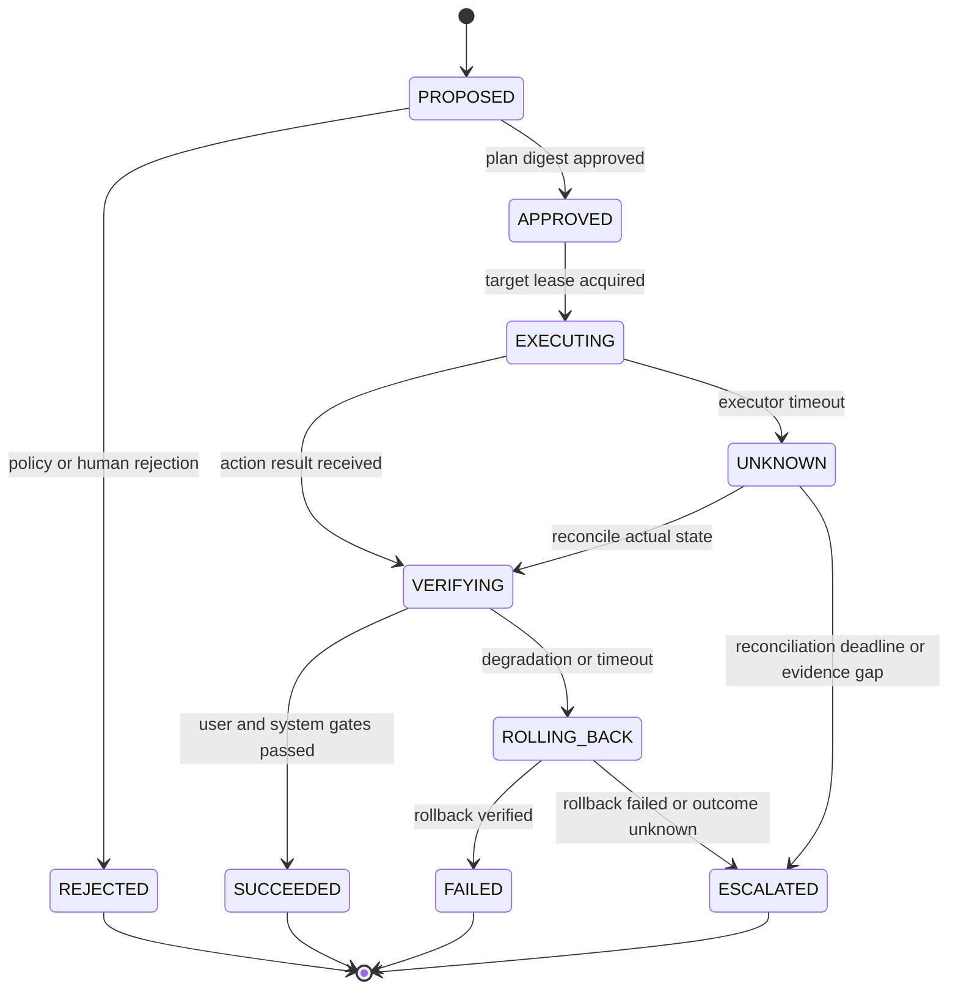

# Making Remediation a State Machine and Safety Contract

## Terms introduced in this chapter

| word | Meaning in this chapter | Why it matters / when to use it |
|---|---|---|
| operation | Records representing a remediation request and its execution/verification results | Track approval, execution, and verification of one remediation request across retries. **Concrete situation (illustrative):** A timed-out remediation request may already have executed. → Look up its durable operation record. → Decide whether to resume, verify, or stop without duplicating effects. |
| plan | Change plan that fixes the execution target, expected diff, and precondition | Review targets, differences, and assumptions before authorizing a state-changing operation. **Concrete situation (illustrative):** A change intended to add capacity also proposes deletion. → Review the plan's exact targets and differences. → Resolve the unexpected deletion before approval. |
| commit | Steps to convert an approved plan into an actual status change | Separate reviewing an action from producing its approved real-world effects. **Concrete situation (illustrative):** A remediation proposal is approved but has not executed. → Recheck its target and preconditions before commit. → Record actual effects and verification afterward. |
| reconciliation | The process of converging the operation by rereading the desired state and the actual state | Recover from uncertain acknowledgments by checking actual state before repeating or repairing work. **Concrete situation (illustrative):** A controller loses the response to a successful update. → Reread desired and actual state. → Repeat only the work still needed for convergence. |
| lease | Timed ownership to limit executors changing the same target simultaneously | Coordinate temporary ownership among executors; use fencing when stale writes must be rejected. **Concrete situation (illustrative):** Two workers may attempt the same maintenance target. → Coordinate ownership with a lease and required fencing. → Test expiry and rejection of stale-owner writes. |
| verification receipt | A record of what queries and criteria were used to determine success or failure after an action. | Retain the measurements and criteria needed to audit a recovery verdict later. **Concrete situation (illustrative):** An incident report says recovered without showing its checks. → Attach a verification receipt with queries and criteria. → Reproduce the verdict from the retained observations. |

## Understand the model first

Just because the automatic recovery API returns `200 OK` does not mean that the service has been recovered. If the network is disconnected after the executor sends a command, the actual change has been applied, but the caller can see the timeout. Sending the same request again may cause rollback to occur twice or cause the traffic weight to change more than expected. So remediation is not a single function call, but has an operation ID and a state transition.

1. Create a plan from incidents and runbook revisions.
2. The policy checks target, permission, blast radius, and evidence freshness.
3. If necessary, a person approves the correct plan digest.
4. The executor obtains the target lease and commits.
5. Even if the result is unknown, the actual state is reconciled without re-executing.
6. Independently verifies user SLI and system saturation.
7. In case of failure, deterioration, or timeout, it transitions to abort, rollback, and escalation.



## operation contract

```json
{
  "operation_id": "op-inc-checkout-001-rollback-v17",
  "idempotency_key": "inc-checkout-001:checkout:rollback:v17",
  "runbook_revision": "rollback-deployment@8f21c7",
  "plan_digest": "sha256:reviewed-plan",
  "target": {"kind": "Deployment", "namespace": "shop", "name": "checkout"},
  "scope": {"region": "ap-northeast-2", "max_percent": 10},
  "preconditions": ["current_revision=v18", "previous_revision=v17", "sli_error_burn=true"],
  "abort_conditions": ["error_ratio_increase>2pp", "db_pending_increase>20%"],
  "verification": ["checkout_success_ratio", "orders_db_pending", "rollout_status"],
  "expires_at": "2026-09-03T01:20:00Z"
}
```

The approval is tied to `plan_digest`, not the natural language of “you can rollback.” If the target revision or scope changes after approval, it must be re-evaluated as a new plan. `expires_at` prevents later execution with old incident evidence. The executor identity must have only the minimum privileges required for this target and operation type.

The digest above is a placeholder. A real plan hash must cover canonicalized target, arguments, preconditions, scope, policy/runbook revision, expiry, and verification rules. Recheck target identity and resource revision atomically at the effect boundary. A lease without fencing does not stop a delayed old executor, and controllers outside that lease protocol may still race. Unknown outcomes need bounded reconciliation and an escalation deadline; they must not remain silently in flight forever.

## Scope that Kubernetes rollback proves

Kubernetes Deployment can roll back to the previous revision, and progress, complete, and failed status can be checked through rollout status. However, Deployment revision is created by changing the Pod template, and rollback also reverts the Pod template part. This does not mean that the external database schema, feature flag, route, secret version, or downstream side effects will all go back together.

Therefore, if only `rollout_status` is included in verification, it confirms that the desired Pod revision has changed and the replica has become available, but it cannot confirm the user's successful checkout, DB queue recovery, or absence of duplicate payments. User SLI and dependency saturation are placed in separate gates.

## Limit the automation you want to fix at the same time

A scaler can increase replicas, reduce cost controllers, replace rollout controllers with new versions, and AIOps remediation can revert to previous versions. Although they all fit the individual rules, they conflict on the same target. The operation must check the target lease, priority, and active controller list.

| crash | danger | Limit method |
|---|---|---|
| autoscaler vs manual scale | manifest apply covers replica or controller changes again | Field owner and action prohibition conditions |
| rollout vs rollback | New ReplicaSet transitions overlap and result is unknown | In-progress rollout detection and pause policy |
| traffic switch vs outlier ejection | Concentrate traffic on remaining capacity | synthetic capacity precondition |
| Same target for both incidents | Take opposite actions | Target lease and incident priority |

## Connecting safety contracts and AIOps diagnostics

[Anomaly detection and fault diagnosis](../aiops-diagnosis/01-detection-correlation-rca.md) generates cause candidates and evidence, and this state machine determines feasibility. Even if the candidate category is `release_regression`, if there is no previous revision or the database migration is not backward compatible, the rollback plan is rejected. Whether the diagnosis is correct and the action is safe are separate evaluations.

[The same contract is used to reduce retry or change traffic weight in traffic control ](../traffic-resilience/01-request-budget-and-ownership.md). Only the target is changed by route or proxy policy, and the maximum change width, remaining capacity, and abort condition become key preconditions.

## verification receipt

| field | reason |
|---|---|
| before·after query ID | Make sure you compare with the same definition |
| target observed revision | Verify that the command target matches the actual change target |
| executor·approval identity | Track authority and responsibility |
| started·finished·reconciled time | Reconstruction of timeout and unknown result section |
| user SLI result | Verify user recovery |
| dependency·saturation result | Check for hidden side effects |
| rollback result | Check safe path in case of failure |

## Explain it in your own words

- Why can't the same command be sent again immediately after executor timeout?
- What is the difference between approving plan digest and approving runbook name?
- Let's take a counterexample where Deployment complete does not prove recovery of user results.
- Why might a target lease not be enough in situations where automation conflicts?

<!-- source: https://sre.google/sre-book/automation-at-google/ | checked: 2026-09-03 -->
<!-- source: https://kubernetes.io/docs/concepts/workloads/controllers/deployment/ | checked: 2026-09-03 -->
<!-- source: https://gateway-api.sigs.k8s.io/docs/concepts/security/ | checked: 2026-09-03 -->
<!-- source: https://sre.google/workbook/incident-response/ | checked: 2026-09-03 -->
