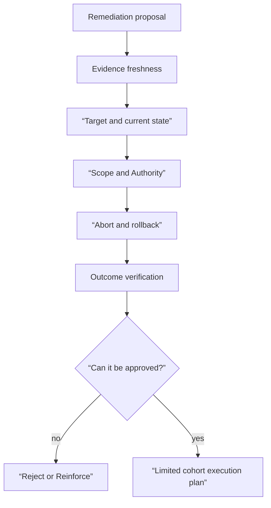

# Automatic recovery dry-run and rollback judgment lab

## Lab prerequisites

This lab is a **Plan only** grade that does not change the actual cluster or cloud resources. Review the provided remediation proposal to determine whether implementation can be approved. There is no need for `kubectl` or credentials. In actual work, even if there is a dry-run command, external database, traffic, and user results cannot be verified, so both plan review before execution and outcome verification after execution must be designed.

| Preparation items | value |
|---|---|
| input | Synthetic incident bundle and rollback proposal |
| execution | doesn't exist |
| output | Approve, reject, or request missing evidence, with a reason |
| stopping condition | Any one of target·previous revision·blast radius·abort is unknown |
| cleanup | doesn't exist |

## Understand the model first

Dry-run checks API validation or diff without changing the target. Although this is an important gate, it does not prove the operational safety of the runbook. For example, even if the deployment rollback plan is syntactically valid, the previous version may not be compatible with the current database schema. Also, even if the plan is safe, it should not be implemented if the incident has already been recovered or the evidence is old.



## Enter incident

```json
{
  "incident_id": "inc-checkout-001",
  "observed_at": "2026-09-03T01:08:00Z",
  "impact": {"sli": "checkout_success_ratio", "current": 0.91, "region": "ap-northeast-2"},
  "candidate": {
    "category": "release_regression",
    "entity": "checkout:v18",
    "evidence": ["revision-cohort-q4", "failed-trace-a91"],
    "counterevidence": ["orders-db pending also increased"],
    "decision": "candidate"
  }
}
```

A candidate is not a confirmed cause. Still, if the user impact is large and there is a strong cohort difference from the recent release, rollback can be considered as a generic mitigation. The Google SRE incident case explains that although general mitigations such as recent release rollback or region traffic reconfiguration before the root cause is fully known can reduce user damage, it is a blunt instrument and can cause other disruptions.

## First proposal — a plan that should be rejected

```yaml
operation: rollback
target: checkout
toRevision: v17
reason: AI confidence 0.94
verify: kubectl rollout status
```

| missing item | why you need it |
|---|---|
| namespace·region·cluster | Prevent misidentification of same name target |
| current revision precondition | Prevent execution of stale plan if it is already a different version. |
| plan·runbook revision | Prevent content changes after approval |
| idempotency key | Timeout and single operation convergence of duplicate requests |
| blast radius | Prevent simultaneous changes across all regions |
| database compatibility | Check if v17 works with current schema |
| abort condition | Stop when rollback gets worse |
| User/dependency verification | Distinguish between rollout success and service recovery |
| rollback·escalation of rollback | Safe path when v17 also fails |

`AI confidence 0.94` is not performance evidence without evaluated calibration and evidence coverage. Not only can the candidate be wrong, but even if the candidate is correct, rollback action may not be safe. This proposal is **rejected and then reinforced**.

## Second proposal — limited approval review

```yaml
operationId: op-inc-checkout-001-rollback-v17
idempotencyKey: inc-checkout-001:checkout:rollback:v17:apne2-canary
runbookRevision: rollback-deployment@8f21c7
target:
  cluster: production-apne2
  namespace: shop
  kind: Deployment
  name: checkout-canary
preconditions:
  currentRevision: v18
  previousRevision: v17
  databaseCompatibilityCheck: passed-contract-test-441
  evidenceFreshWithinSeconds: 300
scope:
  trafficPercent: 5
  maxRegions: 1
abort:
  - checkout_error_ratio_increase_over_baseline_pp: 2
  - orders_db_pending_increase_percent: 20
verify:
  - rollout_status_complete
  - checkout_success_ratio_recovered
  - orders_db_pending_not_worse
  - duplicate_payment_count_unchanged
expiresAt: 2026-09-03T01:20:00Z
```

This proposal has improved to a reviewable level, but this does not mean it will be automatically approved. You need to check the actual current state, approval identity and execution permission, and check whether the canary really receives only 5% of traffic. You must also open what schema·test was used for the receipt of `databaseCompatibilityCheck`.

## Judgment Procedure

1. Verify that incident evidence has not expired and user impact continues.
2. Read-only checks whether the actual current revision of the target is the same as the plan precondition.
3. Check receipt to see if previous revision and external dependency are compatible.
4. Check whether the executor identity has permission only for this namespace·resource·operation.
5. Ensure that the 5% canary is not immediately expanded to 100% by another controller.
6. Check whether the abort query uses the same definition/window as the baseline before the action.
7. If the action is timeout, reconcile the operation and target before re-executing.
8. After success, check all user results, dependency saturation, and work duplication.

## Example results

Illustrative plan-review output. No executor or cluster operation is run by this worksheet.

```text
target_diff: bounded canary cohort
approval_matches_plan: required
rollback_pointer_verified: required
missing_precondition: BLOCK
approved_plan_with_changed_target: BLOCK; regenerate plan and approval
executor_timeout_after_dispatch: UNKNOWN; reconcile existing operation
command_exit_zero_but_user_sli_unhealthy: NOT RECOVERED
```

After filling every prerequisite, the verdict may become READY FOR APPROVED EXECUTION, never RECOVERED before execution and independent outcome checks. A repeated request with the same operation key must inspect the existing operation instead of creating another rollout.

## How to interpret the results

| result | verdict | follow up |
|---|---|---|
| plan validation failed | not executable | Edit target schema·field |
| current revision mismatch | stale plan | Regenerate/reapproval plan in new state |
| Improved canary error rate, DB stabilization | expanded candidate | Separate promotion gate and observation window |
| Canary error rate worsens | abort | Previous state restoration/person escalation |
| rollout complete, user error persists | action invalid | Reassessment of causative candidates |
| User recovery, DB pending increase | hidden side effects | Prohibit expansion/dependency protection |
| executor timeout | result unknown | Transfer after actual state reconciliation |

Kubernetes Deployment’s rollback and rollout status deals with Pod template revision and availability. The API does not replace user SLI, DB pending, and duplicate payment confirmation in this lab. AIOps can connect multiple pieces of evidence, but must remain vigilant about what each piece of evidence warrants.

## Completion criteria

- I did not approve the first proposal because I was drawn to the confidence number.
- We reviewed the target·scope·precondition·abort·verification of the second proposal.
- Dry-run, commit and outcome verification were distinguished.
- Blind retry is prohibited when the result is unknown.
- I decided on the items to return the success/failure results to the label and runbook evaluation of [incident bundle](../aiops-foundations/02-incident-bundle-contract-lab.md).

## Explain it in your own words

- Why is the second proposal more secure than the first, but still requires confirmation before execution?
- What additional gate is needed to not automatically zoom to 100% after canary success?
- Why does rollback relieve user symptoms but not determine the root cause?
- How to evaluate the cost of false positive actions when promoting a repeatable successful runbook to auto-run?

<!-- source: https://sre.google/workbook/incident-response/ | checked: 2026-09-03 -->
<!-- source: https://sre.google/sre-book/automation-at-google/ | checked: 2026-09-03 -->
<!-- source: https://kubernetes.io/docs/concepts/workloads/controllers/deployment/ | checked: 2026-09-03 -->
<!-- source: https://gateway-api.sigs.k8s.io/docs/concepts/security/ | checked: 2026-09-03 -->
