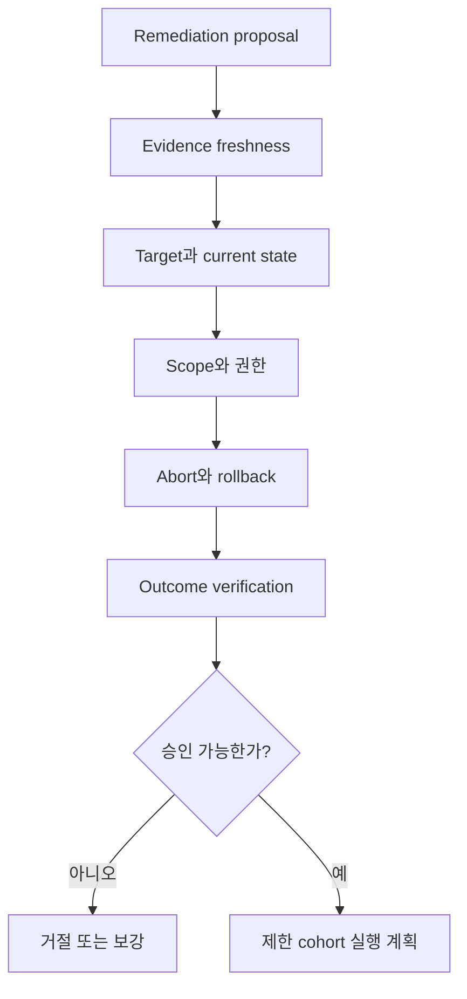

# 자동 복구 dry-run과 rollback 판정 실습

## 실습 전에 준비할 것

이 실습은 실제 cluster나 cloud resource를 변경하지 않는 **Plan only** 등급이다. 제공된 remediation proposal을 검토해 실행을 승인할 수 있는지 판정한다. `kubectl`이나 credential은 필요 없다. 실제 업무에서는 dry-run 명령이 있어도 외부 database·traffic·사용자 결과까지 검증하지 못하므로, 실행 전 계획 검토와 실행 후 outcome verification을 모두 설계해야 한다.

| 준비 항목 | 값 |
|---|---|
| 입력 | 합성 incident bundle과 rollback proposal |
| 실행 | 없음 |
| 출력 | 승인·거절·보강 요청 중 하나와 이유 |
| 중단 조건 | target·previous revision·blast radius·abort 중 하나라도 불명 |
| cleanup | 없음 |

## 먼저 이해하기

dry-run은 대상을 바꾸지 않고 API validation이나 diff를 확인한다. 이것은 중요한 gate지만, runbook의 업무 안전성을 증명하지 않는다. 예를 들어 Deployment rollback plan이 문법상 유효해도 이전 version이 현재 database schema와 호환되지 않을 수 있다. 또한 plan이 안전해도 incident가 이미 회복됐거나 evidence가 오래됐다면 실행하면 안 된다.



## incident 입력

```json
{
  "incident_id": "inc-checkout-001",
  "observed_at": "2026-09-03T01:08:00Z",
  "impact": {"sli": "checkout_success_ratio", "current": 0.91, "region": "ap-northeast-2"},
  "candidate": {
    "category": "release_regression",
    "entity": "checkout:v18",
    "evidence": ["revision-cohort-q4", "failed-trace-a91"],
    "counterevidence": ["orders-db pending also increased"],
    "decision": "candidate"
  }
}
```

후보는 확정 원인이 아니다. 그래도 사용자 영향이 크고 최근 release와 강한 cohort 차이가 있다면 generic mitigation으로 rollback을 검토할 수 있다. Google SRE incident 사례는 root cause를 완전히 알기 전 recent release rollback이나 region traffic reconfiguration 같은 일반 완화가 사용자 피해를 줄일 수 있지만, blunt instrument라 다른 disruption을 만들 수 있다고 설명한다.

## 첫 proposal — 거절해야 하는 계획

```yaml
operation: rollback
target: checkout
toRevision: v17
reason: AI confidence 0.94
verify: kubectl rollout status
```

| 빠진 항목 | 왜 필요한가 |
|---|---|
| namespace·region·cluster | 같은 이름 target 오인 방지 |
| current revision precondition | 이미 다른 version이면 stale plan 실행 방지 |
| plan·runbook revision | 승인 뒤 내용 변경 방지 |
| idempotency key | timeout·중복 요청의 단일 operation 수렴 |
| blast radius | 전 region 동시 변경 방지 |
| database compatibility | v17이 현재 schema에서 동작하는지 확인 |
| abort condition | rollback이 더 악화될 때 중단 |
| 사용자·dependency verification | rollout 성공과 서비스 회복 구분 |
| rollback의 rollback·escalation | v17도 실패할 때 안전 경로 |

`AI confidence 0.94`는 평가된 calibration과 evidence coverage가 없으면 실행 근거가 아니다. 후보가 틀릴 수 있을 뿐 아니라 후보가 맞아도 rollback action이 안전하지 않을 수 있다. 이 proposal은 **거절 후 보강**이 맞다.

## 두 번째 proposal — 제한된 승인 검토

```yaml
operationId: op-inc-checkout-001-rollback-v17
idempotencyKey: inc-checkout-001:checkout:rollback:v17:apne2-canary
runbookRevision: rollback-deployment@8f21c7
target:
  cluster: production-apne2
  namespace: shop
  kind: Deployment
  name: checkout-canary
preconditions:
  currentRevision: v18
  previousRevision: v17
  databaseCompatibilityCheck: passed-contract-test-441
  evidenceFreshWithinSeconds: 300
scope:
  trafficPercent: 5
  maxRegions: 1
abort:
  - checkout_error_ratio_increase_over_baseline_pp: 2
  - orders_db_pending_increase_percent: 20
verify:
  - rollout_status_complete
  - checkout_success_ratio_recovered
  - orders_db_pending_not_worse
  - duplicate_payment_count_unchanged
expiresAt: 2026-09-03T01:20:00Z
```

이 proposal은 검토 가능한 수준으로 좋아졌지만 자동 승인이라는 뜻은 아니다. 실제 current state 조회, approval identity와 실행 권한, canary가 정말 5% traffic만 받는지 확인해야 한다. `databaseCompatibilityCheck`의 receipt가 어떤 schema·test를 썼는지도 열어야 한다.

## 판정 절차

1. incident evidence가 만료되지 않았고 사용자 영향이 계속되는지 확인한다.
2. target의 실제 current revision이 plan precondition과 같은지 read-only 조회한다.
3. previous revision과 외부 dependency가 함께 호환되는지 receipt를 확인한다.
4. executor identity가 이 namespace·resource·operation에만 권한을 갖는지 확인한다.
5. 5% canary가 다른 controller에 의해 즉시 100%로 확대되지 않는지 확인한다.
6. abort query가 action 전 baseline과 같은 정의·window를 쓰는지 확인한다.
7. action timeout이면 재실행 전에 operation과 target을 reconcile하도록 한다.
8. 성공 뒤 사용자 결과, dependency saturation과 업무 중복을 모두 확인한다.

## 결과를 이렇게 읽는다

| 결과 | 판정 | 후속 |
|---|---|---|
| plan validation 실패 | 실행 불가 | target schema·field 수정 |
| current revision 불일치 | stale plan | 새 상태로 plan 재생성·재승인 |
| canary 오류율 개선, DB 안정 | 확대 후보 | 별도 승급 gate와 관찰 window |
| canary 오류율 악화 | abort | 이전 상태 복원·사람 escalation |
| rollout complete, 사용자 오류 지속 | action 무효 | 원인 후보 재평가 |
| 사용자 회복, DB pending 증가 | 숨은 부작용 | 확대 금지·dependency 보호 |
| executor timeout | 결과 불명 | actual state reconciliation 후 전이 |

Kubernetes Deployment의 rollback과 rollout status는 Pod template revision과 availability를 다룬다. 이 실습의 사용자 SLI, DB pending과 중복 결제 확인은 그 API가 대신하지 않는다. AIOps는 여러 증거를 연결할 수 있지만 각 증거가 무엇을 보장하는지 경계를 유지해야 한다.

## 완료

- 첫 proposal을 confidence 숫자에 끌려 승인하지 않았다.
- 두 번째 proposal의 target·scope·precondition·abort·verification을 검토했다.
- dry-run, commit과 outcome verification을 구분했다.
- result unknown 상태에서 blind retry를 금지했다.
- 성공·실패 결과를 [incident bundle](../aiops-foundations/02-incident-bundle-contract-lab.md)의 label과 runbook evaluation으로 되돌릴 항목을 정했다.

## 스스로 설명해 보기

- 두 번째 proposal이 첫 번째보다 안전하지만 여전히 실행 전 확인이 필요한 이유는 무엇인가?
- canary success 뒤 자동으로 100% 확대하지 않으려면 어떤 추가 gate가 필요한가?
- rollback이 사용자 증상을 완화했지만 root cause를 확정하지 못하는 이유는 무엇인가?
- 반복 성공한 runbook을 auto-run으로 승급할 때 false positive action 비용을 어떻게 평가할 것인가?

<!-- source: https://sre.google/workbook/incident-response/ | checked: 2026-09-03 -->
<!-- source: https://sre.google/sre-book/automation-at-google/ | checked: 2026-09-03 -->
<!-- source: https://kubernetes.io/docs/concepts/workloads/controllers/deployment/ | checked: 2026-09-03 -->
<!-- source: https://gateway-api.sigs.k8s.io/docs/concepts/security/ | checked: 2026-09-03 -->
