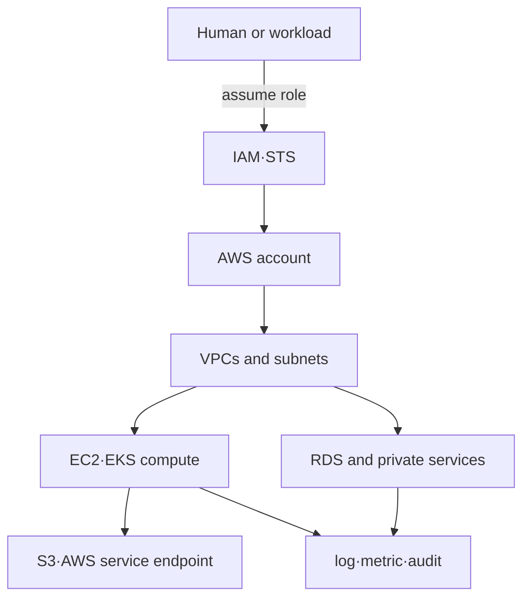

# AWS infrastructure-based roadmap

## Starting point for beginners

If you want others to be able to continue to use applications that are only running on your computer, you need a server, network, storage space, and access rights. AWS is a cloud service that creates these resources when needed and pays based on usage. It's convenient, but if you don't know what account you created, it can lead to security incidents and unexpected costs.

| New term | Plain-language meaning | Why it matters / when to use it |
|---|---|---|
| account | Largest ownership boundary where AWS resources, costs, and permissions gather | Separate ownership, billing, and permission boundaries for environments or organizations. |
| Region | Geographic regions served by AWS | Choose geographic placement according to latency, residency, and recovery requirements. |
| resource | Objects created and managed by AWS, such as servers, networks, and storage. | Choose the exact AWS object whose ownership, cost, and permissions must be managed. |
| IAM | Permissions structure that determines who can do what AWS tasks | Grant specific AWS actions to the right identities and diagnose denied requests. |
| VPC | Isolated network that sets addresses and communication rules directly within AWS | Control workload addressing and allowed communication paths inside an AWS network. |
| role | A bundle of privileges that a person or program temporarily assumes to perform a permitted task. | Delegate task-specific permissions without handing every workload permanent user credentials. |

In the first step, the currently logged in subject and already existing networks are read without creating any resources. Afterwards, separate judgments are made on “who gave permission” and “whether the network path was opened.”

If you learn AWS as a list of service names, the trust and network boundaries are not visible when resources increase. This process first fixes **who changes which resource from which account to which network path**.

## The model in one sentence

> AWS workload is a combination of `account boundary + identity policy + VPC reachability + regional resource + telemetry·cost record`.

## Reading order

1. [Account, identity and network boundary](01-identity-network-resource-model.md): Separate IAM authorization and VPC reachability.
2. [Read-only AWS diagnostic lab](02-read-only-diagnosis-lab.md): Checks the current caller and VPC route without change and interprets `AccessDenied` as evidence.

## Service selection map

| responsibility | Resources to learn first | operational questions |
|---|---|---|
| identity | account, role, policy, STS session | Who can do what and under what conditions? |
| network | VPC, subnet, route table, gateway, endpoint | From which source does it reach which destination? |
| compute | EC2, Auto Scaling, EKS | Where do processes/Pods run and who replaces them? |
| storage | EBS, S3 | What are the lifespan, durability, and deletion boundaries of blocks and objects? |
| database | RDS | Who is in charge of engine operation and infrastructure operation? |
| operations | CloudWatch, CloudTrail, tags | To what identity and resource are states, changes, and costs attributed? |

AWS Well-Architected's operational excellence, security, reliability, performance efficiency, cost optimization, and sustainability are not separate checklists for service selection, but are used as six perspectives to view the same workload.

## out of range

- Solve certification questions and memorize all AWS services
- multi-cloud abstraction
- Organizations·Control Tower’s actual multi-account construction
- Actual resource creation: [Terraform on AWS](../terraform-aws/00-roadmap.md) handles this as an optional lab.

## Completion criteria

This topic is not something you read once and then stop. First, convert the terminology table into your own words and follow the flow of requests made in the concepts chapter. In the lab, the normal state is first recorded, then a failure is created by changing only one condition, and the cause is explained with evidence before recovery. Finally, expand to more complex environments by answering the operational judgment questions below.

- Distinguish between authentication and authorization and confirm the subject of the role session.
- Reachability is determined not by the name of the public subnet, but by a combination of route, address, gateway·policy.
- This explains why the managed service does not take over the responsibility of verifying the schema, query, and backup of the application.

## Check your understanding

1. What is the boundary between AWS account and Region?
2. Why can a request fail without a network route even if I have IAM permissions?

**Confirmation criteria:** Account can be described as a large boundary of ownership, authority, and cost, and Region can be described as a geographic service location. Permit to work and possibility of communication are separate conditions.

## Develop operational judgment

1. What are other policy/network reasons why a request might fail even with IAM Allow?
2. What options are there for the path through which a resource in a private subnet calls the AWS API?
3. Let’s divide the areas managed by EKS and the areas for which node/workload operators are responsible.

<!-- source: https://docs.aws.amazon.com/wellarchitected/latest/framework/welcome.html | checked: 2026-09-03 -->
<!-- source: https://docs.aws.amazon.com/IAM/latest/UserGuide/introduction.html | checked: 2026-09-03 -->
<!-- source: https://docs.aws.amazon.com/vpc/latest/userguide/what-is-amazon-vpc.html | checked: 2026-09-03 -->
<!-- source: https://docs.aws.amazon.com/eks/latest/userguide/what-is-eks.html | checked: 2026-09-03 -->
