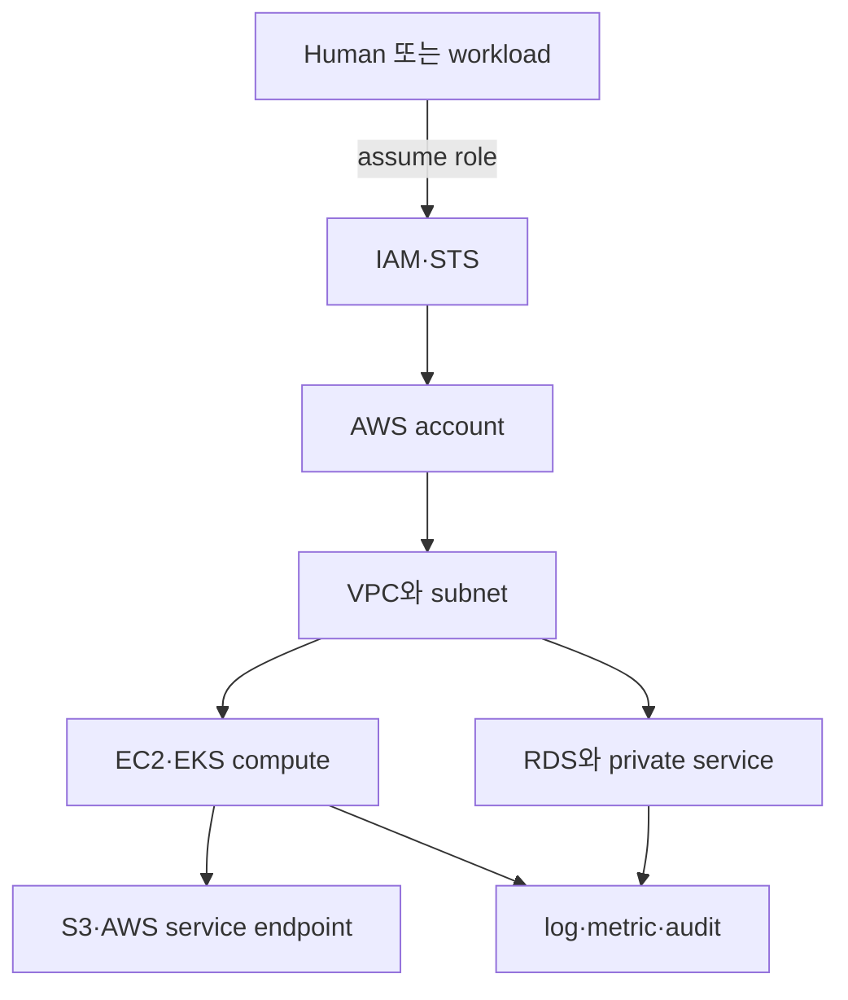

# AWS 인프라 기반 로드맵

AWS를 서비스 이름 목록으로 배우면 resource가 늘 때 trust와 network 경계가 보이지 않는다. 이 과정은 **누가 어떤 account에서 어떤 network path로 어느 resource를 변경하는가**를 먼저 고정한다.

## 한 문장 모델

> AWS workload는 `account boundary + identity policy + VPC reachability + regional resource + telemetry·cost record`의 결합이다.

## 읽는 순서

1. [Account, identity와 network boundary](01-identity-network-resource-model.md): IAM authorization과 VPC reachability를 분리한다.
2. [Read-only AWS 진단 실습](02-read-only-diagnosis-lab.md): 현재 caller와 VPC route를 변경 없이 조회하고 `AccessDenied`를 증거로 해석한다.

## 서비스 선택 지도

| 책임 | 먼저 배우는 resource | 운영 질문 |
|---|---|---|
| identity | account, role, policy, STS session | 누가 어떤 조건으로 무엇을 할 수 있는가? |
| network | VPC, subnet, route table, gateway, endpoint | 어느 source에서 어느 destination에 도달하는가? |
| compute | EC2, Auto Scaling, EKS | process·Pod가 어디서 실행되고 누가 교체하는가? |
| storage | EBS, S3 | block과 object의 수명·내구·삭제 경계는 무엇인가? |
| database | RDS | engine 운영과 infrastructure 운영을 누가 맡는가? |
| operations | CloudWatch, CloudTrail, tags | 상태·변경·비용을 어떤 identity와 resource에 귀속하는가? |

AWS Well-Architected의 운영 우수성, 보안, 신뢰성, 성능 효율, 비용 최적화와 지속 가능성은 서비스 선택의 별도 checklist가 아니라 같은 workload를 보는 여섯 관점으로 사용한다.

## 범위 밖

- 자격증 문제 풀이와 모든 AWS 서비스 암기
- multi-cloud 추상화
- Organizations·Control Tower의 실제 multi-account 구축
- 실제 resource 생성: [Terraform on AWS](../terraform-aws/00-roadmap.md)에서 선택 실습으로 다룬다.

## 완료 기준

- authentication과 authorization을 구분하고 role session의 주체를 확인한다.
- public subnet이라는 이름이 아니라 route와 address, gateway·policy의 조합으로 reachability를 판정한다.
- managed service가 application의 schema·query·backup 검증 책임까지 대신하지 않는 이유를 설명한다.

## 스스로 설명해 보기

1. IAM Allow가 있어도 요청이 실패할 수 있는 다른 policy·network 이유는 무엇인가?
2. private subnet의 resource가 AWS API를 호출하는 경로에는 어떤 선택지가 있는가?
3. EKS가 관리해 주는 영역과 node·workload 운영자가 책임지는 영역을 나눠 보자.

<!-- source: https://docs.aws.amazon.com/wellarchitected/latest/framework/welcome.html | checked: 2026-09-03 -->
<!-- source: https://docs.aws.amazon.com/IAM/latest/UserGuide/introduction.html | checked: 2026-09-03 -->
<!-- source: https://docs.aws.amazon.com/vpc/latest/userguide/what-is-amazon-vpc.html | checked: 2026-09-03 -->
<!-- source: https://docs.aws.amazon.com/eks/latest/userguide/what-is-eks.html | checked: 2026-09-03 -->
