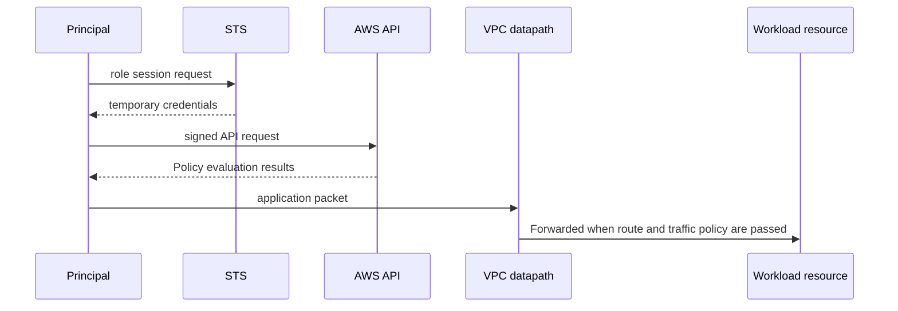

# Account, identity and network boundary

<!-- source: https://docs.aws.amazon.com/awscloudtrail/latest/userguide/logging-data-events-with-cloudtrail.html | checked: 2026-09-10 | data-event support and explicit selection -->

## Terms introduced in this chapter

- **principal**: The identity of the person or program sending the request to AWS. **Why it matters / when to use it:** Determine whose policies apply when evaluating an AWS request.
- **credential**: Login information used to prove your identity. Temporary credentials take precedence over long-term access keys. **Why it matters / when to use it:** Prove the requester's identity to a service; protect and limit the credential's lifetime.
- **API**: A designated channel through which a program requests AWS to “show me a list” or “create a resource.” **Why it matters / when to use it:** Automate repeatable AWS queries and changes through a defined request interface.
- **subnet**: Divides the VPC's IP address range into smaller zones. **Why it matters / when to use it:** Group network interfaces into address ranges with the intended placement and routing.
- **route table**: A set of rules that determine which next point to send traffic to based on the destination address. **Why it matters / when to use it:** Make destination-specific forwarding decisions explicit and reviewable.
- **availability zone (AZ)**: An operational zone that separates power and facility failure boundaries within a region. **Why it matters / when to use it:** Place redundant workloads across distinct facility failure boundaries within a region.

At first, just note that both `the identity is authorized to perform the operation` and `a communication path to the destination exists` are required for a single request to succeed. You cannot find the cause by checking just one of the two.

## Understand the model first

In AWS, resource access is not explained as “I can do it because I am in the same VPC” or “I can do it because I have an IAM role.” API calls require principal and policy evaluation, and network packets require address·route·filter·listener. Although an application request can go through both, the two permissions are independent.

For example, let's say you are reading an S3 object from EC2 in a private subnet. The application must receive `s3:GetObject` permission as a temporary credential of the instance role. At the same time, the packet must have a real route, such as a NAT gateway or S3 VPC endpoint. If IAM allows it but there is no route, a timeout occurs, and if IAM denies it even if the network is open, the AWS API returns AccessDenied.

| boundary | key questions | main evidence |
|---|---|---|
| account | Who is the ultimate owner of resources and costs? | account·organization structure, billing owner |
| identity | Which principal is requesting which session? | role ARN, STS session, CloudTrail |
| authorization | What actions/resources/conditions are allowed? | policy evaluation and denial context |
| network | Which hops and filters does the packet pass through? | subnet, route, SG/NACL, flow evidence |
| resource | In which region·AZ and lifecycle is the actual object located? | service API, tags, state and health |

## Walk through an AWS lookup request step by step

1. A user or program uses the credential to make an AWS API request.
2. AWS checks whether the session with the principal has expired using the credential.
3. Evaluate whether IAM and related policies allow the requested action for the resource.
4. If allowed, the service in the target region inquires or changes the resource status.
5. Tasks that require a data path must also pass the VPC route and security policy.
6. Inspect service logs or CloudTrail where the relevant event type is enabled and supported. For example, S3 object-level data events are not automatically covered by every default management-event history.

These are responsibility boundaries rather than a packet-level sequence. The signed API request itself must reach an AWS endpoint before that endpoint can evaluate it. A separate application connection, such as a database session, has its own network and authentication path.

## Two permissions required for one request

AWS API requests and workload network connections are different paths.

- IAM authorization evaluates whether the principal can perform API actions on the resource.
- Network reachability determines the address, route, gateway, and traffic policy to forward packets.

Even if the DB port is open, the caller does not have the authority to change the RDS configuration. Conversely, even if you have `rds:ModifyDBInstance` permission, it does not mean that the application process can make a TCP connection to the DB endpoint.



## Identity model

| element | meaning | Operationally check |
|---|---|---|
| principal | The user, role session, or service that signed the request. | Actual ARN and session source |
| identity policy | Permissions attached to principal | action, resource, condition |
| resource policy | principal trusted by the resource | cross-account principal and condition |
| role trust policy | Who can assume the role | service, account, federation conditions |
| session | Valid range of temporary credential | duration, session name, source identity |

The root user is only used for limited tasks such as account recovery and is not used as a daily operating path. The workload is associated with a role that the execution environment can receive, not a person's long-term access key.

## VPC model

A VPC is a logically isolated virtual network. A subnet is the address range of one Availability Zone, and the route table determines the next hop for subnet or gateway traffic.

```text
reachability = source address + destination address
             + source route + destination return route
             + gateway/NAT/endpoint
             + security group/NACL/host policy
             + listening application
```

It is not judged solely by the label public/private. Even if there is a public IPv4 and internet gateway route, inbound requests will not succeed if there is no security policy and listener. Outbound private resources also require a NAT gateway, VPC endpoint, or other controlled egress path.

## Regional resources and failure domains

Distinguish between Region, Availability Zone and resource scope. A subnet belongs to one AZ, and dividing resources across multiple AZs is one way to reduce the failure radius, but if data replication/failover and application retry are not prepared, deployment only increases.

## Shared responsibility

A managed service leaves some of the infrastructure lifecycle to AWS, but remains responsible for customer configuration and data use. For example, EKS control plane management and workload RBAC·image·network policy·node selection are not the same responsibility.

## Explain it in your own words

1. What questions do role trust policy and identity policy each ask?
2. Why doesn't it start with network packet capture when the request is `AccessDenied`?
3. Why can a service not meet its reliability goals even if there are instances in two AZs?

<!-- source: https://docs.aws.amazon.com/IAM/latest/UserGuide/introduction.html | checked: 2026-09-03 -->
<!-- source: https://docs.aws.amazon.com/IAM/latest/UserGuide/access_policies.html | checked: 2026-09-03 -->
<!-- source: https://docs.aws.amazon.com/vpc/latest/userguide/what-is-amazon-vpc.html | checked: 2026-09-03 -->
<!-- source: https://docs.aws.amazon.com/AWSEC2/latest/UserGuide/concepts.html | checked: 2026-09-03 -->
<!-- source: https://docs.aws.amazon.com/eks/latest/userguide/what-is-eks.html | checked: 2026-09-03 -->
