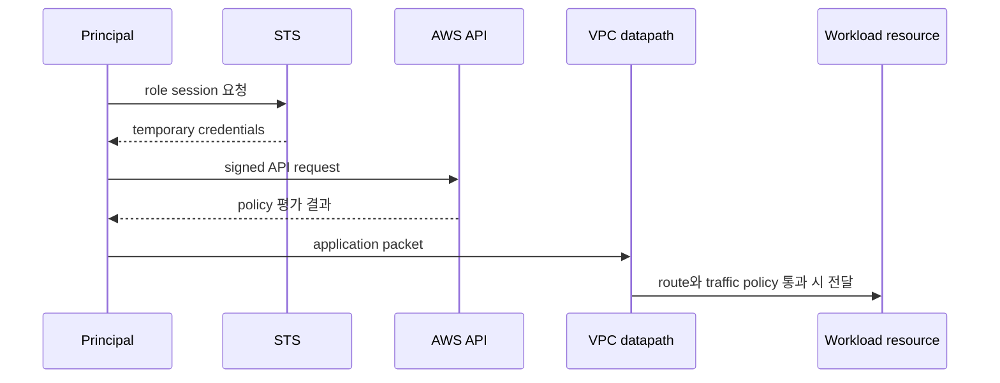

# Account, identity와 network boundary

## 이 장에서 처음 쓰는 말

- **principal**: AWS에 요청을 보내는 사람 또는 프로그램의 신원이다.
- **credential**: 그 신원을 증명할 때 사용하는 로그인 정보다. 장기 access key보다 임시 credential을 우선한다.
- **API**: 프로그램이 AWS에 “목록을 보여 줘”, “자원을 만들어 줘”라고 요청하는 정해진 통로다.
- **subnet**: VPC의 IP 주소 범위를 더 작은 구역으로 나눈 것이다.
- **route table**: 목적지 주소에 따라 traffic을 어느 다음 지점으로 보낼지 정한 규칙 모음이다.
- **availability zone(AZ)**: 한 Region 안에서 전원·시설 장애 경계를 분리한 운영 구역이다.

처음에는 요청 하나가 성공하려면 `신원에 작업 권한이 있음`과 `목적지까지 통신 경로가 있음`이 모두 필요하다는 사실만 잡는다. 둘 중 하나만 확인해서는 원인을 찾을 수 없다.

## 먼저 이해하기

AWS에서 resource 접근은 “같은 VPC에 있으니 된다” 또는 “IAM role이 있으니 된다”로 설명되지 않는다. API 호출에는 principal과 policy evaluation이 필요하고, network packet에는 address·route·filter·listener가 필요하다. 애플리케이션 요청 하나가 둘을 모두 거칠 수 있지만 두 허가는 독립적이다.

예를 들어 private subnet의 EC2에서 S3 object를 읽는다고 하자. application은 instance role의 temporary credential로 `s3:GetObject` 권한을 받아야 한다. 동시에 packet은 NAT gateway 또는 S3 VPC endpoint 같은 실제 경로를 가져야 한다. IAM이 허용해도 route가 없으면 timeout이 나고, network가 열려 있어도 IAM이 거부하면 AWS API가 AccessDenied를 반환한다.

| 경계 | 핵심 질문 | 주된 증거 |
|---|---|---|
| account | 누가 resource와 비용의 최종 owner인가? | account·organization 구조, billing owner |
| identity | 어떤 principal이 어떤 session으로 요청하는가? | role ARN, STS session, CloudTrail |
| authorization | 어떤 action·resource·condition이 허용되는가? | policy evaluation과 denial context |
| network | packet이 어느 hop과 filter를 지나는가? | subnet, route, SG/NACL, flow evidence |
| resource | 실제 object가 어느 region·AZ와 lifecycle에 있는가? | service API, tags, state와 health |

## AWS 조회 요청을 한 단계씩 따라가기

1. 사용자나 프로그램이 credential을 사용해 AWS API 요청을 만든다.
2. AWS가 credential로 principal과 만료된 session이 아닌지 확인한다.
3. IAM과 관련 policy가 요청한 action을 해당 resource에 허용하는지 평가한다.
4. 허용됐다면 대상 Region의 service가 resource 상태를 조회하거나 변경한다.
5. data path가 필요한 작업은 VPC route와 security policy도 통과해야 한다.
6. 결과와 변경 주체는 service log나 CloudTrail 같은 감사 기록에서 다시 확인할 수 있다.

IAM 허용은 3단계의 결과다. database 연결처럼 network를 지나야 하는 요청은 3단계가 성공해도 5단계에서 실패할 수 있다.

## 요청 하나에 필요한 두 허가

AWS API 요청과 workload network 연결은 서로 다른 경로다.

- IAM authorization은 principal이 API action을 resource에 수행할 수 있는지 평가한다.
- network reachability는 address, route, gateway와 traffic policy가 packet을 전달하는지 결정한다.

DB port가 열려 있어도 caller가 RDS configuration을 바꿀 권한은 생기지 않는다. 반대로 `rds:ModifyDBInstance` 권한이 있어도 application process가 DB endpoint에 TCP 연결할 수 있다는 뜻은 아니다.



## Identity model

| 요소 | 의미 | 운영상 확인할 것 |
|---|---|---|
| principal | 요청을 서명한 user, role session 또는 service | 실제 ARN과 session source |
| identity policy | principal에 붙은 권한 | action, resource, condition |
| resource policy | resource가 신뢰하는 principal | cross-account principal과 condition |
| role trust policy | 누가 role을 assume할 수 있는가 | service, account, federation 조건 |
| session | temporary credential의 유효 범위 | duration, session name, source identity |

root user는 account 복구 등 제한된 작업에만 두고 일상 운영 경로로 사용하지 않는다. workload에는 사람의 장기 access key가 아니라 execution environment가 받을 수 있는 role을 연결한다.

## VPC model

VPC는 논리적으로 격리된 virtual network다. subnet은 한 Availability Zone의 address range이고 route table이 subnet 또는 gateway traffic의 next hop을 정한다.

```text
reachability = source address + destination address
             + source route + destination return route
             + gateway/NAT/endpoint
             + security group/NACL/host policy
             + listening application
```

public/private이라는 label만으로 판정하지 않는다. public IPv4와 internet gateway route가 있어도 security policy와 listener가 없으면 inbound 요청은 성공하지 않는다. private resource의 outbound도 NAT gateway, VPC endpoint 또는 다른 controlled egress 경로가 필요하다.

## Regional resource와 failure domain

Region, Availability Zone과 resource scope를 구분한다. subnet은 한 AZ에 속하고, 여러 AZ에 resource를 나누는 것은 장애 반경을 줄이는 한 방법이지만 data replication·failover와 application retry가 준비되지 않으면 배치만 늘어난다.

## Shared responsibility

managed service는 일부 infrastructure lifecycle을 AWS에 맡기지만 customer configuration과 data 사용 책임은 남는다. 예를 들어 EKS control plane 관리와 workload RBAC·image·network policy·node 선택은 같은 책임이 아니다.

## 스스로 설명해 보기

1. role trust policy와 identity policy가 각각 묻는 질문은 무엇인가?
2. request가 `AccessDenied`일 때 network packet capture부터 시작하지 않는 이유는 무엇인가?
3. 두 AZ에 instance가 있어도 service가 신뢰성 목표를 못 지킬 수 있는 이유는 무엇인가?

<!-- source: https://docs.aws.amazon.com/IAM/latest/UserGuide/introduction.html | checked: 2026-09-03 -->
<!-- source: https://docs.aws.amazon.com/IAM/latest/UserGuide/access_policies.html | checked: 2026-09-03 -->
<!-- source: https://docs.aws.amazon.com/vpc/latest/userguide/what-is-amazon-vpc.html | checked: 2026-09-03 -->
<!-- source: https://docs.aws.amazon.com/AWSEC2/latest/UserGuide/concepts.html | checked: 2026-09-03 -->
<!-- source: https://docs.aws.amazon.com/eks/latest/userguide/what-is-eks.html | checked: 2026-09-03 -->
