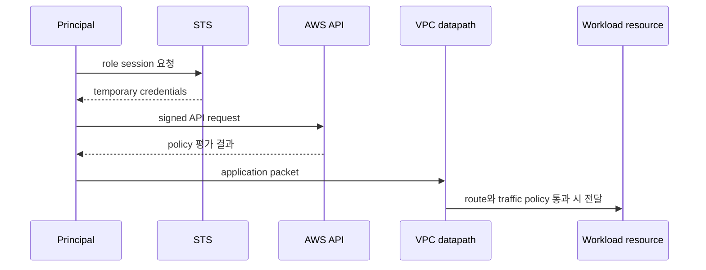

# Account, identity와 network boundary

## 요청 하나에 필요한 두 허가

AWS API 요청과 workload network 연결은 서로 다른 경로다.

- IAM authorization은 principal이 API action을 resource에 수행할 수 있는지 평가한다.
- network reachability는 address, route, gateway와 traffic policy가 packet을 전달하는지 결정한다.

DB port가 열려 있어도 caller가 RDS configuration을 바꿀 권한은 생기지 않는다. 반대로 `rds:ModifyDBInstance` 권한이 있어도 application process가 DB endpoint에 TCP 연결할 수 있다는 뜻은 아니다.



## Identity model

| 요소 | 의미 | 운영상 확인할 것 |
|---|---|---|
| principal | 요청을 서명한 user, role session 또는 service | 실제 ARN과 session source |
| identity policy | principal에 붙은 권한 | action, resource, condition |
| resource policy | resource가 신뢰하는 principal | cross-account principal과 condition |
| role trust policy | 누가 role을 assume할 수 있는가 | service, account, federation 조건 |
| session | temporary credential의 유효 범위 | duration, session name, source identity |

root user는 account 복구 등 제한된 작업에만 두고 일상 운영 경로로 사용하지 않는다. workload에는 사람의 장기 access key가 아니라 execution environment가 받을 수 있는 role을 연결한다.

## VPC model

VPC는 논리적으로 격리된 virtual network다. subnet은 한 Availability Zone의 address range이고 route table이 subnet 또는 gateway traffic의 next hop을 정한다.

```text
reachability = source address + destination address
             + source route + destination return route
             + gateway/NAT/endpoint
             + security group/NACL/host policy
             + listening application
```

public/private이라는 label만으로 판정하지 않는다. public IPv4와 internet gateway route가 있어도 security policy와 listener가 없으면 inbound 요청은 성공하지 않는다. private resource의 outbound도 NAT gateway, VPC endpoint 또는 다른 controlled egress 경로가 필요하다.

## Regional resource와 failure domain

Region, Availability Zone과 resource scope를 구분한다. subnet은 한 AZ에 속하고, 여러 AZ에 resource를 나누는 것은 장애 반경을 줄이는 한 방법이지만 data replication·failover와 application retry가 준비되지 않으면 배치만 늘어난다.

## Shared responsibility

managed service는 일부 infrastructure lifecycle을 AWS에 맡기지만 customer configuration과 data 사용 책임은 남는다. 예를 들어 EKS control plane 관리와 workload RBAC·image·network policy·node 선택은 같은 책임이 아니다.

## 스스로 설명해 보기

1. role trust policy와 identity policy가 각각 묻는 질문은 무엇인가?
2. request가 `AccessDenied`일 때 network packet capture부터 시작하지 않는 이유는 무엇인가?
3. 두 AZ에 instance가 있어도 service가 신뢰성 목표를 못 지킬 수 있는 이유는 무엇인가?

<!-- source: https://docs.aws.amazon.com/IAM/latest/UserGuide/introduction.html | checked: 2026-09-03 -->
<!-- source: https://docs.aws.amazon.com/IAM/latest/UserGuide/access_policies.html | checked: 2026-09-03 -->
<!-- source: https://docs.aws.amazon.com/vpc/latest/userguide/what-is-amazon-vpc.html | checked: 2026-09-03 -->
<!-- source: https://docs.aws.amazon.com/AWSEC2/latest/UserGuide/concepts.html | checked: 2026-09-03 -->
<!-- source: https://docs.aws.amazon.com/eks/latest/userguide/what-is-eks.html | checked: 2026-09-03 -->
