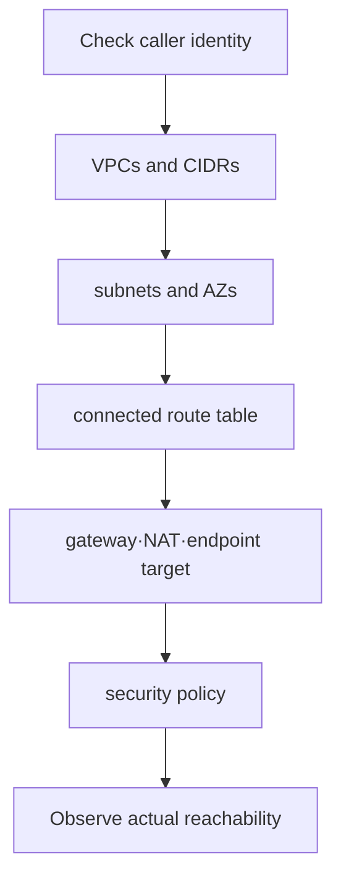

# Read-only AWS diagnostic lab

> Lab grade: **Read-only inquiry equivalent to Plan only**. It does not create or change AWS resources, but requires API call permission and credentials. The account ID and ARN in the output are not copied to the public repository.

## Lab prerequisites

- **Environment**: Requires an AWS account and AWS CLI. If you do not have an account, do not run the command and just proceed to reading the example output.
- **Identity**: Do not create a new root user or long-term access key. Use SSO or temporary role provided by the organization.
- **Permissions**: Use a read-only role that allows only viewing of STS caller and EC2 VPC·subnet·route table list.
- **Range**: The operator confirms and then specifies the profile and region names to be used.
- **Change or not**: The commands in this chapter only perform queries. AWS commands containing `create`, `modify`, and `delete` are not executed.
- **Record Protection**: Account ID, ARN, internal CIDR and resource ID are not attached to public documents or issues.

The purpose of the first command is not to look at the VPC, but to fix “what identity and region are we looking at?” If this value is different from expected, further commands do not proceed.

## Understand the model first

This lab does not change the AWS configuration, but starts by checking “what account I am looking at now.” A common mistake in cloud failure investigation is believing that you are investigating the correct target even when you see a dev/prod resource with the same name or a different region. So the first evidence is not the VPC, but the caller identity and region.

`public subnet` also does not judge with just one setting. To reach an instance on the Internet, a public address, a route to the internet gateway, an acceptable security policy, a listening process, and a return path are all required. `MapPublicIpOnLaunch` is just a subnet property that determines whether to automatically assign a public address to the new instance.

| floor | What to collect | Things that shouldn't be concluded yet |
|---|---|---|
| identity context | account, role session, region | Allow actual resource access All |
| declared network | VPC, subnet, route, gateway | The fact that the packet actually made a round trip |
| runtime endpoint | address, SG, listener, health | Is the application internally normal? |

## preparation

- AWS CLI is installed.
- Use a learning role or federated profile rather than a root user.
- The profile and region are determined according to your environment.

```bash
export AWS_PROFILE="study-readonly"
export AWS_REGION="ap-northeast-2"
```

Do not enter the access key directly into the document or shell history. Configure the profile to use SSO or temporary role session.

## 1. Check current principal

```bash
aws sts get-caller-identity
aws configure list
```

The success criterion is that the expected account and assumed role identity are output. If this step is violated, subsequent resource searches will not proceed.

## 2. Inventory VPCs and routes

```bash
aws ec2 describe-vpcs \
  --query 'Vpcs[].{VpcId:VpcId,Cidr:CidrBlock,Default:IsDefault}' \
  --output table

aws ec2 describe-subnets \
  --query 'Subnets[].{SubnetId:SubnetId,VpcId:VpcId,AZ:AvailabilityZone,Cidr:CidrBlock,PublicIp:MapPublicIpOnLaunch}' \
  --output table

aws ec2 describe-route-tables \
  --query 'RouteTables[].{RouteTableId:RouteTableId,VpcId:VpcId,Associations:Associations[].SubnetId,Routes:Routes[].{Destination:DestinationCidrBlock,Gateway:GatewayId,Nat:NatGatewayId,State:State}}' \
  --output json
```

`MapPublicIpOnLaunch=true` alone does not determine public reachability. A subnet association, default route target, instance address, security group, and actual listener are additionally required.



## 3. Order of reading `AccessDenied`

If you have a read-only profile without permission, some commands may fail. Instead of expanding your authority blindly, record the following.

1. caller ARN and account
2. Rejected API action
3. Target resource or scope
4. Policy layer to check for explicit deny
5. Minimum read action required for lab

If IAM changes are required, they are beyond the scope of this read-only lab. Propose the minimum action and resource scope to the administrator and follow a separate approval flow.

## 4. Create a table of results

| Subnet | AZ | CIDR | Default route | Not a classification but evidence |
|---|---|---|---|---|
| Example value | Example value | Example value | IGW/NAT/None | Address·route·policy·listener additional confirmation required |

Account ID, actual resource ID, and internal CIDR may be sensitive depending on organizational policy, so they are de-identified in public learning records.

## cost and organization

The `sts`·`describe` commands in this chapter do not create resources. However, API call records may remain in the organization's audit path, such as CloudTrail. Exported shell variables disappear when the terminal is closed, and there is no separate cloud cleanup.

## Example results

Synthetic, redacted AWS CLI examples. These are reading fixtures; no account was queried to create them.

```json
{
  "UserId": "AROAEXAMPLE:study-session",
  "Account": "123456789012",
  "Arn": "arn:aws:sts::123456789012:assumed-role/StudyReadOnly/study-session"
}
```

A selected route might read as follows; the query can also return NAT targets or an empty list.

```text
Destination: 0.0.0.0/0
Gateway: igw-example
State: active
# A denied inventory call may report:
An error occurred (UnauthorizedOperation) when calling the DescribeVpcs operation
```

Pass identity review only against the account and role you intended to use. An empty inventory is not proof of a permission failure; a successful STS call is not permission to query EC2. Route configuration still needs an endpoint reachability test.

## How to interpret the results

`0.0.0.0/0 → igw-...` in the route table refers to the basic next hop of connected subnet traffic. This does not mean that all destinations go to an internet gateway, nor does it mean that an instance has a public address. If there is a more specific prefix route, the longest-prefix match takes precedence, and security group and network ACLs are also applied separately.

NAT gateway route is usually used for routes where resources with private addresses go out. This does not mean that external parties can arbitrarily initiate connections through the NAT. If you have a VPC endpoint, AWS service traffic may use a private path instead of NAT.

`describe-*` success means you have permission to read the control-plane API. It is not evidence that data-plane traffic was successful from the laptop that executed the command to the application endpoint. Reachability is checked separately at the actual source location.

## Explain it in your own words

1. Why put `get-caller-identity` as the first command?
2. What evidence should we gather before calling a subnet public or private?
3. What is the minimum information to request without adding a wildcard admin policy to resolve `AccessDenied`?

<!-- source: https://docs.aws.amazon.com/STS/latest/APIReference/API_GetCallerIdentity.html | checked: 2026-09-03 -->
<!-- source: https://docs.aws.amazon.com/cli/latest/reference/ec2/describe-vpcs.html | checked: 2026-09-03 -->
<!-- source: https://docs.aws.amazon.com/cli/latest/reference/ec2/describe-route-tables.html | checked: 2026-09-03 -->
<!-- source: https://docs.aws.amazon.com/IAM/latest/UserGuide/troubleshoot_access-denied.html | checked: 2026-09-03 -->
