# Read-only AWS 진단 실습

> 실습 등급: **Plan only에 준하는 read-only 조회**. AWS resource를 생성·변경하지 않지만 API 호출 권한과 credential이 필요하다. 출력의 account ID와 ARN은 공개 저장소에 복사하지 않는다.

## 먼저 이해하기

이 실습은 AWS 구성을 바꾸지 않고 “내가 지금 어느 계정에서 무엇을 보고 있는가”부터 확인한다. cloud 장애 조사에서 흔한 실수는 이름이 같은 dev/prod resource나 다른 region을 보고도 올바른 대상을 조사한다고 믿는 것이다. 그래서 첫 증거는 VPC가 아니라 caller identity와 region이다.

`public subnet`도 설정 하나로 판정하지 않는다. 인터넷에서 instance에 도달하려면 public address, internet gateway로 향하는 route, 허용하는 security policy, listening process와 return path가 모두 필요하다. `MapPublicIpOnLaunch`는 새 instance에 public address를 자동 할당할지에 관한 subnet 속성일 뿐이다.

| 층 | 수집할 것 | 아직 결론 내리면 안 되는 것 |
|---|---|---|
| identity context | account, role session, region | 실제 resource 접근 허용 전체 |
| declared network | VPC, subnet, route, gateway | packet이 실제로 왕복했다는 사실 |
| runtime endpoint | address, SG, listener, health | application 내부 정상 여부 |

## 준비

- AWS CLI가 설치되어 있다.
- root user가 아닌 학습용 role 또는 federated profile을 사용한다.
- profile과 region은 자신의 환경에 맞게 정한다.

```bash
export AWS_PROFILE="study-readonly"
export AWS_REGION="ap-northeast-2"
```

문서나 shell history에 access key를 직접 넣지 않는다. profile이 SSO나 temporary role session을 사용하도록 구성한다.

## 1. 현재 principal 확인

```bash
aws sts get-caller-identity
aws configure list
```

성공 기준은 기대한 account와 assumed role identity가 출력되는 것이다. 이 단계가 어긋나면 뒤의 resource 조회를 진행하지 않는다.

## 2. VPC와 route를 inventory로 만들기

```bash
aws ec2 describe-vpcs \
  --query 'Vpcs[].{VpcId:VpcId,Cidr:CidrBlock,Default:IsDefault}' \
  --output table

aws ec2 describe-subnets \
  --query 'Subnets[].{SubnetId:SubnetId,VpcId:VpcId,AZ:AvailabilityZone,Cidr:CidrBlock,PublicIp:MapPublicIpOnLaunch}' \
  --output table

aws ec2 describe-route-tables \
  --query 'RouteTables[].{RouteTableId:RouteTableId,VpcId:VpcId,Associations:Associations[].SubnetId,Routes:Routes[].{Destination:DestinationCidrBlock,Gateway:GatewayId,Nat:NatGatewayId,State:State}}' \
  --output json
```

`MapPublicIpOnLaunch=true` 하나로 public reachability를 판정하지 않는다. subnet association, default route의 target, instance address, security group과 실제 listener가 추가로 필요하다.

```mermaid
flowchart TD
    A[caller identity 확인] --> B[VPC와 CIDR]
    B --> C[subnet과 AZ]
    C --> D[연결된 route table]
    D --> E[gateway·NAT·endpoint target]
    E --> F[security policy]
    F --> G[실제 reachability 관찰]
```



## 3. `AccessDenied`를 읽는 순서

권한이 없는 read-only profile이라면 일부 명령이 실패할 수 있다. 권한을 무작정 넓히지 말고 다음을 기록한다.

1. caller ARN과 account
2. 거부된 API action
3. 대상 resource 또는 scope
4. explicit deny 여부를 확인할 policy 계층
5. 실습에 필요한 최소 read action

IAM 변경이 필요하면 이 read-only 실습 범위를 벗어난다. 관리자에게 최소 action과 resource scope를 제안하고 별도 승인 흐름을 따른다.

## 4. 결과 표 만들기

| Subnet | AZ | CIDR | Default route | 분류가 아니라 근거 |
|---|---|---|---|---|
| 예시 값 | 예시 값 | 예시 값 | IGW/NAT/없음 | address·route·policy·listener 추가 확인 필요 |

account ID, 실제 resource ID와 내부 CIDR은 조직 정책에 따라 민감할 수 있으므로 공개 학습 기록에는 비식별화한다.

## 비용과 정리

이 장의 `sts`·`describe` 명령은 resource를 만들지 않는다. 다만 API 호출 기록은 CloudTrail 등 조직의 audit 경로에 남을 수 있다. export한 shell 변수는 terminal 종료 시 사라지며 별도 cloud cleanup은 없다.

## 결과를 이렇게 읽는다

route table의 `0.0.0.0/0 → igw-...`는 연결된 subnet traffic의 기본 next hop을 말한다. 모든 destination이 internet gateway로 간다는 뜻도 아니고 instance가 public address를 가진다는 뜻도 아니다. 더 구체적인 prefix route가 있으면 longest-prefix match가 우선하며 security group과 network ACL도 별도로 적용된다.

NAT gateway route는 보통 private address를 가진 resource가 외부로 나가는 경로에 쓰인다. 외부가 그 NAT를 통해 임의로 connection을 시작할 수 있다는 의미는 아니다. VPC endpoint가 있으면 AWS service traffic이 NAT 대신 private path를 사용할 수도 있다.

`describe-*` 성공은 control-plane API를 읽을 권한이 있다는 뜻이다. 그 명령을 실행한 laptop에서 application endpoint까지 data-plane traffic이 성공했다는 증거는 아니다. reachability는 실제 source 위치에서 별도로 확인한다.

## 스스로 설명해 보기

1. `get-caller-identity`를 첫 명령으로 두는 이유는 무엇인가?
2. subnet을 public 또는 private이라고 부르기 전에 어떤 증거를 모아야 하는가?
3. `AccessDenied` 해결을 위해 wildcard admin policy를 붙이지 않고 요청할 최소 정보는 무엇인가?

<!-- source: https://docs.aws.amazon.com/STS/latest/APIReference/API_GetCallerIdentity.html | checked: 2026-09-03 -->
<!-- source: https://docs.aws.amazon.com/cli/latest/reference/ec2/describe-vpcs.html | checked: 2026-09-03 -->
<!-- source: https://docs.aws.amazon.com/cli/latest/reference/ec2/describe-route-tables.html | checked: 2026-09-03 -->
<!-- source: https://docs.aws.amazon.com/IAM/latest/UserGuide/troubleshoot_access-denied.html | checked: 2026-09-03 -->
