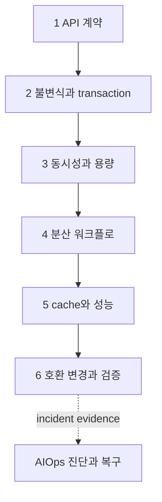

# 운영 가능한 백엔드 엔지니어링 로드맵

<!-- source: https://www.rfc-editor.org/rfc/rfc9110.html | checked: 2026-09-03 -->
<!-- source: https://sre.google/sre-book/addressing-cascading-failures/ | checked: 2026-09-03 -->

백엔드는 API 코드를 작성하는 일만이 아니다. 사용자의 의도가 요청으로 들어와 업무 규칙을 통과하고, 데이터와 이벤트로 남고, 실패와 재시도 속에서도 한 번의 결과로 수렴하며, 다음 변경 때도 깨지지 않아야 한다. 이 경로는 vault의 백엔드 지식 지도를 공개 문서용 여섯 축으로 압축해 기존 DevOps 주제와 연결한다.

## 처음 보는 사람을 위한 출발점

| 처음 만나는 말 | 학습용 쉬운 뜻 |
|---|---|
| API 계약 | 호출자가 무엇을 보내고 어떤 결과·오류를 받을지 정한 약속 |
| 불변식 | 요청이 동시에 들어와도 반드시 참이어야 하는 업무 규칙 |
| idempotency | 같은 의도의 요청을 다시 보내도 업무 효과가 한 번으로 수렴하는 성질 |
| backpressure | 처리할 수 있는 양보다 입력이 많을 때 상류에 속도를 줄이라고 알리는 제어 |
| outbox | 업무 데이터 변경과 발행할 사건을 한 DB transaction에 함께 기록하는 패턴 |
| 호환 변경 | 구버전과 신버전이 동시에 동작하는 동안에도 소비자를 깨뜨리지 않는 변경 |

처음에는 기술 이름을 외우지 않는다. 아래 한 줄을 실제 예로 끝까지 따라갈 수 있으면 된다.

## 여섯 문서가 답하는 질문

1. [요청 의미와 API 계약](#doc=backend-engineering-api-contract): 클라이언트가 성공, 실패, 재시도와 장기 작업 상태를 어떻게 구분하는가?
2. [도메인 불변식과 데이터 트랜잭션](#doc=backend-engineering-domain-transaction): 업무 규칙을 코드, DB constraint와 transaction 중 어디에서 지킬 것인가?
3. [동시성·큐·런타임과 용량](#doc=backend-engineering-runtime-capacity): 요청이 늘 때 thread, connection, heap과 dependency 중 무엇이 먼저 고갈되는가?
4. [부분 실패와 분산 워크플로](#doc=backend-engineering-distributed-workflow): 응답을 잃거나 event가 중복되어도 업무 결과를 어떻게 수렴시키는가?
5. [캐시·데이터 흐름과 성능 증거](#doc=backend-engineering-cache-performance): 더 빠르게 만들면서 정본, freshness와 무효화 책임을 어떻게 보존하는가?
6. [호환 변경·테스트와 점진적 배포](#doc=backend-engineering-evolution): 구·신 버전 공존 기간과 rollback 가능성을 어떤 증거로 닫는가?

## 백엔드 전체 내용 연결표

vault의 백엔드 81개 노트를 공개 문장으로 복사하지 않고, 아래 기술 항목을 공식 자료로 다시 검증한 공개 장에 연결한다. 한 항목이 여러 실패 경계에 걸치면 하나의 장에 가두지 않고 선수·후속 링크를 함께 둔다.

| 전체 축 | 포함한 세부 내용 | 공개 학습 연결 |
|---|---|---|
| 요청·프로토콜·API | HTTP 의미, DNS·TCP·TLS, HTTP/2·HTTP/3, gRPC·WebSocket·SSE, REST·RPC·GraphQL, cursor pagination, 비동기 operation, webhook | [API 계약](#doc=backend-engineering-api-contract), [네트워크 요청 경로](#doc=networking-request-path) |
| 도메인·관계형 데이터 | 관계형 모델링·무결성, DDD Aggregate, MVCC·격리, index·실행 계획, WAL·checkpoint·VACUUM, lock 진단, PgBouncer, Patroni 장애조치 | [도메인과 transaction](#doc=backend-engineering-domain-transaction), [PostgreSQL 운영](#doc=postgresql-roadmap) |
| 런타임·성능·부하 | Linux process·kernel 자원, memory hierarchy·storage latency, runtime 동시성·GC, Little의 법칙, queue·backpressure, profiling·benchmark, eBPF·io_uring·zero-copy, rate limit, 비용·용량 계획 | [동시성·용량](#doc=backend-engineering-runtime-capacity), [Linux 운영](#doc=linux-roadmap), [신뢰성·FinOps](#doc=reliability-finops-roadmap) |
| cache·저장 엔진 | HTTP cache, 다계층 cache, Redis 내부 구조·transaction·Lua·Sorted Set·Pub/Sub·Streams·big key·hot key·Sentinel·Cluster, B-tree·LSM-tree | [cache와 성능](#doc=backend-engineering-cache-performance), [Redis와 DynamoDB](#doc=nosql-roadmap) |
| 분산 정확성·event | replication·partition·consistency, quorum·Raft, logical clock·분산 ID, lease·leader election·fencing, Saga, outbox·멱등 consumer, 증분 집계의 삽입 여부 기반 멱등성, Kafka 보증, message queue·event log·DLQ, event schema 진화 | [분산 workflow](#doc=backend-engineering-distributed-workflow), [메시징](#doc=messaging-roadmap) |
| 데이터 플랫폼 | sharding·online relocation, multi-region consistency·failover, key-value·document·wide-column, 검색 engine, object storage, stream processing·event time·watermark, CDC·CQRS·Event Sourcing, OLTP·OLAP·Parquet·Lakehouse | [분산 workflow](#doc=backend-engineering-distributed-workflow), [PostgreSQL](#doc=postgresql-roadmap), [NoSQL](#doc=nosql-roadmap), [메시징](#doc=messaging-roadmap) |
| identity·보안·격리 | 인증·인가·API 보안, OAuth·OIDC session·token, Cookie·CORS·CSRF, PKI·mTLS·certificate lifecycle, secret·저장 암호화, tenant 격리, 개인정보 보존·삭제·감사, 집계 인원수의 재식별 위험, SSRF·공급망 위협 | [API 계약](#doc=backend-engineering-api-contract), [인프라 보안](#doc=infrastructure-security-roadmap) |
| 변경·검증·운영 | schema 호환·무중단 배포, online migration·backfill·shadow read, feature flag·점진 배포, test 계층·성능 검증, property-based·fuzz·mutation test, TLA+·linearizability, chaos·fault injection, backup·RPO·RTO, on-call·Incident Command·postmortem, OpenTelemetry pipeline의 단계별 보증 | [호환 변경과 테스트](#doc=backend-engineering-evolution), [Observability와 SRE](#doc=observability-sre-roadmap) |
| 구조·실행·traffic | service 경계·분산 비용, modular monolith·Hexagonal Architecture, service discovery·load balancing·health check, container·Kubernetes lifecycle·autoscaling, Gateway API, Envoy circuit breaker·retry, NetworkPolicy·Cilium | [호환 변경과 테스트](#doc=backend-engineering-evolution), [Kubernetes](#doc=kubernetes-roadmap), [트래픽 복원력](#doc=traffic-resilience-roadmap) |
| AI·robot 교차 경계 | agent Plan/Commit 승인, offline mission reconciliation, control plane·data plane, fleet device registry와 desired/reported state, end-to-end fault matrix | [분산 workflow](#doc=backend-engineering-distributed-workflow), [Enterprise agent 운영](#doc=ai-transformation-platform-agents), [AIOps 자동 복구](#doc=aiops-remediation-roadmap) |

이 표의 “포함”은 제품별 명령을 모두 외운다는 뜻이 아니다. 각 항목의 정본·소유자·deadline·failure boundary·검증 증거가 어느 공개 장에서 이어지는지를 뜻한다. 예를 들어 TLA+는 [분산 workflow](#doc=backend-engineering-distributed-workflow)의 불변식 검증으로, eBPF는 [동시성·용량](#doc=backend-engineering-runtime-capacity)의 관측 수단으로 들어가며 둘 자체가 운영 결과의 증거가 되지는 않는다.

## DevOps 안에서의 연결

이 주제는 앞의 인프라 문서를 대체하지 않는다. 애플리케이션 계약이 인프라 제어와 만나는 경계를 보여 준다.

| 백엔드 판단 | 먼저 연결할 DevOps 문서 | 이유 |
|---|---|---|
| 요청 deadline과 재시도 | [네트워크와 요청 경로](#doc=networking-roadmap), [트래픽 제어와 복원력](#doc=traffic-resilience-roadmap) | 전송 시간과 proxy 정책까지 포함해야 전체 예산이 닫힌다 |
| transaction과 query | [PostgreSQL 운영](#doc=postgresql-roadmap) | 애플리케이션 불변식이 MVCC·lock·WAL 위에서 실행된다 |
| cache와 특수 저장소 | [Redis와 DynamoDB](#doc=nosql-roadmap) | key·TTL·hot key가 데이터 계약과 함께 결정된다 |
| event와 재처리 | [메시징과 이벤트 인프라](#doc=messaging-roadmap) | broker 보증과 업무 중복 제거는 서로 다른 책임이다 |
| 부하·사용자 결과 | [Observability와 SRE](#doc=observability-sre-roadmap) | CPU보다 먼저 사용자 SLI와 queue를 봐야 한다 |
| identity와 데이터 | [인프라 보안](#doc=infrastructure-security-roadmap) | 인증된 subject, tenant와 권한을 transaction까지 전달한다 |
| 배포와 복구 | [Helm Charts와 GitOps](#doc=helm-gitops-roadmap), [AIOps 자동 복구](#doc=aiops-remediation-roadmap) | 선언 적용 성공과 사용자 결과 회복을 구분한다 |

## 학습 순서

각 장의 예시는 하나의 주문 API를 공유한다. `POST /orders`가 요청을 받고 재고를 예약한 뒤 event를 발행하고 조회 cache를 갱신한다고 가정한다. 이렇게 같은 업무 흐름을 반복하면 HTTP, DB, broker, cache와 배포를 따로 외우지 않고 경계 사이의 실패를 볼 수 있다.

## 처음 이해했는지 확인

- HTTP 응답을 받지 못했다는 사실만으로 서버가 업무 처리를 하지 않았다고 단정할 수 없는 이유를 설명할 수 있는가?
- DB commit과 event publish 사이에서 process가 종료되면 어떤 모순이 생기는가?
- queue가 길어질 때 worker 수를 무조건 늘리면 dependency가 더 나빠질 수 있는 이유는 무엇인가?
- cache hit ratio가 올랐는데 사용자에게 오래된 값이 보인다면 성공이라고 할 수 있는가?
- Deployment rollout 완료와 업무 성공률 회복이 같은 판정이 아닌 이유는 무엇인가?

## 완료

- 요청 한 건의 API·transaction·event·cache·telemetry 경로를 그렸다.
- 각 경계의 정본, deadline, 중복 처리와 소유자를 표시했다.
- 정상 경로뿐 아니라 응답 유실, 중복 event, 과부하와 구·신 버전 공존을 검토했다.
- 기존 DevOps 및 AIOps 문서 중 다음에 열어야 할 근거를 연결했다.

## 운영 판단으로 확장하기

실무에서는 프레임워크 설정 목록보다 `owner`, `state`, `deadline`, `evidence` 네 열로 설계를 검토한다. 누가 상태를 바꿀 수 있는지, 어느 저장소가 정본인지, 언제 포기할지, 성공과 복구를 무엇으로 증명할지를 답하지 못하면 기술 선택은 아직 끝나지 않았다. 마지막에는 [AIOps 신호와 운영 토폴로지](#doc=aiops-foundations-roadmap)에 이 식별자와 상태 전이를 전달해 진단 데이터가 애플리케이션 의미를 잃지 않게 한다.
