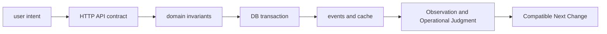
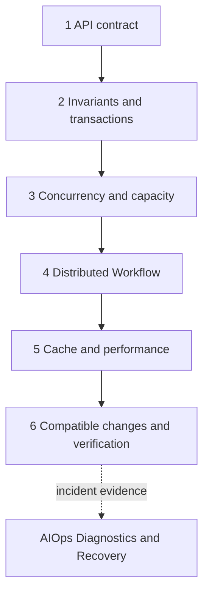

# Operational backend engineering roadmap

<!-- source: https://www.rfc-editor.org/rfc/rfc9110.html | checked: 2026-09-03 -->
<!-- source: https://sre.google/sre-book/addressing-cascading-failures/ | checked: 2026-09-03 -->

Backend is not just about writing API code. The user's intent comes in as a request, passes the business rules, remains as data and events, converges to a single result even amid failures and retries, and must not be broken even when changed next time. This path connects Vault's backend knowledge map to existing DevOps topics by condensing it into six axes for public documentation.

## Starting point for beginners

| New term | Plain-language meaning |
|---|---|
| API contract | A promise that determines what the caller will send and what results and errors will be received. |
| invariant | Business rule that must be true even if requests come in at the same time |
| idempotency | The nature of the work effect converging even if a request with the same intent is sent again |
| backpressure | Control that tells upstream to reduce speed when there is more input than can be processed |
| outbox | A pattern that records business data changes and events to be issued together in one DB transaction |
| Compatible Changes | Changes that do not break the consumer while the old and new versions run simultaneously |

At first, do not memorize the technology name. You just need to be able to follow each line below as an actual example.

## Questions answered by six documents

1. [Request Semantics and API Contracts](#doc=backend-engineering-api-contract): How does the client distinguish between success, failure, retry, and long-term task states?
2. [Domain invariants and data transactions](#doc=backend-engineering-domain-transaction): Where should business rules be kept: code, DB constraint, or transaction?
3. [Concurrency, queue, runtime and capacity](#doc=backend-engineering-runtime-capacity): When requests increase, which of threads, connection, heap or dependency is exhausted first?
4. [Partial failure and distributed workflow](#doc=backend-engineering-distributed-workflow): How do you converge work results even if responses are lost or events are duplicated?
5. [Cache/Data Flow and Performance Evidence](#doc=backend-engineering-cache-performance): How to preserve source of truth, freshness and invalidation responsibility while making it faster?
6. [Compatibility changes/tests and gradual deployment](#doc=backend-engineering-evolution): What evidence closes the coexistence period of old and new versions and the possibility of rollback?

## Backend full content connection table

Rather than copying the vault's backend 81 notes as public sentences, the technology items below are linked to the public chapter that has been verified again with official data. If an item crosses multiple failure boundaries, place the prerequisite and follow-up links together instead of confining it to one chapter.

| full axis | Details including | Open Learning Connections |
|---|---|---|
| Request·Protocol·API | HTTP meaning, DNS·TCP·TLS, HTTP/2·HTTP/3, gRPC·WebSocket·SSE, REST·RPC·GraphQL, cursor pagination, asynchronous operation, webhook | [API Contract](#doc=backend-engineering-api-contract), [Network Request Path](#doc=networking-request-path) |
| Domain/relational data | Relational modeling·integrity, DDD Aggregate, MVCC·isolation, index·execution plan, WAL·checkpoint·VACUUM, lock diagnosis, PgBouncer, Patroni failover | [domain and transaction](#doc=backend-engineering-domain-transaction), [PostgreSQL operation](#doc=postgresql-roadmap) |
| Runtime/Performance/Load | Linux process·kernel resources, memory hierarchy·storage latency, runtime concurrency·GC, Little's law, queue·backpressure, profiling·benchmark, eBPF·io_uring·zero-copy, rate limit, cost·capacity planning | [Concurrency·Capacity](#doc=backend-engineering-runtime-capacity), [Linux Operations](#doc=linux-roadmap), [Reliability·FinOps](#doc=reliability-finops-roadmap) |
| cache·storage engine | HTTP cache, multi-tier cache, Redis internal structure·transaction·Lua·Sorted Set·Pub/Sub·Streams·big key·hot key·Sentinel·Cluster, B-tree·LSM-tree | [cache and performance](#doc=backend-engineering-cache-performance), [Redis and DynamoDB](#doc=nosql-roadmap) |
| Distributed accuracy·event | replication·partition·consistency, quorum·Raft, logical clock·distributed ID, lease·leader election·fencing, Saga, outbox·idempotence consumer, insertion-based idempotence of incremental aggregates, Kafka assurance, message queue·event log·DLQ, event schema evolution | [Distributed workflow](#doc=backend-engineering-distributed-workflow), [Messaging](#doc=messaging-roadmap) |
| data platform | sharding·online relocation, multi-region consistency·failover, key-value·document·wide-column, search engine, object storage, stream processing·event time·watermark, CDC·CQRS·Event Sourcing, OLTP·OLAP·Parquet·Lakehouse | [Distributed workflow](#doc=backend-engineering-distributed-workflow), [PostgreSQL](#doc=postgresql-roadmap), [NoSQL](#doc=nosql-roadmap), [Messaging](#doc=messaging-roadmap) |
| identity·security·isolation | Authentication·authorization·API security, OAuth·OIDC session·token, Cookie·CORS·CSRF, PKI·mTLS·certificate lifecycle, secret·storage encryption, tenant isolation, personal information preservation/deletion/audit, risk of re-identification from aggregate headcounts, SSRF/supply chain threat | [API Contract](#doc=backend-engineering-api-contract), [Infrastructure Security](#doc=infrastructure-security-roadmap) |
| Change/Verification/Operation | Schema compatibility·uninterrupted deployment, online migration·backfill·shadow read, feature flag·incremental deployment, test layer·performance verification, property-based·fuzz·mutation test, TLA+·linearizability, chaos·fault injection, backup·RPO·RTO, on-call·Incident Command·postmortem, guarantees at each stage of the OpenTelemetry pipeline | [Compatibility Changes and Testing](#doc=backend-engineering-evolution), [Observability and SRE](#doc=observability-sre-roadmap) |
| Structure·execution·traffic | Service boundary·distributed cost, modular monolith·Hexagonal Architecture, service discovery·load balancing·health check, container·Kubernetes lifecycle·autoscaling, Gateway API, Envoy circuit breaker·retry, NetworkPolicy·Cilium | [Compatibility Changes and Testing](#doc=backend-engineering-evolution), [Kubernetes](#doc=kubernetes-roadmap), [Traffic Resiliency](#doc=traffic-resilience-roadmap) |
| AI·robot crossing boundaries | agent plan/commit approval, offline mission reconciliation, control plane/data plane, fleet device registry and desired/reported state, end-to-end fault matrix | [Distributed workflow](#doc=backend-engineering-distributed-workflow), [Enterprise agent operations](#doc=ai-transformation-platform-agents), [AIOps automatic recovery](#doc=aiops-remediation-roadmap) |

“Include” in this table does not mean memorizing all commands for each product. It refers to which public field the source of truth, owner, deadline, failure boundary, and verification evidence of each item follows. For example, TLA+ is an invariant verification of [distributed workflow](#doc=backend-engineering-distributed-workflow), and eBPF is an observation method of [concurrency/capacity](#doc=backend-engineering-runtime-capacity), and neither itself serves as evidence of the operation result.

## Connections within DevOps

This topic does not replace the previous infrastructure document. It shows the boundary where application contracts meet infrastructure controls.

| Backend judgment | DevOps Documents to Link First | reason |
|---|---|---|
| Request deadline and retry | [Network and Request Path](#doc=networking-roadmap), [Traffic Control and Resiliency](#doc=traffic-resilience-roadmap) | Transmission time and proxy policy must be included to close the entire budget. |
| transactions and queries | [PostgreSQL Operations](#doc=postgresql-roadmap) | Application invariants run on top of MVCC, lock, and WAL |
| cache and special storage | [Redis and DynamoDB](#doc=nosql-roadmap) | key·TTL·hot key is decided along with the data contract |
| events and reprocessing | [Messaging and Event Infrastructure](#doc=messaging-roadmap) | Broker assurance and deduplication of work are different responsibilities. |
| Load/User Results | [Observability and SRE](#doc=observability-sre-roadmap) | You need to look at user SLI and queue before CPU |
| identity and data | [Infrastructure Security](#doc=infrastructure-security-roadmap) | Authenticated subject, tenant, and permissions are transferred to the transaction. |
| deployment and recovery | [Helm Charts and GitOps](#doc=helm-gitops-roadmap), [AIOps Automated Recovery](#doc=aiops-remediation-roadmap) | Distinguish between declaration application success and user outcome recovery |

## learning sequence

The examples in each chapter share one ordering API. Assume that `POST /orders` receives a request, reserves inventory, issues an event, and updates the inquiry cache. By repeating the same work flow like this, you can see failures between boundaries without having to separately memorize HTTP, DB, broker, cache, and deployment.

## Check your understanding

- Can you explain why we cannot conclude that the server did not process its business simply because it did not receive an HTTP response?
- What contradictions arise when the process terminates between DB commit and event publish?
- Why can dependency get worse if you unconditionally increase the number of workers when the queue gets longer?
- If the cache hit ratio increases but users see old values, can it be considered a success?
- Why are completing the deployment rollout and recovering the task success rate not the same thing?

## Completion criteria

- I drew the API·transaction·event·cache·telemetry path for one request.
- The source of truth, deadline, duplicate processing, and owner of each boundary are indicated.
- In addition to the normal path, response loss, duplicate events, overload, and coexistence of old and new versions were reviewed.
- Among the existing DevOps and AIOps documents, we have linked the evidence that should be opened next.

## Develop operational judgment

In practice, the design is reviewed in four columns, `owner`, `state`, `deadline`, and `evidence`, rather than the framework settings list. If you cannot answer who can change the state, which repository is the source of truth, when to give up, and what will prove success and recovery, the technology selection is not yet complete. At the end, we pass these identifiers and state transitions to [AIOps signals and operational topology](#doc=aiops-foundations-roadmap) to ensure that the diagnostic data does not lose application meaning.
