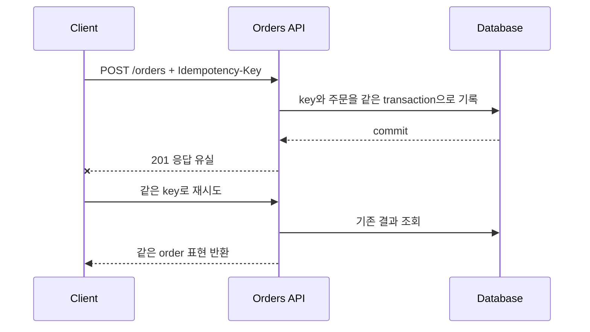

# 요청 의미와 API 계약

<!-- source: https://www.rfc-editor.org/rfc/rfc9110.html | checked: 2026-09-03 -->
<!-- source: https://www.rfc-editor.org/rfc/rfc9457.html | checked: 2026-09-03 -->
<!-- source: https://spec.openapis.org/oas/v3.1.0.html | checked: 2026-09-03 -->

API 계약은 endpoint 목록이 아니라 호출자가 다음 행동을 안전하게 선택할 수 있게 하는 의미의 집합이다. method, status, representation, 오류 코드, deadline, 중복 요청과 장기 작업 상태가 서로 맞아야 proxy·SDK·재시도 정책도 같은 의도로 동작한다.

## 이 장에서 처음 쓰는 말

| 말 | 이 장에서의 뜻 |
|---|---|
| resource | API가 식별하고 표현하는 대상 |
| safe | 호출자가 상태 변경을 요청하지 않는 method 성질 |
| idempotent | 같은 요청을 반복해도 의도한 서버 효과가 한 번과 같은 성질 |
| representation | resource의 현재 상태를 전송 가능한 형식으로 표현한 값 |
| problem detail | 기계가 읽을 수 있는 공통 오류 본문 형식 |
| operation | 응답보다 오래 실행되는 한 번의 업무 작업과 그 상태 |

1. 먼저 사용자의 의도를 resource와 method로 적는다.
2. 그다음 성공·실패·중복·처리 중 상태를 클라이언트 행동과 연결한다.

## 먼저 이해하기

RFC 9110에서 method는 요청의 주된 의미를 전달한다. `GET`이 읽기처럼 보인다는 관습만으로 충분하지 않다. safe method에서 업무 상태를 바꾸게 만들면 crawler, cache와 자동 재시도가 의도하지 않은 효과를 만들 수 있다. idempotent method는 통신이 끊긴 뒤 같은 의도를 다시 보내는 판단에 도움을 주지만, 로그가 한 줄만 생긴다는 뜻도 아니고 모든 `POST`가 자동으로 안전해진다는 뜻도 아니다.



## 계약 표부터 쓴다

`POST /orders` 예시를 코드보다 먼저 표로 고정한다.

| 상황 | HTTP 결과 | 안정 식별자 | 호출자의 다음 행동 |
|---|---|---|---|
| 새 주문 생성 | `201 Created` | `orderId`, request key | 표현 저장 또는 조회 |
| 같은 key·같은 payload | 기존 결과 | 같은 `orderId` | 성공으로 수렴 |
| 같은 key·다른 payload | `409 Conflict` | problem `type` | 자동 재시도 중단 |
| 입력 형식 오류 | `400` 또는 `422` 계약 | field problem | 입력 수정 |
| 인증은 됐지만 권한 없음 | `403 Forbidden` | audit correlation | 권한 요청 또는 중단 |
| 처리 접수, 아직 완료 전 | `202 Accepted` | `operationId`와 상태 URI | polling 또는 callback 대기 |
| 서버 과부하 | `503 Service Unavailable` | request ID, 선택적 Retry-After | budget 안에서 backoff |

RFC 9457의 problem detail은 HTTP status만으로 부족한 오류 세부를 `type`, `title`, `status`, `detail`, `instance` 같은 공통 구조에 담는다. `detail` 문자열을 파싱해 분기하지 말고 안정적인 `type` URI나 확장 code를 계약으로 둔다. 내부 stack trace, SQL과 개인정보를 오류 본문에 노출하지 않는다.

```json
{
  "type": "https://example.test/problems/idempotency-conflict",
  "title": "The idempotency key was already used",
  "status": 409,
  "instance": "/operations/op-0182",
  "code": "ORDER_REQUEST_PAYLOAD_MISMATCH"
}
```

## OpenAPI가 보장하는 것과 못 하는 것

OpenAPI 3.1 문서는 path, operation, parameter, response와 schema를 기계가 읽을 수 있게 표현한다. lint, 문서 생성과 contract test의 입력으로 쓸 수 있다. 그러나 schema가 유효하다는 사실만으로 의미 호환성이 보장되지는 않는다.

| 변경 | schema 검사 | 실제 호환성 질문 |
|---|---|---|
| optional field 추가 | 대체로 통과 | 엄격한 consumer가 미지 필드를 거부하는가 |
| enum 값 추가 | 형식상 가능 | consumer의 exhaustive switch가 실패하는가 |
| 숫자 범위 축소 | schema에 표현 가능 | 기존 저장 값과 요청이 거부되는가 |
| status 변경 | 문서화 가능 | retry·error mapping이 달라지는가 |
| sync를 `202` 비동기로 변경 | 표현 가능 | operation polling과 timeout 계약이 생겼는가 |

따라서 provider schema diff와 실제 consumer contract test를 함께 둔다. [호환 변경·테스트와 점진적 배포](#doc=backend-engineering-evolution)에서 이 공존 기간을 배포 gate로 확장한다.

## 장기 작업과 결과 불명

요청 deadline이 끝났다고 operation을 취소했다고 가정하면 안 된다. server가 commit한 뒤 응답만 잃을 수 있다. 오래 걸리는 작업은 `operationId`, 현재 상태, 생성·갱신 시각, 결과 링크, 취소 가능 상태를 별도 resource로 제공한다.

```yaml
operationId: op-0182
kind: order-create
state: running
requestedAt: 2026-09-03T01:02:00Z
updatedAt: 2026-09-03T01:02:03Z
requestKey: order-web-7731
result: null
retryable: false
```

`retryable: false`는 실패라는 뜻이 아니라 같은 업무를 새로 시작하지 말고 이 operation을 조회하라는 뜻이다. 외부 callback은 `eventId`, signature, 발생 시각과 replay window를 확인하고 중복 수신을 정상 시나리오로 처리한다.

## API review 순서

1. resource와 method가 사용자의 의도를 표현하는지 본다.
2. success, accepted, conflict, overload와 validation failure를 분리한다.
3. 모든 상태 변경 요청에 중복·응답 유실 시나리오를 적는다.
4. 오류 code와 필드가 SDK에 안정적인지 확인한다.
5. auth subject와 tenant가 [인프라 보안](#doc=infrastructure-security-roadmap)의 identity에서 transaction까지 이어지는지 확인한다.
6. 전체 deadline과 retry는 [트래픽 제어와 서비스 복원력](#doc=traffic-resilience-request-budget)에 맞춘다.
7. operation과 request ID를 [AIOps evidence graph](#doc=aiops-foundations-evidence-graph)에 전달한다.

## 완료

- method·status·오류 본문을 호출자의 다음 행동과 연결했다.
- 상태 변경 요청의 idempotency key와 payload conflict를 정의했다.
- 요청 timeout과 operation 결과 불명을 구분했다.
- OpenAPI schema 검사와 의미 호환성 검사를 분리했다.

## 스스로 설명해 보기

- `PUT`이 idempotent하다는 사실과 업무 중복이 절대로 없다는 주장이 왜 다른가?
- `503`을 받은 모든 요청을 즉시 재시도하면 어떤 feedback loop가 생기는가?
- enum 값 하나를 추가하는 변경이 어떤 consumer에서는 breaking change가 되는가?
- `202 Accepted`가 성공 완료를 뜻하지 않는다면 어떤 상태 resource가 필요한가?
