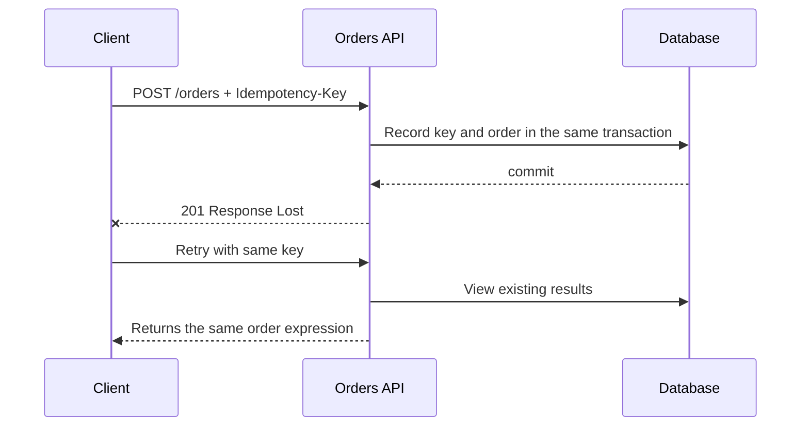

# Request semantics and API contract

<!-- source: https://www.rfc-editor.org/rfc/rfc9110.html | checked: 2026-09-03 -->
<!-- source: https://www.rfc-editor.org/rfc/rfc9457.html | checked: 2026-09-03 -->
<!-- source: https://spec.openapis.org/oas/v3.1.0.html | checked: 2026-09-03 -->

An API contract is not a list of endpoints, but rather a set of semantics that allows the caller to safely choose the next action. The method, status, representation, error code, deadline, duplicate request, and long-term task status must match for the proxy, SDK, and retry policy to operate with the same intent.

## Terms introduced in this chapter

| word | Meaning in this chapter | Why it matters / when to use it |
|---|---|---|
| resource | What the API identifies and represents | Give callers a stable object to identify, read, and change through an API contract. |
| safe | Method properties that do not require the caller to change state | Distinguish read-intended HTTP methods from requested mutations when designing clients and APIs. |
| idempotent | Even if the same request is repeated, the intended server effect is the same as once. | Decide when repeating a request can preserve its intended server effect after an uncertain response. |
| representation | A value that expresses the current state of the resource in a transmittable format. | Let clients read or exchange a resource's state through a defined response format. |
| problem detail | Common machine-readable error body formats | Give clients consistent machine-readable failure information for handling and diagnosis. |
| operation | One business task that runs longer than it responds and its state | Expose progress and results for work that outlasts the initial HTTP response. |

1. First, write the user's intention as a resource and method.
2. Next, connect the success, failure, duplicate, and processing states with client actions.

## Understand the model first

In RFC 9110, method conveys the main meaning of the request. The convention that `GET` looks like a read is not enough. Changing the task state in a safe method can have unintended effects on crawlers, caches, and automatic retries. The idempotent method helps determine whether to resend the same intent after communication is lost, but it does not mean that only one line will be created in the log, nor does it mean that all `POST` will automatically become safe.



## Start with the contract table

`POST /orders` The example is fixed as a table before the code.

| situation | HTTP result | stable identifier | Caller's next action |
|---|---|---|---|
| Create new order | `201 Created` | `orderId`, request key | Save or view expressions |
| Same key, same payload | existing results | Same as `orderId` | converge to success |
| Same key, different payload | `409 Conflict` | problem `type` | Abort automatic retry |
| Input format error | `400` or `422` contract | field problem | Input correction |
| Authenticated but no permissions | `403 Forbidden` | audit correlation | Request permission or stop |
| Received for processing, not yet completed | `202 Accepted` | `operationId` and status URI | polling or waiting for callback |
| server overload | `503 Service Unavailable` | request ID, optional Retry-After | backoff within budget |

The problem detail of RFC 9457 contains error details that are insufficient with HTTP status alone in common structures such as `type`, `title`, `status`, `detail`, and `instance`. Instead of parsing the `detail` string and branching, place the stable `type` URI or extension code as the contract. Internal stack traces, SQL and personal information are not exposed in the error body.

```json
{
  "type": "https://example.test/problems/idempotency-conflict",
  "title": "The idempotency key was already used",
  "status": 409,
  "instance": "/operations/op-0182",
  "code": "ORDER_REQUEST_PAYLOAD_MISMATCH"
}
```

## What OpenAPI guarantees and what it doesn’t

The OpenAPI 3.1 document expresses path, operation, parameters, response, and schema in a machine-readable manner. It can be used as input for lint, document creation, and contract testing. However, semantic compatibility is not guaranteed just because the schema is valid.

| change | schema check | Actual Compatibility Questions |
|---|---|---|
| Add optional field | Mostly passed | Does a strict consumer reject unknown fields? |
| Add enum value | Formally possible | Does the consumer's exhaustive switch fail? |
| Narrow down the number range | Can be expressed in schema | Are existing stored values ​​and requests rejected? |
| change status | Documentable | Does retry·error mapping change? |
| Change sync to `202` asynchronous | expressible | Are there operation polling and timeout contracts? |

Therefore, the provider schema diff and the actual consumer contract test are placed together. [In compatibility changes/tests and gradual deployment](#doc=backend-engineering-evolution), this coexistence period is extended to the deployment gate.

## Long-term operation and results unknown

You should not assume that the operation is canceled just because the request deadline has ended. The response can only be lost after the server commits. For tasks that take a long time, `operationId`, current status, creation/update time, result link, and cancellable status are provided as separate resources.

```yaml
operationId: op-0182
kind: order-create
state: running
requestedAt: 2026-09-03T01:02:00Z
updatedAt: 2026-09-03T01:02:03Z
requestKey: order-web-7731
result: null
retryable: false
```

`retryable: false` does not mean failure, but rather means that you should check this operation instead of starting the same task again. The external callback checks `eventId`, signature, occurrence time, and replay window, and processes duplicate reception as a normal scenario.

## API review order

1. Check whether the resource and method express the user's intent.
2. Separate success, accepted, conflict, overload, and validation failure.
3. Write down duplication and response loss scenarios for all status change requests.
4. Check whether the error code and field are stable in the SDK.
5. Check whether the auth subject and tenant continue from the identity of [Infrastructure Security ](#doc=infrastructure-security-roadmap) to the transaction.
6. The overall deadline and retry are aligned with [Traffic Control and Service Resiliency](#doc=traffic-resilience-request-budget).
7. Pass the operation and request ID to [AIOps evidence graph](#doc=aiops-foundations-evidence-graph).

## Completion criteria

- We linked the method·status·error body to the caller's next action.
- Defined the idempotency key and payload conflict of the status change request.
- A distinction is made between request timeout and operation result unknown.
- OpenAPI schema check and semantic compatibility check were separated.

## Explain it in your own words

- Why is the fact that `PUT` is idempotent different from the claim that there is absolutely no duplication of work?
- What feedback loop will occur if all requests receiving `503` are immediately retried?
- Does a change that adds one enum value become a breaking change for some consumers?
- If `202 Accepted` does not mean successful completion, what status resource is needed?
