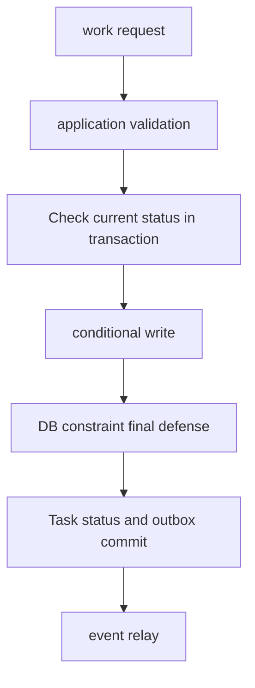

# Domain invariants and data transactions

<!-- source: https://www.postgresql.org/docs/current/transaction-iso.html | checked: 2026-09-03 -->
<!-- source: https://www.postgresql.org/docs/current/ddl-constraints.html | checked: 2026-09-03 -->
<!-- source: https://www.postgresql.org/docs/current/sql-insert.html | checked: 2026-09-03 -->

Order amount must be non-negative, the same coupon can only be applied once per order, and inventory must be reduced only under approved policies. These invariants must be maintained not only across normal requests, but also across concurrent requests, process termination, and retries. Code verification, DB constraints, and transactions are not substitutes for each other, but are lines of defense against different points of failure.

## Terms introduced in this chapter

| word | Meaning in this chapter | Why it matters / when to use it |
|---|---|---|
| invariant | Business rules that must be true before and after a transaction | Turn business correctness into rules that every concurrent execution must preserve. **Concrete situation (illustrative):** Two concurrent purchases could oversell the last item. → Define the inventory invariant and enforce its boundary. → Test that combined commits cannot make stock negative. |
| aggregate | Boundaries of work status that must be consistently changed together | Choose which business state must change consistently together before defining transaction boundaries. **Concrete situation (illustrative):** Changing an order total also changes its line items. → Define the aggregate's consistency boundary. → Test that related state cannot commit inconsistently. |
| constraint | Structure, value, and relationship rules that DB enforces on all write paths | Enforce data rules even when writes come from different applications or maintenance jobs. **Concrete situation (illustrative):** A maintenance script bypasses application validation. → Enforce essential data constraints in the database. → Verify invalid writes fail through both paths. |
| isolation | Rules that determine how much concurrent transactions can see each other's intermediate states | Choose the concurrency anomalies the application must prevent and test those choices explicitly. **Concrete situation (illustrative):** A concurrent update breaks a rule despite passing individual checks. → Reproduce the transaction isolation behavior. → Choose and test coordination that preserves the rule. |
| write skew | A phenomenon in which the read conditions of each transaction are correct, but the result of committing them together breaks the rule. | Recognize when individually valid transactions jointly break a rule and choose stronger coordination. **Concrete situation (illustrative):** Two on-call staff each see another available and both leave duty. → Test the shared rule under concurrent transactions. → Verify the chosen coordination keeps someone on duty. |
| outbox | A table that records work status and events scheduled to be issued in the same commit. | Avoid losing a required event between committing business data and publishing to another system. **Concrete situation (illustrative):** An order commits just before its event publisher crashes. → Save the order and outbox record in one transaction. → Verify later publication and consumer deduplication. |

1. First, we transform the natural language task rule into two competing requests.
2. Next, decide which rules the DB will enforce and which conflicts the application will retry.

## Lab prerequisites

There is no need for an actual production DB. You can divide the order and inventory example below into two transactions on paper. If you run SQL, only use a disposable PostgreSQL database and test data, and do not generalize the results to a production setup.

## Understand the model first

The location of verification determines the scope of failure. The API handler's `if` creates fast and friendly errors, but does not block other workers, migration, and admin queries. Constraints such as `NOT NULL`, `CHECK`, `UNIQUE`, and `FOREIGN KEY` apply to all writes to that table. Rules that span multiple rows and external systems require additional transaction, lock·compare-and-set, or workflow states.



## Ordered invariant table

| rule | nearest line of defense | Concurrency Review |
|---|---|---|
| Quantity is 1 or more | `CHECK (quantity > 0)` | Same applies to all write paths |
| The request key is unique within the tenant | `UNIQUE (tenant_id, request_key)` | Only one of the concurrent inserts succeeds |
| Order refers to an existing customer | foreign key or explicit lifecycle | Review deletion policy and lock impact |
| Inventory cannot be negative by policy | Conditional `UPDATE` and affected rows | Prevent competition between reading and writing later |
| After payment approval, status transitions are allowed only in the order permitted. | `UPDATE` with current state condition | refuse stale command |
| Avoid missing events after order commit | Transactions such as order and outbox | Relay overlap allowed, consumer idempotence required |

## Conditional writing rather than reading and writing

For an executable local fixture, open one disposable PostgreSQL session and create these temporary tables. They disappear when the session closes and demonstrate transaction semantics, not durable storage:

```sql
CREATE TEMP TABLE inventory (sku text PRIMARY KEY, available integer NOT NULL CHECK (available >= 0));
INSERT INTO inventory VALUES ('book-01', 1);
CREATE TEMP TABLE orders (
  order_id bigint GENERATED ALWAYS AS IDENTITY PRIMARY KEY,
  tenant_id text NOT NULL,
  request_key text NOT NULL,
  status text NOT NULL,
  total_amount integer NOT NULL,
  UNIQUE (tenant_id, request_key)
);
CREATE TEMP TABLE outbox (
  event_id text PRIMARY KEY,
  aggregate_id bigint REFERENCES orders(order_id),
  event_type text NOT NULL,
  payload jsonb NOT NULL
);
```

Reading inventory into application memory and later writing a calculated value allows two callers to act on the same stock. The conditional decrement below keeps the availability test and write in one statement:

```sql
UPDATE inventory
SET available = available - 1
WHERE sku = 'book-01'
  AND available >= 1;
```

The application checks whether the affected row count is 1. If it is 0, it means that the current state does not satisfy the precondition. Although this pattern does not solve all invariants, it bundles comparison and modification of the same row into one DB statement.

Do not choose an isolation level by its name alone. PostgreSQL Read Committed can use a new snapshot for each statement; Repeatable Read and Serializable have different anomaly and abort behavior. Retry serialization failures as whole transactions with bounded attempts and the same business identity. A `CHECK (quantity > 0)` also needs `NOT NULL` if missing quantity is forbidden: SQL CHECK accepts an unknown result. Continue to [PostgreSQL operations](#doc=postgresql-roadmap) for lock diagnosis.

## The moment you leave the transaction

If a broker publish or HTTP call is performed first within a DB transaction, only external effects may remain after rollback. If you publish after DB commit, the process may die in the meantime and the event may be missed. Outbox records business rows and event intent in one transaction, and a separate relay publishes them.

```sql
BEGIN;

WITH placed AS (
  INSERT INTO orders (tenant_id, request_key, status, total_amount)
  VALUES ('shop-a', 'web-7731', 'PLACED', 42000)
  RETURNING order_id
)
INSERT INTO outbox (event_id, aggregate_id, event_type, payload)
SELECT 'evt-981', order_id, 'OrderPlaced',
       jsonb_build_object('orderId', order_id)
FROM placed;

COMMIT;
```

This fragment assumes an `orders.order_id` default and a compatible outbox schema. `RETURNING` ties the event to the row actually created; an unrelated hard-coded order ID would defeat the transaction's meaning. A uniqueness conflict must resolve the existing tenant/request result and compare its payload instead of inventing a second event.

Since the relay may fail in the mark process after successful publish, the same `event_id` can be sent again. Therefore, outbox reduces the event missing window, but does not automatically create end-to-end exactly-once. [Messaging and event infrastructure](#doc=messaging-roadmap) and [Partial failure and distributed workflow](#doc=backend-engineering-distributed-workflow) close the duplicate processing of consumers.

## Example results

Expected PostgreSQL results for the temporary fixture. Run the conditional inventory UPDATE twice, then the outbox transaction once in the same session:

```text
# First inventory decrement
UPDATE 1
# Second decrement: no stock remains
UPDATE 0
# Order and outbox transaction
BEGIN
INSERT 0 1
COMMIT
```

Verify the business state and the event's actual foreign key:

```sql
SELECT available FROM inventory WHERE sku = 'book-01';
SELECT count(*) FROM orders o JOIN outbox e ON e.aggregate_id = o.order_id
WHERE e.payload->>'orderId' = o.order_id::text;
```

The first query returns 0 and the second returns 1. Repeating the order INSERT without application-level idempotency handling raises a unique-key violation; roll back the failed transaction. For an atomicity test, use fresh request/event IDs and replace COMMIT with ROLLBACK: the existing order and outbox counts must both stay at one. A broker has not been invoked by this fixture.

## How to interpret the results

| Observation Results | Meaning | next action |
|---|---|---|
| unique violation | Same request key competition or retry | Check and collect existing work results |
| affected rows 0 | Current state does not meet precondition | Conflict return, blind retry prohibited |
| serialization failure | DB could not confirm the concurrent execution order | Bounded retry and re-executing the entire transaction |
| With order, without outbox | write path is not atomic | Modify schema·transaction boundary |
| outbox duplicate publish | Predictable relay failure | Check consumer inbox·dedupe |
| DB commit, user failure persists | Save success and work results are different | Investigate dependency·event·read path |

## Design review sequence

1. Write rules in the form “Always,” “At most one,” or “B only after state A.”
2. Draw a schedule in which two requests read the same precondition at the same time.
3. Single row·table rules are reduced as much as possible with constraints and conditional writes.
4. Transaction isolation and abort/retry operations are verified in the actual DB.
5. External effects commit intent and design overlap between relay and consumer.
6. tenant·subject transfers DB policy and audit from the trust boundary of [infrastructure security](#doc=infrastructure-security-trust).
7. The outcome SLI is set as the result of the order received by the user, not the number of rows.

## Completion criteria

- The business rules were written as invariant expressions that could be falsified across concurrent requests.
- Responsibilities for application validation and DB constraints were divided.
- Distinguish between conditional write, isolation abort, and retry boundaries.
- The task row and outbox were placed in the same transaction, and a duplicate publish was left as a follow-up contract.

## Explain it in your own words

- Why can't we guarantee the prevention of negative inventory numbers just by looking at the handler's dictionary?
- What is lost in the API contract if constraint errors are unconditionally returned as `500`?
- Why doesn't outbox remove event duplicates?
- What evidence will be used to judge DB commit success and order task success?
