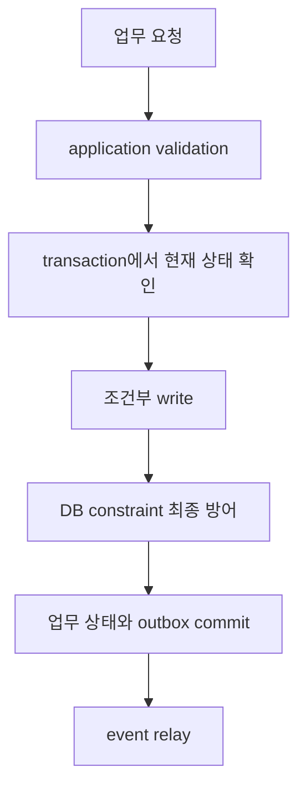

# 도메인 불변식과 데이터 트랜잭션

<!-- source: https://www.postgresql.org/docs/current/transaction-iso.html | checked: 2026-09-03 -->
<!-- source: https://www.postgresql.org/docs/current/ddl-constraints.html | checked: 2026-09-03 -->
<!-- source: https://www.postgresql.org/docs/current/sql-insert.html | checked: 2026-09-03 -->

주문 금액은 음수가 아니어야 하고, 같은 쿠폰은 한 주문에 한 번만 적용되며, 재고는 승인된 정책 아래에서만 감소해야 한다. 이런 불변식은 정상 요청 하나가 아니라 동시 요청, process 종료와 재시도에서도 지켜져야 한다. 코드 검증, DB constraint와 transaction은 서로 대체재가 아니라 다른 실패 지점의 방어선이다.

## 이 장에서 처음 쓰는 말

| 말 | 이 장에서의 뜻 |
|---|---|
| 불변식 | transaction 전후에 반드시 참이어야 하는 업무 규칙 |
| aggregate | 함께 일관되게 바꿔야 하는 업무 상태의 경계 |
| constraint | DB가 모든 쓰기 경로에 강제하는 구조·값·관계 규칙 |
| isolation | 동시 transaction이 서로의 중간 상태를 얼마나 보게 할지 정한 규칙 |
| write skew | 각 transaction이 읽은 조건은 맞지만 함께 commit한 결과가 규칙을 깨는 현상 |
| outbox | 업무 상태와 발행 예정 event를 같은 commit에 기록하는 table |

1. 먼저 자연어 업무 규칙을 경쟁하는 두 요청으로 바꾼다.
2. 그다음 어느 규칙을 DB가 강제하고 어느 충돌을 application이 재시도할지 정한다.

## 실습 전에 준비할 것

실제 production DB는 필요 없다. 아래 주문·재고 예시를 종이에 두 개 transaction으로 나눠도 된다. SQL을 실행한다면 disposable PostgreSQL database와 test data만 사용하고, 결과를 production 설정으로 일반화하지 않는다.

## 먼저 이해하기

검증의 위치는 실패 범위를 정한다. API handler의 `if`는 빠르고 친절한 오류를 만들지만 다른 worker, migration과 admin query를 막지 못한다. `NOT NULL`, `CHECK`, `UNIQUE`, `FOREIGN KEY` 같은 constraint는 그 table에 들어오는 모든 쓰기에 적용된다. 여러 row와 외부 시스템을 아우르는 규칙은 transaction, lock·compare-and-set 또는 workflow 상태가 추가로 필요하다.



## 주문 불변식 표

| 규칙 | 가장 가까운 방어선 | 동시성 검토 |
|---|---|---|
| 수량은 1 이상 | `CHECK (quantity > 0)` | 모든 쓰기 경로에 동일 적용 |
| request key는 tenant 안에서 유일 | `UNIQUE (tenant_id, request_key)` | concurrent insert 중 하나만 성공 |
| 주문은 존재하는 customer를 참조 | foreign key 또는 명시적 lifecycle | 삭제 정책과 lock 영향 검토 |
| 재고는 정책상 음수가 될 수 없음 | 조건부 `UPDATE`와 affected rows | 읽고 나중에 쓰는 경쟁 방지 |
| 결제 승인 뒤 상태 전이는 허용 순서만 | current state 조건이 있는 `UPDATE` | stale command 거부 |
| 주문 commit 뒤 event 누락 금지 | order와 outbox 같은 transaction | relay 중복 허용·consumer 멱등 필요 |

## 읽고 쓰기보다 조건부 쓰기

다음처럼 재고를 먼저 읽고 application에서 계산한 뒤 저장하면 두 transaction이 같은 값 1을 읽어 모두 성공했다고 판단할 수 있다.

```sql
UPDATE inventory
SET available = available - 1
WHERE sku = 'book-01'
  AND available >= 1;
```

application은 affected row count가 1인지 확인한다. 0이면 현재 상태가 precondition을 만족하지 않았다는 뜻이다. 이 패턴이 모든 불변식을 해결하지는 않지만, 같은 row의 비교와 변경을 DB statement 하나로 묶는다.

격리 수준의 이름만 보고 안전을 선언하지 않는다. PostgreSQL의 Read Committed에서는 statement마다 snapshot이 달라질 수 있고, Repeatable Read와 Serializable은 다른 anomaly·abort 특성을 가진다. Serializable도 충돌 시 transaction이 실패할 수 있으므로 전체 transaction을 같은 입력과 idempotency 경계 안에서 재시도하는 정책이 필요하다. 자세한 실행·lock 진단은 [PostgreSQL 운영](#doc=postgresql-roadmap)으로 이어 간다.

## transaction 밖으로 나가는 순간

DB transaction 안에서 broker publish나 HTTP 호출을 먼저 수행하면 rollback 뒤 외부 효과만 남을 수 있다. DB commit 뒤 publish하면 process가 그 사이에 죽어 event가 빠질 수 있다. outbox는 업무 row와 event intent를 한 transaction에 기록하고 별도 relay가 publish한다.

```sql
BEGIN;

INSERT INTO orders (tenant_id, request_key, status, total_amount)
VALUES ('shop-a', 'web-7731', 'PLACED', 42000);

INSERT INTO outbox (event_id, aggregate_id, event_type, payload)
VALUES ('evt-981', 'order-204', 'OrderPlaced', '{"orderId":"order-204"}');

COMMIT;
```

relay는 publish 성공 뒤 mark 과정에서 실패할 수 있으므로 같은 `event_id`를 다시 보낼 수 있다. 따라서 outbox는 event 누락 창을 줄이지만 end-to-end exactly-once를 자동으로 만들지 않는다. [메시징과 이벤트 인프라](#doc=messaging-roadmap)와 [부분 실패와 분산 워크플로](#doc=backend-engineering-distributed-workflow)에서 consumer의 중복 처리까지 닫는다.

## 결과를 이렇게 읽는다

| 관찰 결과 | 뜻 | 다음 행동 |
|---|---|---|
| unique violation | 같은 request key 경쟁 또는 재시도 | 기존 업무 결과를 조회해 수렴 |
| affected rows 0 | 현재 상태가 precondition 불충족 | conflict 반환, blind retry 금지 |
| serialization failure | 동시 실행 순서를 DB가 확정하지 못함 | bounded retry와 전체 transaction 재실행 |
| order 있음, outbox 없음 | write 경로가 원자적이지 않음 | schema·transaction boundary 수정 |
| outbox 중복 publish | 예상 가능한 relay 실패 | consumer inbox·dedupe 확인 |
| DB commit, 사용자 실패 지속 | 저장 성공과 업무 결과가 다름 | dependency·event·read path 조사 |

## 설계 검토 순서

1. 규칙을 “항상”, “최대 하나”, “상태 A 뒤에만 B” 형태로 적는다.
2. 두 요청이 동시에 같은 전제조건을 읽는 schedule을 그린다.
3. 단일 row·table 규칙은 constraint와 조건부 write로 최대한 내린다.
4. transaction 격리와 abort·retry 동작을 실제 DB에서 검증한다.
5. 외부 효과는 intent를 commit하고 relay·consumer의 중복을 설계한다.
6. tenant·subject는 [인프라 보안](#doc=infrastructure-security-trust)의 신뢰 경계에서 DB 정책과 audit까지 전달한다.
7. outcome SLI는 row 수가 아니라 사용자가 받은 주문 결과로 둔다.

## 완료

- 업무 규칙을 동시 요청에서 반증할 수 있는 불변식으로 썼다.
- application validation과 DB constraint의 책임을 나눴다.
- 조건부 write, isolation abort와 재시도 경계를 구분했다.
- 업무 row와 outbox를 같은 transaction에 두고 중복 publish를 후속 계약으로 남겼다.

## 스스로 설명해 보기

- handler의 사전 조회만으로 재고 음수 방지를 보장할 수 없는 이유는 무엇인가?
- constraint 오류를 무조건 `500`으로 반환하면 API 계약에서 무엇을 잃는가?
- outbox가 event 중복까지 제거하지 않는 이유는 무엇인가?
- DB commit 성공과 주문 업무 성공을 각각 어떤 증거로 판정할 것인가?
