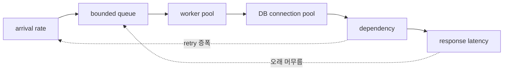

# 동시성·큐·런타임과 용량

<!-- source: https://sre.google/sre-book/addressing-cascading-failures/ | checked: 2026-09-03 -->
<!-- source: https://docs.oracle.com/en/java/javase/17/gctuning/ | checked: 2026-09-03 -->

요청이 느려졌을 때 worker 수부터 늘리면 처리량이 오를 수도 있지만 DB connection, heap과 downstream을 먼저 소진할 수도 있다. 용량 설계는 CPU 비율 하나가 아니라 도착률, 요청이 머무는 시간, 동시에 진행 중인 작업, queue와 dependency 상한을 하나의 흐름으로 보는 일이다.

## 이 장에서 처음 쓰는 말

| 말 | 이 장에서의 뜻 |
|---|---|
| concurrency | 같은 시간에 시작되어 아직 끝나지 않은 작업 수 |
| throughput | 단위 시간에 성공적으로 끝난 업무 수 |
| queue | 실행 자리가 날 때까지 기다리는 작업의 모음 |
| backpressure | 하류가 포화될 때 상류 입력을 늦추거나 거절하는 제어 |
| saturation | 자원이 더 많은 일을 받아도 유용한 처리량이 늘지 않는 상태 |
| GC pause | runtime이 회수할 메모리를 찾는 동안 application 진행이 영향을 받는 시간 |

1. 정상 부하에서 arrival, latency와 in-flight를 함께 측정한다.
2. 과부하에서 어디까지 받아들이고 어디서 싸게 거절할지 정한다.

## 먼저 이해하기

안정 상태에서 평균 동시 작업 수는 대략 도착률과 평균 체류 시간의 곱으로 생각할 수 있다. 초당 100건이 들어오고 한 건이 평균 0.2초 머문다면 평균 20건이 진행 중이다. 그러나 capacity는 평균만으로 결정하지 않는다. tail latency, burst, 재시도와 느린 dependency가 체류 시간을 늘리면 in-flight가 급격히 커진다.



## 네 개의 상한을 한 표에 둔다

| 경계 | 제한할 값 | 포화 신호 | 보호 동작 |
|---|---|---|---|
| ingress | 요청률·tenant별 동시성 | reject ratio, queue age | rate limit·load shed |
| worker | active task·queue length | runnable, event-loop lag | bounded queue·deadline |
| DB | connection·transaction time | pool wait, lock wait | query budget·pool cap |
| dependency | in-flight·retry | timeout, slow-call ratio | circuit breaker·fallback |

worker가 200개인데 DB connection이 20개라면 나머지는 일을 하는 것이 아니라 기다린다. DB pool을 200개로 키워도 DB CPU·lock·I/O가 감당하지 못하면 전체 체류 시간만 늘어난다. `max concurrency`는 각 계층의 가장 작은 안전 상한과 연결해야 한다.

```yaml
capacity_contract:
  request_deadline_ms: 800
  max_in_flight: 80
  queue_capacity: 40
  queue_max_age_ms: 120
  db_pool_max: 24
  dependency_attempts: 2
  overload_response: 503
```

이 값들은 예시이지 권장 기본값이 아니다. 실제 workload로 포화 지점을 측정하고, [트래픽 실패 예산](#doc=traffic-resilience-request-budget)에서 전체 deadline과 retry attempt를 맞춘다.

## queue는 메모리가 아니라 시간 예산이다

무제한 queue는 순간 burst를 흡수하는 것처럼 보이지만 이미 deadline을 넘긴 요청까지 보관한다. queue length뿐 아니라 가장 오래 기다린 작업의 age를 본다. 남은 예산으로 실행을 끝낼 수 없는 요청은 worker와 dependency를 소비하기 전에 거절하는 편이 전체 성공률을 지킬 수 있다.

Google SRE의 cascading failure 설명은 overload를 흔한 원인으로 보고, load test, 빠른 거절, load shedding과 graceful degradation을 방어로 제시한다. 중요한 점은 단순한 CPU threshold가 아니라 실제 실패 모드를 부하 테스트로 찾는 것이다. degraded path도 평소에 실행해 보지 않으면 장애 때 처음 깨질 수 있다.

## runtime 신호를 업무 신호와 연결한다

Java HotSpot은 요구에 맞는 여러 garbage collector를 제공하며 throughput과 latency 목표가 다를 수 있다. GC 이름을 바꾸기 전에 allocation rate, live set, heap occupancy, pause, CPU와 request latency를 같은 시간축에서 본다.

| 관찰 | 가능한 해석 | 확인할 반례 |
|---|---|---|
| heap 사용량이 톱니처럼 반복 | 정상 회수 주기일 수 있음 | pause와 latency가 함께 증가하는가 |
| allocation rate 급증 | payload·buffer·logging 변화 | traffic 증가만으로 설명되는가 |
| 오래된 객체가 계속 증가 | cache·listener·queue retention | workload 종료 뒤에도 남는가 |
| CPU 100%, throughput 정체 | GC·serialization·busy loop | profile에서 실제 hot path는 무엇인가 |
| event-loop lag 증가 | blocking call 또는 긴 callback | thread dump·span에서 같은 구간인가 |

GC pause와 thread 수치는 원인이 아니라 후보다. [Observability와 SRE](#doc=observability-sre-signals)에서 사용자 SLI, trace와 resource saturation을 연결하고, [AIOps 진단](#doc=aiops-diagnosis-pipeline)은 이 시간 상관을 근거 후보로만 사용해야 한다.

## 부하 실험 설계

1. 성공한 업무 단위와 latency percentile을 먼저 정의한다.
2. warm-up 뒤 일정 부하, 단계 증가, burst를 분리해 실행한다.
3. client timeout과 server deadline을 기록한다.
4. queue age, in-flight, pool wait, GC와 dependency 지표를 함께 수집한다.
5. 최초 포화 지점과 그 뒤의 실패 형태를 기록한다.
6. retry를 켠 경우와 끈 경우를 비교해 증폭을 측정한다.
7. 거절·degraded mode에서 중요한 tenant와 작업이 보호되는지 확인한다.

## 완료

- 도착률·체류 시간·동시 작업을 같은 capacity model에 두었다.
- ingress, worker, DB와 dependency 상한을 나눴다.
- 무제한 queue와 무제한 retry를 제거할 기준을 정했다.
- runtime metric을 사용자 결과와 연결해 해석했다.

## 스스로 설명해 보기

- latency가 두 배가 되면 같은 arrival rate에서 in-flight가 왜 늘어나는가?
- worker와 DB pool을 같은 크기로 맞추는 것이 항상 정답이 아닌 이유는 무엇인가?
- queue length가 짧아도 queue age가 위험할 수 있는 경우는 언제인가?
- GC tuning 전에 workload와 allocation profile을 고정해야 하는 이유는 무엇인가?
